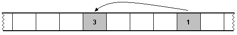
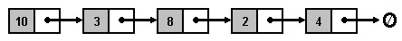

# Unit 2. Linear Structures

## 2.1 Using the Standard `string` Class

- [C-style Strings](#C-style Strings) 
- [Advanced String Operations](#Advanced String Operations) 

### C-style Strings

The standard `string` class provides support for character  strings. We have already examined the basic properties and use of the standard  `string` class in page [1.3.1 Data Types](). Before  examining it in more detail, we consider another more primitive mechanism that  provides support for character strings. This mechanism is C-style  strings. C-style strings are neither as safe nor as easy to use as the  `string` class. We discuss C-style strings only because they are  occasionally encountered in C++ programming. 

In the C programming language, arrays of type `char` provide  support for character strings. With the introduction of C++, this mechanism  became known as C-style strings. The following figure illustrates how a C-style  string stores the individual characters of the "apple".

> 
> Figure 1 A C-style string is an array of type  `char` 

The null character, or null terminator, is a special  character that terminates the array to indicate the end of a C-style string.  C-style strings therefore require one extra byte of storage in addition to the  number of characters in the string. For example, to store the five-letter word  "apple", a C-style string uses a six-element array. The array uses five elements  to store the letters of "apple" and one element to store the null character.

During the remainder of this course, we manipulate character strings using  the standard `string` class. This class provides ease of use,  convenience, and safety that C-style strings lack. Any discussion further into  the topic of C-style strings is beyond the scope of this course, except for how  to convert a C-style string to a `string` object. A constructor of  the `string` class converts a C-style string into a  `string` object. Listing 1 demonstrates the use of this  constructor.

> ```c++
> int main(int argc, char* argv[]) {
> 
>     string s1(argv[0]);  // convert from char*
> 
>     char apple[] = "apple";
>     string s2(apple);    // convert from char[]
> 
>     cout << s1 << endl;
>     cout << s2 << endl;
> 
>     return EXIT_SUCCESS;
> }
> ```
>
> Listing 1 Converting from a C-style string

### Advanced String Operations

Class `string` also provides advanced character string support.  Beyond the basic support of initialization, concatenation, length, input and  output, class `string` provides a set of higher-level string handling  functions. While a list of some of these follows, please refer to chapter 36 of  the Schildt reference for a complete list.

- erase 
  Removes a sequence of characters from a string 
- find 
  Searches a string for the occurrence of another string 
- substr 
  Returns, as a string, part of another string 
- replace 
  Replaces a substring of characters with another string 
- insert 
  Inserts a string into another string 

The following listing demonstrates the above member functions. 

> ```c++
> string s1("Demonstrating all the advanced");
> string s2("string functions!!!");
> 
> // erase the exclamation marks
> s2.erase(16, 3);
> 
> // replace 'all the' with 'some'
> s1.replace(14, 7, "some");
> 
> // insert a space at the beginning of s2
> s2.insert(0, " ");
> 
> // extract everything after "some" from s1
> int index = s1.find("some");
> string s3 = s1.substr(index);
> 
> cout << s1 << s2 << endl << s3 << endl;
> ```
>
> Listing 2 [Some advanced string functions](http://www.icarnegie.com/content/SSD/SSD5/2.1.1/normal/pg-linear/pg-stl-string/advanced.cpp)

The above listing yields the following output:

> | **`Demonstrating some advanced string functions some advanced `** |
> | ------------------------------------------------------------ |
> | Figure 2 Output of listing 2                                 |

## 2.2 The STL and Basic Containers 


With this module, the course introduces the Standard Template Library and two  of its basic containers.

- **Required:**

  | Weiss, sections 1.2, 2.6. **Remark:** Remember that this book supplements the  course's online material. You will be asked questions based on this material. |
  | ------------------------------------------------------------ |

### 2.2.1 Introduction to the Standard Template Library

- [STL Overview](#STL Overview) 
- [Containers](#containers) 
- [Iterators](#iterators) 
- [Algorithms](#algorithms) 

#### STL Overview

Standard C++ includes a fairly extensive set of libraries and, in particular,  the *Standard Template Library (STL)*. The STL provides general-purpose  components for common programming tasks. These components are characterized by  their flexibility, efficiency, and theoretical soundness. The library is  organized into three main abstractions.

- Containers 
- Iterators 
- Algorithms 

The containers include strings, vectors, lists, sets, stacks, and the like.  The containers are organized as a collection of independent C++ classes. All the  STL containers classes are template classes, and therefore can accommodate items  of arbitrary types. The user interfaces of the individual container classes are  surprisingly small. Instead, there is a large and well-organized collection of  STL algorithms that perform many of the tasks one might expect to see handled by  a member function. For example, there is a universal `remove()`  function that works on all kinds of containers. Other examples of STL algorithms  are methods for searching, sorting, replacement, and various functional  operations. Another interesting conceptual feature in the STL is that iterators  form the link between containers and algorithms. Access to the items held in a  container is always mediated by iterators, a sort of generalized array index or  pointer.

Unlike similar libraries, the STL focuses strongly on algorithmic  abstractions. Its implementation relies heavily on templates, but it uses little  inheritance and virtual functions. As a consequence, the efficiency of STL  components often equals that of components developed using traditional C++ code. 

### 2.2.2 Using the STL `vector` Container

- [Vector as an Array Class](#Vector as an Array Class) 
- [Vector as an STL Container](#Vector as an STL Container) 

#### Vector as an Array Class

Class `vector` provides a safe and feature-rich alternative to an  array. Similar to an array, a vector sequentially stores a series of objects of  identical data types. Since it is an STL container, class `vector`  supports generic programming. We can create a `vector` that stores  integers, or one that stores strings, or one that stores any other primitive or  user defined type.

Arrays can be dangerous to use because they provide no functionality to the  programmer. When using arrays, the programmer is responsible for creating any  higher-level functionality, such as resizing or reversing the array. These  implementations can be tricky and, if not coded correctly, can introduce subtle  bugs into an application. Vectors provide a safer alternative to arrays since  they provide member functions that implement these (and other) higher-level  tasks. 

> ```c++
> #include <string>
> #include <cstdlib>
> #include <iostream>
> #include <vector>
> 
> using namespace std;
> 
> int main(int argc, char* argv[]) {
> 
>     vector<int> v1;
>     vector<double> v2;
>     vector<bool> v3;
>     vector<string> v4;
> 
>     return EXIT_SUCCESS;
> }
> ```
>
> Listing 1 [Declaring `vector` objects](http://www.icarnegie.com/content/SSD/SSD5/2.1.1/normal/pg-linear/pg-stl-vector-deque/pg-stl-vector/declare.cpp)

Listing 1 demonstrates the declaration of objects of class  `vector`. Notice that in order to use objects of type  `vector`, we have to include the library that defines the vector  class. This is done in line 4 in the above listing. 

It is interesting to note that we can also declare a `vector` of  `vector` objects. This provides an implementation for a  two-dimensional data structure such as a matrix. Listing 2 illustrates the  declaration of a vector of vectors. To avoid confusion with the  `>>` operator, most compilers require a space following the  first greater-than symbol. This applies to any nested template declaration, not  just vectors of vectors.

> ```c++
> vector<vector<int> > matrix;
> ```
>
> Listing 2 A `vector` of `vector`  objects

Class `vector` contains a set of constructors programmers can use  to set the initial size of the vector and the initial values of the elements.  Listing 3 demonstrates these constructors.

> ```c++
> #include <string>
> #include <cstdlib>
> #include <iostream>
> #include <vector>
> 
> using namespace std;
> 
> int main(int argc, char* argv[]) {
> 
>     vector<int> v1;         // initially empty
>     vector<int> v2(5);      // 5 elements, initialized to 0
>     vector<int> v3(10, 1);  // 10 elements, initialized to 1
>     vector<int> v4(v3);     // v4 is a copy of v3
> 
>     return EXIT_SUCCESS;
> }
> ```
>
> Listing 3 [`vector` constructors](http://www.icarnegie.com/content/SSD/SSD5/2.1.1/normal/pg-linear/pg-stl-vector-deque/pg-stl-vector/vectorconstructors.cpp)

We can access the elements stored in a vector in a few different ways. First,  class `vector` overloads `operator[]`. This allows us to  access elements using syntax similar to array subscripting. Just like array  subscript access, the overloaded bracket operator of class `vector`  does not provide out-of-bounds access checking. When bounds checking is  required, we must use the `at()` method. There are also special  access methods for the first and last element in the array, as demonstrated in  Listing 4.

> ```c++
> vector<int> v(10);
> 
> v[1] = 2;
> v.at(2) = 45;
> v.front() = v.back();
> ```
>
> Listing 4 Element access

In addition to providing the standard member functions discussed above, class  `vector` also supplies some other functions that you may not expect  as part of an array class. For example, method `push_back` appends a  data item to the end of the vector. This method automatically resizes the vector  to accommodate the new element. Method `pop_back` performs the  opposite task. This member function removes the last element from the vector,  decreasing the size of the vector by one. The `empty` function  returns `true` if the vector contains zero elements, and  `false` otherwise.

### 2.2.3 Using the STL `deque` Container

- [Interface](#interface) 
- [Implementation](#implementation) 

#### Interface

An object of type `deque` (pronounced "deck") can store and  provide access to a linear sequence of elements. In this respect, a deque is  similar to a vector. In fact, the two classes share nearly identical class  interfaces. 

> ```c++
> #include <cstdlib>
> #include <iostream>
> #include <vector>
> #include <deque>
> 
> using namespace std;
> 
> int main(int argc, char* argv[]) {
> 
>     vector<int> v(10, 1);
>     deque<int> d(10, 1);
> 
>     v[9] = 2;
>     d[9] = 2;
> 
>     cout << v.front() << " " << v.back() << endl;
>     cout << d.front() << " " << d.back() << endl;
> 
>     v.push_back(3);
>     d.push_back(3);
> 
>     v.pop_back();
>     d.pop_back();
> 
>     cout << v.size() << endl;
>     cout << d.size() << endl;
> 
>     ostream_iterator<int> out(cout, " ");
>     copy(v.begin(), v.end(), out);
>     copy(d.begin(), d.end(), out);
> 
>     return EXIT_SUCCESS;
> }
> ```
>
> Listing 1 [Deques and Vectors](http://www.icarnegie.com/content/SSD/SSD5/2.1.1/normal/pg-linear/pg-stl-vector-deque/pg-stl-deque/deque.cpp)

In the listing above, we can see that both classes provide similar  constructors, element access methods, insertion and removal methods, and  iterator support. Deques and vectors differ, however, in their ability to handle  element insertions and removals from the front of the respective structures. In  class `vector`, element insertion and removal from the end of the  vector is accomplished using functions `push_back` and  `pop_back`. For implementation reasons we examine shortly, vectors  contain no corresponding `push_front` and `pop_front`  methods. Instead, programmers must use `vector` class member  functions `insert` and `erase`. As we examined in [2.2.2 Using the STL `vector` Container](), these functions  introduce overhead of element copying. Class `deque`, on the other  hand, does provide methods `push_front` and `pop_front`.  These methods do not require the element copying overhead. 

> ```c++
> deque<int> d(10);  // 10 elements, initialized to 0
> 
> d.push_front(2);
> cout << d.front() << endl; // Outputs "2"
> 
> d.pop_front();
> cout << d.front() << endl; // Outputs "0"
> ```
>
> Listing 2 `push_front` and  `pop_front`

Counting the number of items that possess certain properties can be done  using the `count` and `count_if` functions. The  `count` function accepts a range of elements in a container (through  a beginning and ending iterator) and a value to count. The function returns  number of occurrences of the value within the specified range. The  `count_if` function uses a programmer supplied function to determine  if an element in the specified range is counted. This programmer supplied  function must take a single argument and return a value of type  `bool`. The data type of the argument must match the type of the  element stored in the specified range. The following listing demonstrates both  the `count` and `count_if` functions used with a  `deque`.

> ```c++
> // a predicate
> bool is_odd(int i) {
>     return ((i % 2) == 1);
> }
> 
> int main(int argc, char* argv[]) {
> 
>     deque<int> numbers;
>     for (int i = 0; i < 20; i++) {
>         numbers.push_back(i);
>     }
> 
>     cout << count(numbers.begin(), numbers.end(), 10) << endl;
>     cout << count_if(numbers.begin(), numbers.end(), is_odd)
>     << endl;
> 
>     return EXIT_SUCCESS;
> }
> ```
>
> Listing 3 [The `count` and `count_if`  functions](http://www.icarnegie.com/content/SSD/SSD5/2.1.1/normal/pg-linear/pg-stl-vector-deque/pg-stl-deque/count.cpp)

#### Implementation

Class `deque` and `vector` differ in their  implementation. As we have seen in [2.2.2 Using the STL  `vector` Container](), class `vector` essentially wraps a  C++ array, providing a safe and feature-rich interface. To accommodate efficient  insertions and deletions of elements from both the front and back, a deque  implementation is typically based on a series of arrays. While this  implementation is interesting, we will ignore the details. Comparing element  storage strategies between the two containers is enough to illustrate the main  difference between deques and vectors. 

> 
> Figure 1 Element storage in a `vector` 

Figure 1 represents how elements are stored in a vector. In this figure, the  shaded squares represent the elements of the vector (the size) and the  non-shaded squares represent the reserved memory (the capacity). This vector  contains three elements, and has four reserved memory locations. In this  arrangement, inserting an element at the beginning of the vector is not a  trivial task since all the elements need to be moved to make room for the newly  added element. 

> 
> Figure 2 Element storage in a `deque` 

Deques reserve memory locations at both the front and back of their stored  elements. Figure 2 illustrates this fundamental difference between vectors and  deques. Reserving memory at both the front and back of the structure allows for  efficient insertion and removal of elements at both ends, at the cost of a more  complex implementation. 

## 2.3 Linked Lists 


With this module, the course introduces the linked list data structure.

- **Required:**

  | Weiss, chapter 2. **Remark:** Remember that this book supplements the  course's online material. You will be asked questions based on this material. |
  | ------------------------------------------------------------ |

### 2.3.1 A Linked Structure

- [A Non-Contiguous List](#A Non-Contiguous List) 
- [Linking Elements Together](#Linking Elements Together) 

#### A Non-Contiguous List

A linked list stores a linear sequence of elements. Using a linked  list and its associated operations, we can build, manipulate, and maintain a  list of elements. Recall that vectors also store a sequence of elements. Linked  lists share many of the same operations as vectors. For example, both data  structures support element insertion and removal, element traversal, and other  basic operations.

The efficiency of certain operations differs between linked lists and  vectors. For example, the operation associated with removing the first element  is more efficient in a linked list than it is in a vector. On the other hand,  accessing a random element in a sequence stored in a vector is more efficient  than it is in a linked list. These differences in efficiency are rooted in how  each data structure stores elements in memory. Vectors use contiguous storage  whereas a linked list stores elements arbitrarily in memory. All the elements in  a vector, for instance, appear one after another in memory. Figure 1 illustrates  the elements of a vector in memory. 

> 
> Figure 1 A vector in memory 

Linked lists store elements in non-contiguous memory locations. This means  that adjacent elements in the sequence the list maintains are not stored in  adjacent memory locations. Figure 2 shows a linked list in memory.

> 
> Figure 2 A linked list in memory 

Storing elements in non-contiguous memory locations is only possible if each  element somehow references the next element in the list. The reference from one  element to the next appears in Figure 2 as an arrow. The linked list in this  figure begins with the element whose value is `1`. This element  references the next element (value `2`) which references the third  element (value `3`). The reference is typically known as a "link," which  explains the name "linked list." It is important to notice that extra memory is  required to store the link for each item in the list. This additional memory  requirement per list element is a fundamental difference between linked lists  and vectors.

Storing elements in contiguous or non-contiguous memory affects the  efficiency of certain operations. When elements are stored in contiguous memory  locations, random element access is efficient because the implementation can  compute directly the location of any element. Storing elements in contiguous  memory locations has an adverse impact on other operations. We have already seen  the overhead involved in inserting an element in the middle of a vector. This  overhead exists since the implementation must move values in memory to create  "space" for the inserted item.

Non-contiguous storage also has its advantages and disadvantages. One  advantage of a linked list is that we can remove or add an element by simply  rearranging the links. For example, we can easily remove the second element from  the list in Figure 2. To do this we update the link that points from element one  to point it to element three. If the memory where element two exists was  allocated dynamically (using `new`), then we also must deallocation  this memory. This element removal process is the same regardless of the size of  the list. Figure 3 represents the state of the list in Figure 2 after the  removal of the second element.

> 
> Figure 3 After removing element two 

On the other hand, random element access in a linked list is not as efficient  as it is in a vector. To access a specific element in a linked list, we must  traverse all the elements from the beginning until we reach the item we seek.  This is because the use of non-contiguous storage prevents the implementation  from easily calculating where a specific element is stored.

#### Linking Elements Together

As we noted above, storing in memory only the element data is not sufficient  to maintain the structure of a linked list. Each element must also indicate  where in memory the next element is located. Since we are dealing with memory  locations, linking together the elements contained in a linked list is a perfect  application for pointers. With this in mind, we can build a mental model of a  linked list that resembles Figure 4. 

> 
> Figure 4 Pointers as links 

In Figure 4 we see a linked list containing five elements. The data from each  list item is paired with a pointer (represented by the arrows) that indicates  the location in memory of the next element. Notice that the pointer associated  with the last item is set to the null pointer. This is a standard technique used  to denote the last item in a list.

A node in a linked list contains the data for one element and any  bookkeeping information necessary to maintain the list representation. In the  example in Figure 4, the node contains an integer (the data), and a pointer to  the next node in the list. The structure represented in Figure 4 is known as a  singly-linked list since only one link exists for each node. Because  only one link exists for each node, we can traverse a singly-linked list only  from front to back.

To facilitate traversal of a list in either direction, we can add an  additional pointer to each node that points to the previous node in the  list.

> 
> Figure 5 Doubly-linked lists 

In Figure 5, one additional pointer has been added to each node. This new  pointer references the previous node in the list. This type of linked list is a  doubly-linked list. A doubly-linked list allows one to move forward  and backward through a list.

### 2.3.2 A C++ Implementation

- [A Template List Class](#A Template List Class) 
- [Implementation](#Implementation)
  - [Node Representation](#Node Representation) 
  - [Simple Member Functions](#simple) 
  - [Inserting and Removing from the Beginning](#beginning) 
  - [Inserting and Removing from the End](#end) 
  - [The Destructor](#destructor) 
  - [The Copy Constructor](#copyconstructor) 
  - [Displaying the List Contents](#printing) 
- [Testing the Implementation](#testing) 

#### A Template List Class

In this page, we examine the implementation of a linked list class.

We start by examining some high-level requirements that we want our class to  support. Let's assume that this list class, which we name  `LinkedList`, needs to support only forward traversal. For this  reason, we can implement the class as a singly-linked list. We can also assume  that class `LinkedList` needs to support insertion and removal of  elements at both the front and back of the list. To support this requirement,  our class will maintain pointers to both the beginning and end of the list.  Finally, we would like to use this class to store lists of integers, floats,  strings, or any data type. This requires the class to be a template class.

The following C++ declaration contains the public members of our class.

> ```c++
> template <class T>
> class LinkedList {
> 
> public:
>     LinkedList();   // Default constructor
>     LinkedList(const LinkedList<T>& src);  // Copy constructor
>     ~LinkedList();  // Destructor
> 
>     T& front();  // Element access for front of list
>     T& back();   // Element access for back of list
>     int size();  // count of elements in list
>     bool empty(); // Size > 0
> 
>     void push_front(const T&);  // Insert element at beginning
>     void push_back(const T&);   // Insert element at end
>     void pop_front();  // Remove element from beginning
>     void pop_back();  // Remove element from end
> 
>     void dump();  // Output contents of list
> };
> ```
>
> Listing 1 Public interface of class  `LinkedList` 

#### Implementation

**Node Representation**

Now that we have an idea of the member functions that the class implements,  let's shift our focus and think about how we can represent a node of the linked  list. We know a node must store the element data and any bookkeeping information  necessary to maintain the structure of the linked list. Since this is a  singly-linked list implementation, a pointer to the next node in the list is the  only bookkeeping information required. 

> ```c++
> template <class T>
> class LinkedList {
> 
> private:
>     class Node {
>         T data;
>         Node* next;
>     };
> 
> public:
>     // rest of public members ...
> ```
>
> Listing 2 Class `Node` 

The above class is an adequate representation for a node in a singly-linked  list. It contains a member to store the data for the node and a pointer to the  next node. Within the context of our linked list class, however, class  `Node` needs to be augmented with a few more features. First, we add  a constructor that allows initialization of the data members of the class. We  also add a `friend` statement that allows the member functions of  class `LinkedList` to access the private data members of class  `Node`.

### 2.3.3 Using the STL `list` Container

- [The Interface](#The Interface) 
- [Traversing a List](#Traversing a List) 
- [Inserting and Removing Elements](#Inserting and Removing Elements) 

#### The Interface

The `list` container is the Standard Template Library's linked  list class. Page 819 of the Schildt reference book contains a complete listing  of the member functions that comprise the interface of class `list`. 

The container class `list` supports element insertion and removal  from both the front and back. In class `list`, member functions  `push_front`, `pop_front`, `push_back`, and  `pop_back` accomplish these tasks. Class `list` also  provides access to the data in the first and last elements via methods  `front` and `back`. Furthermore, similar to our class  `LinkedList`, method `size` returns the number of elements  in a list and method `empty` reports whether or not a list is  empty.

> ```c++
> #include <iostream>
> #include <string>
> #include <cstdlib>
> #include <list>
> 
> using namespace std;
> 
> int main(int argc, char* argv[]) {
> 
>     list<int> l1;
>     l1.push_front(10);
>     cout << l1.size() << endl; // count of 1
> 
>     list<string> l2(10);
>     cout << l2.size() << endl; // count of 10
> 
>     list<double> l3(1, 2.3);   // initial value of 2.3
>     cout << l3.back() << endl;
>     l3.pop_back();
>     cout << l3.empty() << endl;
> 
>     return EXIT_SUCCESS;
> }
> ```
>
> Listing 1 [The STL `list` container](http://www.icarnegie.com/content/SSD/SSD5/2.1.1/normal/pg-linear/pg-linked-lists/pg-stl-list/familiar.cpp)

In addition to the default constructor, the STL `list` class  provides a constructor that specifies an initial number of elements in a list.  Line 14 of the above listing uses this constructor to declare a list that  initially contains ten elements. This constructor also has an optional second  parameter. A programmer can use this second parameter to specify the default  value for the initial elements. An example of this usage is demonstrated in line  17 of Listing 1. This line declares a list that initially contains one element  with the value `2.3`. Omitting the second argument invokes the default  constructors of the initial elements. 

#### Traversing a List

Traversing through the elements contained in a `list` is a common  application of iterators. Using the iterator returned by function  `begin` and the iterator returned by function `end`, a  loop construct can visit all the elements in a list.

> ```c++
> // Populate
> list<int> l;
> for (int i = 1; i <= 10; i++) {
>     l.push_back(i);
> }
> 
> // Traverse
> list<int>::iterator it;
> for (it = l.begin(); it != l.end(); it++) {
>     cout << *it << endl;
> }
> ```
>
> Listing 2 Traversing a list 

Listing 2 works correctly because the iterator returned by function  `end` points to the one position past the last element in the list.  The iterator returned by function `begin`, on the other hand, points  to the first element in the list. 

The STL `list` is a doubly-linked list. This means the list should  support traversal from back to front. At first thought, one might attempt the  following for a reverse traversal.

> ```c++
> // Populate
> list<int> l;
> for (int i = 1; i <= 10; i++) {
>     l.push_back(i);
> }
> 
> // Reverse Traverse
> list<int>::iterator it;
> it = l.end();
> do {
>     --it;
>     cout << *it << endl;
> }
> while (it != l.begin());
> ```
>
> Listing 3 Wrong way to traverse in reverse 

The code in Listing 3 does traverse the entire list in reverse, but it is  clearly not as readable as the forward traverse listing. To implement a more  readable version of a reverse traverse, we need iterators that point to the last  element in the list and one position before the first element. These iterators  exist, and are returned by functions `rbegin` and `rend`,  respectively. 

> ```c++
> // Populate
> list<int> l;
> for (int i = 1; i <= 10; i++) {
>     l.push_back(i);
> }
> 
> // Reverse Traverse
> list<int>::reverse_iterator it;
> for (it = l.rbegin(); it != l.rend(); it++) {
>     cout << *it << endl;
> }
> ```
>
> > Listing 4 Reverse iterators 

The iterators returned by functions `rbegin` and `rend`  are reverse iterators and are used for reverse traversals. Reverse  iterators operate much the same way as regular iterators, except they handle  increment operations in reverse. Notice the use of the increment operator  (`++`) in the for-loop in Listing 4. Incrementing the reverse  iterator moves it backwards through the list. Reverse iterators, found also in  the other STL containers (`string`, `vector`, and  `deque`) that we have examined, provide an effective and intuitive  way to traverse a structure in reverse order. 

#### Inserting and Removing Elements

Linked lists perform efficient element insertions and removals, regardless of  the positions of elements with the list. This is due to the linked nature of the  structure. Member functions `insert` and `erase` perform  this functionality in STL `list` class. To indicate the range of  elements to insert or remove, both of these functions use iterators. Function  `erase` either takes one argument indicating the element to remove,  or two arguments that indicate the range of elements to remove. Listing 5  demonstrates the single argument use of function `erase`. 

> ```c++
> // Erase the second element from a list
> list<int> l(10);
> list<int>::iterator second = l.begin();
> second++;
> l.erase(second);
> ```
>
> Listing 5 Using function `erase` 

Method `insert` is used similar to method `erase`.  Listing 6 inserts an element with the value 5 after the first list element.

> ```c++
> // Insert an element after the first element
> list<int> l(10);
> list<int>::iterator it = l.begin();
> it++;
> l.insert(it, 5);
> ```
>
> Listing 6 Function `insert` 

Using function `insert`, we can insert an entire sequence of  elements into a list. Listing 7 demonstrates this use of the function.

> ```c++
> // Insert a range of elements
> list<double> l1(10, 2.14);
> list<double> l2(5, 0.0);
> 
> list<double>::iterator it = l1.begin();
> it++;
> 
> l1.insert(it, l2.begin(), l2.end());
> cout << l1.size() << endl;
> ```
>
> Listing 7 Inserting a range of elements 

## 2.4 Queues 


With this module, the course introduces the queue abstract data type.

- **Required:**

  | Weiss, section 7.2.3 and chapter 16. **Remark:** Remember that this book  supplements the course's online material. You will be asked questions based on  this material. |
  | ------------------------------------------------------------ |

### 2.4.1 First-In, First-Out

A queue is a linear data structure that utilizes a first-in, first-out  element insertion and removal policy. First-in, first-out means that the first  element added to a queue is the first element removed from a queue. Put another  way, things are only removed from the beginning and only added to the end of  queues.

Queues are used in the real world in many places. Remember from [1.2.1 What are Data Structures and Algorithms?]() we discussed a line  at a movie theater as a data structure. This line is really just a queue. People  enter the line at the back and leave the line only when they reach the front and  buy their tickets. Airplanes waiting to land and take off from an airport also  wait in queues. Anywhere a "First Come, First Served" sign is seen, a queue is  at work. 

Queues have many different applications in computer science and software  development. A queue can be used to provide a buffer. A buffer  provides temporary storage for information that needs to be processed later.  Network routers buffer incoming data packets in a queue to give the routers time  to process outgoing packets. Operating systems can use a queue to implement a  scheduling policy that decides which program to run next. Applications that  stream audio and video across the Internet buffer a certain number of packets in  a queue to account for temporary slow downs in connection speeds. 

### 2.4.2 Using the STL `queue` Adapter

The Standard Template Library contains adapters that provide a  new, but similar interface to an existing container. The `queue`  adapter provides the interface suitable for a queue data structure. It is based,  by default, on the `deque` container. When an object of type  `queue` is used, an object of type `deque` is actually  instantiated, just with an interface more suitable for a queue. Listing 1  illustrates the entire, small interface of the `queue` adapter.

> ```c++
> #include <iostream>
> #include <string>
> #include <cstdlib>
> #include <queue>
> 
> using namespace std;
> 
> int main(int argc, char* argv[]) {
> 
>     queue<int> q;
> 
>     // push and pop
>     q.push(1);
>     q.pop();
> 
>     // front and back
>     q.push(1);
>     q.push(2);
>     cout << q.front() << endl;
>     cout << q.back() << endl;
> 
>     // size and empty
>     cout << q.size() << endl;
>     cout << q.empty() << endl;
> 
>     return EXIT_SUCCESS;
> }
> ```
>
> Listing 1 [The `queue` interface](http://www.icarnegie.com/content/SSD/SSD5/2.1.1/normal/pg-linear/pg-queues/pg-stl-queue/queue.cpp)

Only six member functions exist in the `queue` adapter interface.  Methods `push` and `pop` insert and remove elements from a  queue, and methods `front` and `back` provide access to  the data stored in the beginning and end of a queue. Similar to the other STL  containers we have examined, method `size` returns the number of  elements stored in a queue and method `empty` returns  `true` if a queue is empty and `false` if a queue is  storing at least one element. Notice from line 4 in the above listing that  inclusion of the `<queue>` library is necessary to use the  `queue` adapter.

One thing that the `queue` adapter lacks is support for iterators.  Without iterators, a method to traverse the elements stored in a  `queue` does not exist. Essentially, a queue hides all the elements  it stores except for the first and last. If an application requires a queue, but  also requires access to the elements stored in the queue, a `deque`  should be used instead. Table 1 shows the member functions of class  `queue` and their `deque` equivalents.

> | `queue` member | `deque` equivalent |
> | -------------- | ------------------ |
> | `push`         | `push_back`        |
> | `pop`          | `pop_front`        |
> | `front`        | `front`            |
> | `back`         | `back`             |
> | `size`         | `size`             |
> | `empty`        | `empty`            |
>
> Table 1 `queue` member functions and their  `deque` equivalents

## 2.5 Stacks 


With this module, the course introduces the stack abstract data type.

- **Required:**

  | Weiss, sections 7.2.1 - 7.2.2 and chapter 16. **Remark:** Remember that this  book supplements the course's online material. You will be asked questions based  on this material. |
  | ------------------------------------------------------------ |

### 2.5.1 Last-In, First-Out

- [Stacks Introduced](#Stacks Introduced) 
- [Applications of Stacks](#Applications of Stacks) 

#### Stacks Introduced

A stack is a linear data structure that provides access to only the most  recently added element. In a stack, items can only be added at and removed from  one end of the sequence. This amounts to a "Last-in, First-Out" element  insertion and removal policy. Put another way, the next item that can be removed  from a stack is always the element that was most recently added to the stack. We  can always add more elements to a stack, but each time we do, the newly added  element becomes the element that can be removed first. 

A stack of plates or dishes in a kitchen is a real world example of a stack  data structure. Consider how one uses a stack of plates. When a plate is needed  for dining, one is taken from the top of the stack of plates. It is not a good  idea to try to take a plate from the bottom, since this probably would topple  the entire stack. When plates are put away, they are placed on top of the stack.  Because we only take plates from the top, a plate placed on top of the stack  becomes the next plate that we use. 

Real world examples like the stack of plates make it is easy to think of a  stack as a vertical structure. With this mental model in mind, let's step  through adding a few elements to an initially empty stack. First we add  (typically referred to as "pushing" onto the stack) an element with the value  `1`. Figure 1 represents our stack with this lone element.

> 
> Figure 1 After adding element `1` 

Things become more interesting after we push a second element onto the stack.  Figure 2 shows the state of the stack after we add an element with the value  `2`.

> 
> Figure 2 After adding element `2` 

The element shaded in gray is now at the top of the stack. Adding this second  element effectively hides the first element since the second element is now the  only element that can be removed. Also, it is the only element in the stack  whose value we can access. This is an important property of the stack data  structure that differs from vectors and deques. In a stack, we have access to  the number of elements stored in the data structure, but we do not have access  to all the values of the elements. We can "peek" into the stack to return the  value of the element that sits at the top. A peek operation performed on the  stack in Figure 2 would return the value `2`.

> 
> Figure 3 After adding element `3` 

Figure 3 shows the stack after we push a third element onto the stack. The  element added contains the value `3`. If we were to remove an element  from the stack (often referred to as "popping" an element), our stack would then  look like Figure 2.

We have examined how stacks operate and have seen the primary operations  associated with stacks. Summarizing, "pushing" adds an element to the top of a  stack, "popping" removes the element at the top of a stack, and "peeking"  returns the value of the element at the top of a stack. 

#### Applications of Stacks

An important data structure in Computer Science, stacks have many different  applications. These applications range from simple tasks such as reversing the  characters in a string to seemingly more complex tasks such as the evaluation of  arithmetic expressions or the navigation of mazes. It is important to gain a  solid understanding of the concept of a stack since later in this course we  encounter many uses of stacks in the context of other data structures and  algorithms. 

### 2.5.2 Using the STL `stack` Adapter

The STL `stack` adapter provides an interface suitable for use as  a stack. Listing 1 demonstrates all the member functions of the  `stack` adapter.

> ```c++
> #include <iostream>
> #include <string>
> #include <cstdlib>
> #include <stack>
> 
> using namespace std;
> 
> int main(int argc, char* argv[]) {
> 
>     stack<int> s;
> 
>     // push and pop
>     s.push(1);
>     s.pop();
> 
>     // top
>     s.push(10);
>     s.push(11);
>     cout << s.top() << endl;
> 
>     // size and empty
>     cout << s.size() << endl;
>     cout << s.empty() << endl;
> 
>     return EXIT_SUCCESS;
> }
> ```
>
> Listing 1 [The `stack` adapter](http://www.icarnegie.com/content/SSD/SSD5/2.1.1/normal/pg-linear/pg-stacks/pg-stl-stack/stack.cpp)

Only six member functions exist in the `stack` adapter interface.  Methods `push` and `pop` insert and remove elements from a  stack respectively, and method `top` returns a reference to the data  stored at the top of the stack. As with the `queue` adapter, method  `size` returns the number of elements stored in a stack and method  `empty` returns `true` if a stack is empty and  `false` if a stack is not empty. 

To use the STL `stack` adapter in a program, a programmer must  include the `<stack>` library. This is done in line 4 of  Listing 1.

Listing 2 shows a more practical example of the `stack` adapter.  This listing displays the lines of a text file in reverse order. A stack  provides a natural data structure to solve this problem.

> ```c++
> // open file specified by command-line argument
> ifstream inf(argv[1]);
> 
> if ( !inf ) {
>     cerr << "cannot open " << filename << " for input" << endl;
>     return EXIT_FAILURE;
> }
> 
> stack<string> s;
> string line;
> 
> // read file line by line
> while (getline(inf, line)) {
>     s.push(line);
> }
> 
> inf.close();
> 
> // print lines in reverse
> while (!s.empty()) {
>     cout << s.top() << endl;
>     s.pop();
> }
> ```
>
> Listing 2 [Displaying lines of a file in reverse](http://www.icarnegie.com/content/SSD/SSD5/2.1.1/normal/pg-linear/pg-stacks/pg-stl-stack/tac.cpp)

