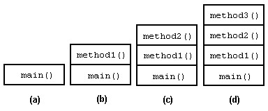
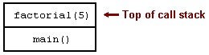
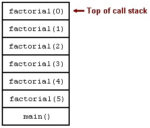
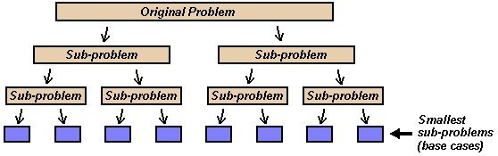
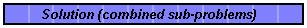
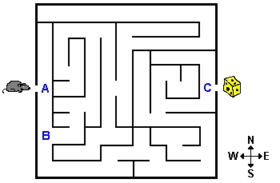
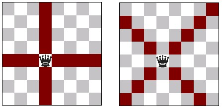
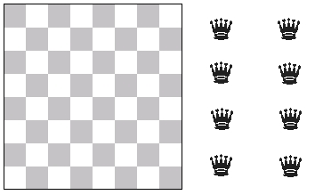
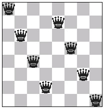
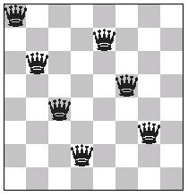

# Unit 3. Recursion


## 3.1 The Basic Concept of Recursion 

- [Recursive Functions](#functions) 
- [The Call Stack](#callstack) 
- [Removing Recursion](#removing) 

- **Required:**

| Weiss, section 8.1 - 8.3. |
| ------------------------- |

- **Remark:**

| Remember that this book supplements the  course's online material. You will be asked questions based on this material. |
| ------------------------------------------------------------ |

### Recursive Functions

A recursive function is a function that calls itself. The use of  recursive functions, called recursion, can yield elegant solutions to  otherwise complex problems. C++, like many other programming languages, supports  recursion. 

A programmer must define recursive functions carefully in order to avoid  creating a function that repeatedly calls itself forever. A pseudocode version  of a typical recursive function looks like the following example.

> ```
> if (simplest case) then
>     solve directly
> else
>     make recursive call to a simpler case
> ```
>
> Example 1 A typical recursive function

A key to creating and using effective recursive functions is learning to  think of a problem in terms of a similar, but smaller problem. Eventually, a  problem becomes small enough that a function can solve it without using  recursion. This is called the base case. 

Calculating factorials is one example of a problem that we can solve using  recursion. The factorial of a number is the product of all the integers from  that number to one. For example, the factorial of five (often called "five  factorial") equals `5 * 4 * 3 * 2 * 1`. This evaluates to `120`.  Three factorial (`3 * 2 * 1`) equals the value `6`. An exclamation  point denotes the factorial of a number. Thus, "five factorial" can be expressed  as `5!`. Example 2 lists some of the first several positive integers and  the calculation of their factorials. The factorial for zero is a special case  and is defined to equal `1`.

> ```
> 5! = 5 * 4 * 3 * 2 * 1 = 120
> 4! = 4 * 3 * 2 * 1 = 24
> 3! = 3 * 2 * 1 = 6
> 2! = 2 * 1 = 2
> 1! = 1
> 0! = 1
> ```
>
> Example 2 Some factorials

We can express factorials recursively, that is, in terms of other factorials.  Consider the factorial calculation for the value `5`. From Example 2, the  calculation is `5! = 5 * 4 * 3 * 2 * 1`. But, from examining the  factorial calculation for `4`, we know that `4! = 4 * 3 * 2 * 1`.  Recursively then, `5! = 5 * 4!`. Example 3 lists the recursive  definitions of the same numbers from Example 2. Since we cannot express zero  factorial recursively, it is the base case.

> ```
> 5! = 5 * 4!
> 4! = 4 * 3! 
> 3! = 3 * 2! 
> 2! = 2 * 1!
> 1! = 1 * 0!
> 0! = 1
> ```
>
> Example 3 Recursive factorials

Listing 1 contains C++ code that recursively calculates factorials. Notice  that function `factorial` follows the recursive function pattern  outlined in Example 1.

> ```c++
> #include <iostream>
> #include <cstdlib>
> #include <string>
> 
> using namespace std;
> 
> int factorial(int n) {
> 
>     if (n == 0) {
>         // base case
>         return 1;
>     }
>     else {
>         // recursive call
>         int value = factorial(n - 1);
>         return n * value;
>     }
> }
> 
> int main(int argc, char* argv[]) {
> 
>     cout << factorial(5) << endl;
>     return EXIT_SUCCESS;
> }
> ```
>
> Listing 1 [Calculating a factorial recursively](http://www.icarnegie.com/content/SSD/SSD5/2.1.1/normal/pg-recursion/pg-recursion-concept/rec-factorial.cpp)

Execution of the program in Listing 1 outputs the expected value of  `120`. We know this is correct, but how did the function achieve this  result? Adding output statements to function `factorial` gives us a  better idea how this example works. Listing 2 contains an updated function  `factorial` that outputs a line indicating when an instance of the  function begins and when an instance of the function is about to end. This  modified version also outputs the return value of function  `factorial`.

> ```c++
> int factorial(int n) {
> 
>     cerr << "factorial(" << n << ") begin" << endl;
> 
>     if (n == 0) {
>         cerr << "factorial(" << n << ") returns 1" << endl;
>         return 1;  // base case
>     }
>     else {
>         int ret = n * factorial(n - 1); // recursive call
>         cerr << "factorial(" << n << ") returns " << ret << endl;
>         return ret;
>     }
> }
> ```
>
> Listing 2 A verbose function  `factorial`

Example 4 contains the output of the factorial program after the addition of  the output statements to function `factorial`.

> `factorial(5) begin `
>
> `factorial(4) begin `
>
> `factorial(3) begin`
>
> ` factorial(2) begin ` 
>
> `factorial(1) begin`
>
> ` factorial(0) begin` 
>
> ` factorial(0) returns 1` 
>
> ` factorial(1) returns 1` 
>
> ` factorial(2) returns 2` 
>
> ` factorial(3) returns 6` 
>
> ` factorial(4) returns 24` 
>
> ` factorial(5) returns 120` 
>
> ` 120 `
>
> | Example 4 Output of Listing 2 |
> | ----------------------------- |

The output in Example 4 shows that the program first calls function  `factorial` with the argument `5`. Function `main`  performs this initial call. During the execution of `factorial(5)` it  makes a call to function `factorial` with an argument value of  `4`. The instance of `factorial(4)` then begins execution and  makes a call to `factorial(3)`, which in turn makes a call to  `factorial(2)`. This behavior continues until  `factorial(0)` begins and returns the value `1`. After this,  `factorial(1)` returns to `factorial(2)` the value  `1`, `factorial(2)` returns to `factorial(3)` the  value `2`, and so on until `factorial(5)` returns to  `main` the value `120`. 

### The Call Stack

The call stack is an area of a program's memory used to manage the  currently executing function and all pending function calls. Figure 3 lends some  insight into what is meant by a "pending function call." Looking back at figure  3, we can see that even though the instance of function `factorial`  with the parameter `5` was the first to begin execution, it is the last  to finish execution. The program pauses the execution of  `factorial(5)` "pending" the completion of the function call to  `factorial(4)`. Likewise, the program pauses the execution of  `factorial(4)` pending the completion of the function call to  `factorial(3)`. This series of nested function calls is managed using  the call stack. Consider the following example C++ program. 

> ```c++
> #include <iostream>
> #include <cstdlib>
> 
> using namespace std;
> 
> void method3(void) {
>     cout << "Method 3" << endl;
> }
> 
> void method2(void) {
>     method3();
> }
> 
> void method1(void) {
>     method2();
> }
> 
> int main(int argc, char* argv[]) {
>     method1();
>     return EXIT_SUCCESS;
> }
> ```
>
> Listing 3 [A program with nested function calls](http://www.icarnegie.com/content/SSD/SSD5/2.1.1/normal/pg-recursion/pg-recursion-concept/callstack.cpp)

Stepping through the function calls in Listing 3 demonstrates how a program  uses the call stack to manage the function calls in a program. As in all C++  programs, the first function that executes in the program in Listing 3 is  function `main`. Figure 1(a) represents the state of the call stack  after function `main` begins execution, but before it calls  `method1`. Since function `main` is the routine currently  in execution, the information needed to run this function sits on the top of the  call stack. This information, which includes among other things the local  variables of the function, is known as an activation record.

> 
> Figure 1 The call stack during various points of Listing  3 

When `main` calls function `method1`, the run-time  system pushes an activation record for `method1` onto the top of the  call stack. The run-time system then halts execution of function  `main`, pending the completion of `method1`. At this point  in the program, Figure 1(b) represents the state of the call stack. Function  `method1` then immediately calls `method2`. The run-time  system pauses execution of `method1` and pushes an activation record  for `method2` onto the top of the stack. This state of the call stack  at this point in the program corresponds to Figure 1(c). 


After function `method2` calls `method3`, the call  stack resembles Figure 1(d). 


At this point during the execution of the program, function calls are nested  four levels deep. The program currently is executing function  `method3`, with functions `method2`, `method1`,  and `main` all suspended. After the program finishes execution of  function `method3`, the run-time system pops off the activation  record for `method3` from the top of the stack. Execution of  `method2` then resumes. The call stack would then again resemble  Figure 1(c). When execution of `method2` completes, the run-time  system pops it off the stack also, putting the call stack back to the state  represented in Figure 1(b). As the nested functions in the program end, the call  stack grows shorter and shorter. Eventually, function `main` finishes  and the run-time system pops its activation record off the stack, ending the  execution of the program. 

The call stack operates in the same manner when dealing with recursive  functions as it does with regular functions. Revisiting the factorial example,  let's trace the call stack as it manages the recursive calls to function  `factorial`. The program execution begins with function  `main`. Function `main` then calls function  `factorial` with the parameter `5`. The run-time system pushes  the information needed to execute `factorial` with the parameter  `5` on top of the stack. The call stack, at this point resembles Figure  2. 

> 
> Figure 2 The call stack while factorial(5)  executes 

The function call `factorial(5)`, as we know from earlier  examination, makes a call to `factorial(4)`, which makes a call to  `factorial(3)`, and so on until `factorial(0)` begins  execution. At this point, the call stack resembles Figure 3.

> 
> Figure 3 The call stack while factorial(0)  executes 

Function `factorial(0)` is the base case of the recursion. When  this instance of the function finishes, it returns the value `1` to the  function whose activation record sits below it. Then the run-time system pops  the activation record for `factorial(0)` off the stack and resumes  execution with function `factorial(1)`. The nested functions continue  to "unwind" in this manner, passing values back to their calling functions,  until function `main` completes and the program terminates. 

Debuggers often provide a feature that allows programmers to inspect the call  stack of a program. This feature can prove invaluable when trying to debug a  recursive function. Figure 4 shows an example call-stack window from Microsoft  Visual C++. 

> 
> Figure 4 Microsoft Visual C++ call stack window 

### Removing Recursion

Recursion comes with a price: the run time system has to maintain a  complicated call stack, on top of having to perform the usual evaluations  contained in the function. Often, we can eliminate recursion in favor of  iteration, which does not make similar demands on the run-time system.

For example, the following loop-based factorial function is guaranteed to  execute faster and consume less memory (in the call stack) than the recursive  version presented earlier.

> ```c++
> int factorial(int n) {
> 
>     int x = 1;
>     for (int i = 2; i <= n; ++i) {
>         x *= i;
>     }
>     return x;
> }
> ```
>
> Listing 4 Non-recursive factorial calculation

It is always possible to eliminate recursion, and it is worthwhile to think  about replacing recursion by loops. In some cases, however, recursion may well  be the superior method. Non-recursive versions of certain algorithms may be so  much more complicated to program that the gain in efficiency is not worth the  added effort.

## 3.2 Problem Solving with Recursion 

With this module, the course introduces some problem solving techniques that  use recursion. As we will see, recursion is a powerful tool that can be used to  create elegant solutions.

**Reading:**

- **Required:** 

| Weiss, sections 8.5, 8.7. **Remark:** Remember that this  book supplements the course's online material. You will be asked questions based  on this material. |
| ------------------------------------------------------------ |

### 3.2.1 Divide and Conquer

Divide and conquer is a problem solving technique that utilizes  recursion to solve a problem by "dividing" the problem into smaller and smaller  sub-problems. The base case of the recursion solves the group of the smallest  sub-problems. The "conquer" portion of this problem solving technique then  combines these solutions to create the solution to the original problem. 

> 
> Figure 1 Dividing a problem 

Generally, divide and conquer algorithms utilize two recursive function  calls. Having two recursive calls continually divides the problem space into two  parts. Figure 1 illustrates a typical "divide" step that uses two recursive  calls. When the recursion reaches the base case, the sub-problems are solved  directly. The solutions to these sub-problems are then combined together (as the  recursion unwinds) and eventually form the solution to the original problem.  Figure 2 shows the solved sub-problems combined into a solution for the original  problem. 

> 
> Figure 2 The combined solution 

Consider the problem of calculating the sum of the squares of a range of  integers. We can apply the divide and conquer approach to reduce the range  continually until we reach a sub-problem size that is easily calculated. Listing  1 contains the source code for this recursive, divide-and-conquer based  algorithm. 

> ```c++
> #include <iostream>
> #include <cstdlib>
> 
> using namespace std;
> 
> int ssq(int m, int n) {
> 
>     if (m == n) {
>         return m * m; // base case
>     }
>     else {
>         int middle = (m + n) / 2;
>         // recursive divide
>         return ssq(m, middle) + ssq(middle + 1, n);
>     }
> }
> 
> int main(int argc, char* argv[]) {
> 
>     cout << "ssq(1,10) = " << ssq(1, 10) << endl;
> 
>     return EXIT_SUCCESS;
> }
> ```
>
> Listing 1 [Finding the sum of the squares of a range of integers](http://www.icarnegie.com/content/SSD/SSD5/2.1.1/normal/pg-recursion/pg-problem-solving-with-recursion/pg-divide-conquer/sumsquares.cpp)

Another example of a simple and effective divide and conquer based algorithm  appears in Listing 2. 

> ```c++
> #include <iostream>
> #include <cstdlib>
> 
> using namespace std;
> 
> int find_smallest(int a[], int size) {
> 
>     if (size == 1) {
>         return a[0]; // base case
>     }
>     else {
> 
>         // Search the first half of the array for the smallest element.
>         int s1 = find_smallest(a, size / 2);
> 
>         // Search the second half of the array for the smallest element.
>         int s2 = find_smallest(a + size / 2, size - size / 2);
> 
>         return (s1 < s2) ? s1 : s2;
>     }
> }
> 
> int main(int argc, char* argv[]) {
> 
>     int arr[] = {13, 19, 12, 11,
>                  15, 19, 23, 12,
>                  13, 22, 18, 19,
>                  14, 17, 23, 21};
> 
>     cout << "smallest: " << find_smallest(arr, 16) << endl;
> 
>     return EXIT_SUCCESS;
> }
> ```
>
> Listing 2 [Finding the smallest element in an array](http://www.icarnegie.com/content/SSD/SSD5/2.1.1/normal/pg-recursion/pg-problem-solving-with-recursion/pg-divide-conquer/smallest.cpp)

Function `find_smallest` determines the smallest element stored in  an array by continually dividing the array into two smaller pieces. When these  pieces are small enough that they only contain one element, the algorithm then  compares the elements stored in two pieces and returns the smaller of the two  elements. 

### 3.2.2 Backtracking

- [The Concept](#The Concept) 
- [An Example: Eight Queens](#An Example: Eight Queens)
  - [The Problem](#The Problem) 
  - [The Solution](#The Solution) 

#### The Concept

Backtracking is a problem solving technique that involves  examining all possibilities in the search for a solution. An example of  backtracking can be seen in the process of finding the solution to a maze.  During the exploration of a maze, we have to make decisions involving which path  to explore. When faced with a choice of paths to explore, we decide whether to  go north, south, east, or west. A backtracking approach to find our way through  a maze involves considering all possible paths until we find a solution.

> 
> Figure 1 A maze 

Backtracking involves pursuing one possible solution until the algorithm  determines that it is or is not a solution. If a backtracking algorithm  discovers a chosen possibility is not a solution, the algorithm "backs up" and  chooses to pursue another possibility from the set of possible solutions. For  example, the mouse needs to find the solution to the maze in order to get to the  cheese in Figure 1. Let's place ourselves in the mouse's situation and see how  we can use backtracking to find the solution. Immediately, at position A, we  have a choice between moving north or south. For the sake of the example, we  will choose north, but we will remember that there is another path leading south  that we have not explored. Going north, we find out quickly that the path leads  to a dead end. In this situation, we must backtrack to position A and visit the  path we did not choose. Moving south from position A, another choice appears at  position B where we can continue to move south or change direction and explore  the path to the east. If we choose to go east, we will surely have to make many  other decisions on which paths to take as we continue to explore. If one of  these paths leads to the solution, our search is complete. If all paths  branching off to the east lead to dead ends, we must backtrack to position B and  explore the path that leads south. This process is guaranteed to find a solution  to the maze since it considers all possible paths. 

Backtracking algorithms that use recursion operate basically the same way as  other recursive algorithms. Similar to any other recursive algorithm,  programmers design backtracking algorithms around base cases that are solved  without recursion. In the maze example, the base case exists when the mouse is  adjacent to the exit of the maze (at position C). In this situation, the choice  to go east is obvious and a recursive search is not needed. Recursive  backtracking algorithms also reduce a problem to a smaller sub-problem. The  recursion, applied in the maze example, effectively makes the maze smaller and  smaller until it reaches the base case.

#### An Example: Eight Queens

##### The Problem

A classic problem that we can solve using backtracking is the Eight  Queens problem. This difficult problem deals with placing eight queens on  a chessboard such that no two queens are attacking each other.

The game of chess is played on a board containing 64 squares of alternating  color. Two players take turns moving a set of pieces on these squares. The  object of the game is to capture the opponent's most important piece, the  "king." While the king is the most important piece, the "queen" is the most  powerful piece. In the game of chess, queens can "attack" or "capture" other  pieces in two different ways. First, a queen can attack pieces on those squares  that are in the same row or the same column as the queen. Second, a queen can  attack pieces occupying the squares that run diagonally through the square that  the queen occupies. Figure 2 shows the two different ways that queens attack.  Note that the squares highlighted in red indicate the squares that the queen in  the figure can attack.

> 
> Figure 2 Queens attack in two different ways 

Combining these two methods together, we see (again in red) all the squares  on a chessboard that a queen can attack in Figure 3. We consider the queen in  Figure 3 to be "attacking" any piece that occupies a red square. 

> 
> Figure 3 All the squares a queen can attack 

A queen is considered the most powerful chess piece since it attacks the  largest number of squares out of any other piece. Are queens so powerful that  eight of them cannot be placed on a board without any two of them attacking each  other? Spend some time and see if you can create a solution. If you do not have  access to a chessboard, printing a copy of this page will give you, from the  following figure, an empty board and eight queens.

> 
> Figure 4 An empty board and eight queens 

Remember, when considering a solution to this problem you must make sure not  to place two queens in the same row or in the same column. To complicate  matters, you also cannot place two queens on the same diagonal. An example of a  non-solution appears in Figure 5. This is a non-solution since the queen in the  upper left corner attacks the queen in the lower right corner, and vice-versa. 

> 
> Figure 5 A non-solution 

##### The Solution

To solve the Eight Queens problem, we use a backtracking  algorithm. The algorithm involves placing queens, column by column, onto the  chessboard. The algorithm terminates when it places all eight queens on the  board with no two queens attacking each other. The algorithm backtracks when it  reaches a situation where a new queen cannot be placed on the board without  attacking a queen already on the board. When the algorithm reaches this  situation, it moves the piece that it most recently added to the board to  another location. The idea here is that moving this piece may create a  combination that allows the algorithm to add more pieces. For example, consider  the chessboard in Figure 6. Here, we have placed seven queens successfully in  the first seven columns such that no two queens are attacking each other. We  must backtrack, however, since no legal space in column eight exists where we  can place the eighth queen. 

> 
> Figure 6 Seven queens placed, but we must  backtrack 

The backtracking portion of the algorithm would  then attempt to move the seventh queen to another spot in the seventh column to  open a spot in the eighth column for the eighth queen. If the seventh queen  cannot be moved because no other legal spaces exist in column seven, the  algorithm must remove that queen and back up and consider moving the queen in  column six. Eventually, the algorithm repeats this process of placing queens and  backing up until it finds a combination that solves the problem. 


- [`queens.cpp`](http://www.icarnegie.com/content/SSD/SSD5/2.1.1/normal/pg-recursion/pg-problem-solving-with-recursion/pg-backtracking/queens.cpp) - Includes  `main` and the backtracking algorithm 
- [`Queenboard.h`](http://www.icarnegie.com/content/SSD/SSD5/2.1.1/normal/pg-recursion/pg-problem-solving-with-recursion/pg-backtracking/Queenboard.h) - Defines a class  that models a chessboard of only queens 

The above implementation of the Eight Queens problem outputs the first  solution it finds and then terminates. As an exercise, can you extend it to find  and display all possible solutions?