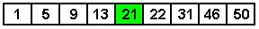

# Unit 4. Sorting, Searching and Complexity

## 4.1 Sorting and Searching 


With this module, the course introduces some of the basic concepts of sorting  and searching.

**Readings:**

- **Required:**

  | Weiss, chapter 9 and 20. |
  | ------------------------ |

  **Remark:**

  | Remember that this book supplements the course's online material. You will be  asked questions based on this material. |
  | ------------------------------------------------------------ |


- **Required:**

  | Schildt, chapters 33 through 37. Remark: Remember that this book serves as a  general reference to the C++ language, not a course textbook. Therefore, you  should browse through the assigned sections in order to get a sense of what they  have to offer and where and how they treat important topics. Do not study the  sections assigned in this book as you would assignments from a textbook: your  goal here should be familiarity, not mastery. |
  | ------------------------------------------------------------ |


### 4.1.1 Linear vs. Binary Search

- [Searching: A Common Task](#Searching: A Common Task) 
- [Linear Search](#Linear Search) 
- [Binary Search](#Binary Search) 

#### Searching: A Common Task

Searching for data is a common task found not just in computer science but  also in the real world. In the most basic sense, finding an element stored in a  vector is similar to searching for a person's name in a telephone book. In both  cases, we want to find one piece of data that exists somewhere in a larger set  of similar data. 

In both computer science and in the real world, the process involved in  searching differs depending on the arrangement of the data set being searched.  If a set is arranged in no particular order, the best search process we can use  is a simple pass through the set. This process involves examining every item in  the set until we find the item we are seeking. This is probably an adequate  solution for only small sets of data. Imagine looking for a specific card from a  completely shuffled deck of cards. With only fifty-two total cards in the deck,  a front-to-back pass through the deck is a valid approach to finding a specific  card. 

Larger sets of data require a more efficient searching approach. Imagine  trying to find a person's telephone number using a telephone book that lists  people in random order. Examining every listing during a front-to-back pass  through the book probably would take a few days. This is definitely not an  efficient approach, and is the reason why telephone book listings are  alphabetized. Leveraging our knowledge of how the telephone book arranges its  listings, we can perform a more efficient search. This search involves opening  the telephone book and comparing the listings on the page to the listing we are  seeking. If we are searching for "Doe, John", and the page we opened the book to  contains only listings for "Smith", we know we must flip to another page closer  to listings for "Doe". We continue this approach until we reach the page  containing our listing. This search probably only takes a minute to complete.  This is fast compared to the time that a front-to-back pass through the book  would take.

Both of these real world approaches to searching have computer-science  algorithm analogues. A front-to-back pass through a data set is known as a  linear search. A more formal variant of searching through the  telephone book is known as a binary search. 

#### Linear Search

A linear search is a simple search algorithm that finds an item by examining  a data set in order. A linear search is sometimes known as a sequential search.  In C++, we can implement a linear search as a for-loop using only a few lines of  code.

> ```c++
> // Finding an element in a vector using linear search
> template <class T>
> int linear_search(const vector<T>& v, const T& item) {
> 
>     for (int i = 0; i < v.size(); i++) {
>         if (v[i] == item) {
>             return i; // item found
>         }
>     }
>     return -1; // item not found
> }
> ```
>
> Listing 1 [Finding an element in a vector using a linear search](http://www.icarnegie.com/content/SSD/SSD5/2.1.1/normal/pg-sorting-searching-complexity/pg-sorting-searching/pg-linear-vs-binary/linear.cpp)

Besides the simplicity of its implementation, the main advantage of a linear  search is that it does not require sorted data. Even if the data contained in a  data set is stored in random order, a linear search still works as expected.  This is because a linear search makes no assumption on the arrangement of the  data. It simply examines every item in a data set until it finds the desired  item. 

The main disadvantage of a linear search is its suitability for only small  data sets. Remember, a linear search examines all items in a set until it finds  the item. In the best case, this happens when the first item examined by a  linear search is the item. In the worst case, the search terminates when the  last item is examined. In this situation, the search examines every item in the  data set. For a vector or array that contains several million elements, this  could take a considerable amount of time, especially if the search is repeated  many times. On average, a linear search examines half the items in a data  set.

The STL `find` function performs a linear search on a container.  This function accepts three arguments. The first two arguments are iterators  that specify a range to search. The third argument is the value that the  function attempts to find. This function returns an iterator to the first  position that contains the value sought. If the search is unsuccessful, the  `find` function returns an iterator equal to the second iterator. An  example usage of the `find` function appears in [find.cpp](http://www.icarnegie.com/content/SSD/SSD5/2.1.1/normal/pg-sorting-searching-complexity/pg-sorting-searching/pg-linear-vs-binary/find.cpp). This program populates a vector with the first  twenty-five Fibonacci numbers. It then allows the user to enter a number and  reports whether or not the number is one of those Fibonacci numbers.

#### Binary Search

A binary search is a fast search algorithm suitable for data sets of any  reasonable size encountered. Unlike a linear search, it is suitable even for  very large data sets because it eliminates large numbers of comparisons. A  binary search differs from a linear search in that it requires sorted data to  operate successfully. 

We can explore how a binary search operates by considering how it would find  an element in the following vector.

> 
> Figure 1 A vector containing nine elements 

Given the vector pictured in Figure 1, we can use a binary search to find the  element that contains the value `9`. All binary searches begin by  comparing the item being sought against the item in the middle of the data set.  In this example, the middle element contains the value `21`.

> 
> Figure 2 Selecting the middle element 

The value we are seeking is `9`. Since `9` is less than  `21`, we know that `9` must be stored in an element somewhere to  the left of the middle element. With this in mind, we can safely ignore the  right half of the vector and continue our search, only considering the left half  of the vector. Figure 3 demonstrates this partitioning of the vector. 

> 
> Figure 2 Partitioning the vector 

After we partition the vector, the middle element changes. We then compare  the value stored here to the value we seek. Since `5` is less than  `9`, we know that `9` must be stored in the right half of this  partition. We can then ignore the left half of this partition, and compare  against the midpoint of the right half. 

> 
> Figure 4 Partitioning the vector, again 

Figure 4 highlights the midpoint of the current vector partition in green.  The value stored here equals the value we seek so our search is complete. For  this vector, which contains nine elements, only three comparisons were needed to  find the element that stored the value `9`. Starting from the left side  of the vector, a linear search needs only three comparisons also to find the  element that stores the value `9`. The real advantage of binary search  appears when we consider larger data sets. The following table lists the maximum  number of comparisons a binary search algorithm has to make to find any element  in vectors of various sizes.

> | Size of vector | Max comparisons |
> | -------------- | --------------- |
> | 10             | 4               |
> | 100            | 7               |
> | 1,000          | 10              |
> | 10,000         | 13              |
> | 100,000        | 17              |
> | 1,000,000      | 20              |
> | 10,000,000     | 23              |
> | 100,000,000    | 27              |
> | 1,000,000,000  | 30              |
>
> Table 1 Maximum comparisons of binary search

### 4.1.2 Basic Sorting Algorithms

- [Sorting Overview](#Sorting Overview) 
- [Selection Sort](#Selection Sort) 

#### Sorting Overview

Many different basic sorting algorithms exist. Each of these algorithms has  unique characteristics, behaviors, and requirements. For example, for the same  set of data, one algorithm may perform far fewer comparisons than another  algorithm. Similarly, during execution another algorithm may swap the positions  of data items far less often than another algorithm. The behavior of some  algorithms differ when presented with data that is almost sorted as opposed to  data that is completely shuffled. It is the differences between the set of these  properties that make each sorting algorithm unique. These characteristics also  make an algorithm more or less applicable in certain situations.

Because professional programmers rarely use basic sorting algorithms, we  examine only one algorithm in this page. In page [4.1.3 Fast Sorting  Algorithms](), we examine a sorting algorithm that is typically faster than all  basic sorting algorithms. 

#### Selection Sort

Selection sort is a basic sorting algorithm that works by making iterations,  or passes, through the data being sorted. Each pass results in the placement of  one element into its correct location. As a result, each subsequent pass has to  inspect one fewer item than the previous pass.

> 
> Figure 1 An unsorted array 

Figure 1 contains an unsorted array. Since this array contains eight  elements, a selection sort must make seven passes to sort the data. Each pass  places one element into the position that will result in a sorted array. The  next two figures represent the first two passes, respectively. In each figure,  the filled arrow indicates the position that the pass is seeking to fill. During  each pass, the algorithm looks for the smallest remaining element. The pass ends  with the algorithm swapping the smallest element into the position under  consideration. 

> 
> Figure 2 The first pass 

After the first pass, the lowest element is placed into the first position of  the array. The next pass, illustrated by Figure 3, places the second lowest  element into the second position of the array.

> 
> Figure 3 The second pass 

The selection sort algorithm always makes one fewer passes than the number of  elements in the array. This is true even if the original array is already  sorted. The algorithm has no mechanism to detect when the array is sorted, so it  must make all required passes. A C++ implementation of the selection sort  appears in Listing 1. 

> ```c++
> // Sorting using selection sort
> template <class T>
> void selection_sort(vector<T>& v) {
> 
>     for (int i = 0; i < v.size() - 1; i++) {
>         int best = i;
>         for (int j = i + 1; j < v.size(); j++) {
>             if (v[j] < v[best]) {
>                 best = j;
>             }
>         }
> 
>         if (best != i) {
>             T temp = v[i];
>             v[i] = v[best];
>             v[best] = temp;
>         }
>     }
> }
> ```
>
> Listing 1 [Selection Sort](http://www.icarnegie.com/content/SSD/SSD5/2.1.1/normal/pg-sorting-searching-complexity/pg-sorting-searching/pg-basic-sort-algorithms/selection.cpp)

### 4.1.3 Fast Sorting Algorithms

- [Basic and Fast Sorting Algorithms](#Basic and Fast Sorting Algorithms) 
- [Quicksort](#Quicksort)
  - [The Algorithm](#The Algorithm) 
  - [An Implementation](#An Implementation) 
- [Using the STL Sorting Functions](#stl) 

#### Basic and Fast Sorting Algorithms

There exists a set of general-purpose sorting algorithms that typically  outperform the basic algorithms we examined in [4.1.2 Basic Sorting  Algorithms](#4.1.2 Basic Sorting  Algorithms). These "fast" sorting algorithms include mergesort, quicksort,  and Shellsort. Since quicksort is perhaps the most widely used of the  general-purpose sorting algorithms, we examine it here in detail. Chapter 9 of  the Weiss textbook discusses and presents implementations of  mergesort and Shellsort. 


#### Quicksort

##### The Algorithm

Quicksort is a fast sorting algorithm that uses a divide-and-conquer problem  solving approach. Unlike the basic sorting algorithms we have already examined,  quicksort uses recursion. Given an array of elements to sort, the algorithm  recursively divides the array into smaller and smaller arrays. Quicksort then  sorts these very small arrays and combines the results to create a sorted  version of the original array. Because of its recursive nature, the quicksort  implementation can be hard to understand. Before examining an implementation, we  consider the idea behind the algorithm.

The quicksort algorithm can be summarized in four basic steps. Presented in  the context of sorting an array, these steps are as follows.

> 1. If the size of the array is zero or one, then return the array. This is the  base case. 
> 2. Select an element from the array to be used as the pivot element. This is  the pivot selection step. 
> 3. Create two new arrays. Place all the elements from the original array that  are less than the pivot element into one of these sub-arrays and all the  elements that are greater than the pivot element into the other sub-array. This  is the partitioning step. 
> 4. Return the array that contains the result of the quicksorted sub-array that  contains the elements less than the pivot, followed by the pivot, followed by  the result of the quicksorted sub-array that contains the elements greater than  the pivot. This is the recursive divide step. 

Stepping through an example illustrates how these four steps sort a set of  data. Consider the array presented in Figure 1.

> 
> Figure 1 An unsorted array 

Since the array in Figure 1 contains more than one element, quicksort enters  step two and selects a pivot element. There are many different strategies we can  use to pick this pivot element. One that is simple involves choosing the middle  element of the array as the pivot element. This element contains the value  `33`. After selecting the pivot element, quicksort partitions the  remaining elements into two sub-arrays. One sub-array contains the elements of  the partitioned array whose values are less than `33`, and the other  sub-array contains the elements whose values are greater than `33`.  Figure 2 illustrates this first pivot and partition step. In this figure, a  circle denotes the pivot element. 

> 
> Figure 2 Pivot selection and partition 

The first partition creates two smaller arrays. The quicksort algorithm then  recursively calls itself on these arrays. Notice that both of these arrays  contain two or more elements. Therefore, the algorithm selects pivot elements  for each array and partitions their remaining elements into smaller arrays. The  result of this appears in Figure 3. 

> 
> Figure 3 Second level partitioning 

The quicksort algorithm only needs to select pivot elements and partition  sub-arrays that contain more than one element. From Figure 3, we see after two  partitions we are left with four sub-arrays. These arrays appear in the bottom  row of the figure. Starting from the left side of the figure, the first  sub-array contains only one element (the value `3`). The second sub-array  contains elements `12` and `21`, and the third sub-array contains  elements `52` and `53`. The fourth sub-array contains zero  elements. The empty set sign (a circle with a diagonal line through it) denotes  that this sub-array contains zero elements. The quicksort algorithm does not  need to pivot and partition the first and fourth arrays since they each contain  less than two elements. At this point, these two sub-arrays are sorted. Since  the second and third arrays each contain more than one element, there is the  possibility they are not in sorted order. Quicksort must recursively pivot and  partition these arrays. This is demonstrated in Figure 4. 

> 
> Figure 4 After last necessary partition 

The recursive nature of quicksort breaks down the original array into smaller  and smaller sub-arrays. The pivoting and partitioning of these sub-arrays  eventually results in the sorting of the entire array. Figure 5 depicts the  sorted version of the original array from our ongoing example.

> 
> Figure 5 The sorted array 

##### An Implementation

A quicksort implementation appears in Listing 1. This quicksort  implementation uses a basic pivot selection strategy of selecting the middle  element. This is a simple approach to implement, but one that can lead to  efficiency problems when the algorithm selects either the smallest or largest  value as the pivot. In these cases, the performance of the algorithm degrades  since the algorithm can only recursively quicksort one sub-array instead of two. 

> ```c++
> template <class T>
> void quick_sort(vector<T>& v, int low, int high) {
> 
>     // Do not solve recursively when faced with
>     // only 1 or 2 elements
>     if (low == high) {
>         return ;
>     }
>     else if (low + 1 == high) {
>         if (v[low] > v[high]) {
>             swap(v[low], v[high]);
>             return ;
>         }
>     }
> 
>     // select pivot
>     int middle = (low + high) / 2;
>     T pivot = v[middle];
>     swap(v[middle], v[high]);
> 
>     // partition
>     int i;
>     int j;
>     for (i = low, j = high - 1; ;) {
> 
>         while (v[i] < pivot && i < j) i++;
>         while (pivot < v[j] && i < j) j--;
> 
>         if (i < j) {
>             swap(v[i], v[j]);
>         }
>         else {
>             break;
>         }
>     }
> 
>     // place pivot in correct location
>     if (i != high - 1 && j != high - 1) {
>         swap( v[i], v[high]);
>     }
> 
>     // quicksort sub-vectors
>     if (i == low && j == low) {
>         quick_sort(v, low + 1, high);
>     }
>     else if (i == high - 1 && j == high - 1) {
>         quick_sort(v, low, high - 1);
>     }
>     else {
>         quick_sort(v, low, i - 1);
>         quick_sort(v, i + 1, high);
>     }
> 
> }
> ```
>
> Listing 1

### 4.1.4 Using Hash Tables

- [Overview of Hash Tables](#Overview of Hash Tables) 
- [Hash Functions](#Hash Functions) 
- [Memorizing: An Application of Hash Tables](#Memorizing: An Application of Hash Tables) 
- [A Hash Table Implementation](#A Hash Table Implementation) 

#### Overview of Hash Tables

A hash table is a data structure that supports very fast element  insertion, removal, and retrieval. A hash table that is properly configured for  the elements it contains can support these operations in a fixed amount of time.  This is unlike any other data structures and algorithms that we have  examined.

A hash table is a type of map. Maps are associative structures.  Conceptually, associative data structures store data in key-value pairs. This  means that for every value stored there is a corresponding key used to access  the value. A real world example of an associative data structure is a  dictionary. In a dictionary, data is stored in key-value pairs. The keys are the  words, and the values are the definitions. To access a definition, one must use  the corresponding key. 

Hash maps and hash sets are two different types of hash tables. Hash maps are  associative structures that store key-value pairs, whereas hash sets are  structures that keep track of the membership of items within a collection. Hash  sets do not map keys to values. They merely store a collection of keys. A list  of commonly misspelled words, for instance, could be stored using a hash set. In  this example, there is no mapping of a key to a value like there was in the  dictionary example. Each word serves as only a key. A hash set is then used to  report whether or not a word exists in this list of words.

#### Hash Functions

Operations using hash tables are efficient because the position of a stored  value can be calculated using the key. Hash tables are implemented typically as  an array of values. A hash function is used to map a key to an index  within this array. This index is where the key's corresponding value is stored.  Other search algorithms, such as a linear or binary search, cannot map a key to  its value's position as quickly as hash tables. These algorithms must perform  more comparisons to find the index of the stored value. The time this search  takes to complete increases as the number of stored items increases. 

> 
> Figure 1 A sample hash function 

A mapping of keys to indexes is demonstrated in Figure 1. In this figure, the  hash function generates an index based on the rightmost digit of the ASCII value  of the second letter of the person's last name. For example, in the name  "Hanson, Bob", the second letter is an "a". The ASCII value of "a" is  `97`. The rightmost digit of `97` is `7`. Therefore, the  record for "Hanson, Bob" is stored at index `7` of the hash table.

> 
> Figure 3 A sample hash table 

The hash table in Figure 2 shows each name in its mapped position. The  advantage of a hash table is that to find an entry, one only has to apply the  hash function to the key. 

A popular method used in implementing a hash function is the division  method. Like all hash functions, the division method maps a key to an  index within the hash table. The division method implementation involves the  conversion of a key to a variable of type `unsigned int`. Then, this  value is divided by the size of the hash table. The remainder of this division  is used as the index.

> ```c++
> class hash_function {
> 
> public:
> 
>     unsigned int mm;
> 
>     hash_function(unsigned int m = 6151)
>             : mm(m) {}
> 
>     unsigned int operator()(const string& s) const {
>         unsigned int res = 0;
>         for (int i = 0; i < s.size(); i++) {
>             res = res * mm + s[i];
>         }
>         return res;
>     }
> };
> ```
>
> Listing 1 A hash function based on the division  method

A problem arises when we consider that there are typically many more keys  than there are locations within a hash table. This means that a hash function  can potentially map two or more distinct keys to the same index. Consider if we  tried to add the name "Anderson, Jeff" to the hash table pictured in Figure 2.  Applying the hash function yields an index of `0`. The name "Adderly,  Maria", however, already exists at index `0`. When a hash function maps  more than one key to the same index a collision occurs. 

Hash table implementations are complicated by the fact that they must handle  potential collisions. These mechanisms to handle collisions are discussed in  detail in chapter 20 of the Weiss textbook. Basically, collisions  decrease the performance of hash table operations. The best way to reduce the  number of collisions, and thus increase the efficiency of a hash table, is to  use a good hash function. A good hash function evenly distributes the mapping of  keys throughout the positions in the hash table.

It is good software engineering practice to separate the hash function from  the implementation of the hash table. This allows a programmer to customize a  hash function to the data stored by a particular instance of a hash table.  Listing 1 defines a hash table as a class that overloads operator  `()`. 

#### Memorizing: An Application of Hash Tables

When  it is computationally expensive to calculate a function value `y =  f(x)`, it may be a good idea to store the value for future use. In other  words, we calculate `f(x)` only the first time the function value on  this particular input `x` is required, and then store `( x, f(x)  )` in a hash table. Any future requests for `f(x)` will then  result in a table lookup and be much faster than a recalculation. This technique  is called memoizing. 

Note that we have to modify the function a bit to take advantage of the  stored values. Here is the structure of a memoized function.

> ```
> int  f_memo(int  x)  {
> 
>   if ( there is an entry (x,y) in hash table )  {
>     return  y;
>   }
>   else  {
>     compute  y = f(x)  directly
>     store  (x,y)  in table
>     return  y;
>   }
> }
> ```
>
> Example 1  A typical memorized function

Since the hash table has to persist between function calls, it would be  natural to organize this as a class that overloads operator `()`. 

### A Hash Table Implementation

The following header file and implementation file declares and defines a  template hash map class. The class takes four template parameters. The first is  the key type and the second is the value type. The third parameter specifies the  hash function and the fourth parameter specifies how to compare two objects of  the key's data type.

- `hashmap.h` - declaration of class  `HashMap` 
- `hashmap.cpp` - definition of class  `HashMap` 

The return type of the `search` member function of class  `HashMap` is an STL class that we have not yet encountered. Function  `search` returns an object of type `pair`. Class  `pair` is an STL class that contains two data members. These members  are named `first` and `second`. This class is used often  by functions that need to return more than one piece of data. The search member  function needs to return whether or not the item was found and what position it  was found in. Thus, function `search` returns an object of type class  `pair<bool, int>`. 

The file `hash-driver.cpp` demonstrates use of class  `HashMap` and its member functions.

## 4.2 Complexity 


This page introduces complexity. Complexity is the measure of an  algorithm's use of some resource. This resource can be storage requirements,  memory requirements, or time requirements. Typically, the amount of time an  algorithm takes to complete is the resource most often encountered in the  context of complexity.

**Readings:**

- **Required:**

  | Weiss, chapter 6. |
  | ----------------- |

  **Remark:**

  | Remember that this book supplements the course's online material. You will be  asked questions based on this material. |
  | ------------------------------------------------------------ |

- **Required:**

  | Schildt, chapters 33 through 37. Remark: Remember that this book serves as a  general reference to the C++ language, not a course textbook. Therefore, you  should browse through the assigned sections in order to get a sense of what they  have to offer and where and how they treat important topics. Do not study the  sections assigned in this book as you would assignments from a textbook: your  goal here should be familiarity, not mastery. |
  | ------------------------------------------------------------ |

## 4.2.1 Asymptotic Analysis

- [Physical vs. Logical Running Time](#Physical vs. Logical Running Time) 
- [Determining the Logical Running Time](#Determining the Logical Running Time) 
- [Big-Oh Notation](#Big-Oh Notation) 
- [Basic Rules](#Basic Rules) 

### Physical vs. Logical Running Time

Asymptotic analysis is the determination of the amount of resources used by  an algorithm. Usually, this resource is the running time of the algorithm. The  running time of a program is above all a physical quantity. In principle, we can  use a stopwatch and determine how long the program takes to execute. In fact,  all computer systems support an internal clock, and one can measure the running  time even without resorting to an external timing device. 

The first thing to note is that running time is not a fixed quantity; rather,  the running time in almost all programs depends on the particular input given to  the program. For example, a sorting algorithm will obviously take longer on a  list of one million numbers than on a list of one hundred numbers. Hence, we  really need to express running time as a function of input. This is much too  tedious, and in practice, it is quite impossible to describe the running time of  a program for all conceivable inputs. As the example of sorting algorithms  shows, one can lump together a whole class of inputs, such as a list of a given  length. Note also, though, that a sorting algorithm may behave quite differently  when presented with an already sorted list, a reverse sorted list, or a random  list. The running times may differ quite drastically. Nonetheless, it is  customary to refer to the running time of a program on input of size  `n`, meaning the worst possible running time for all such inputs.  This measure is called worst case complexity. Alternatively, one can  analyze the average amount of time it takes to process input of a certain size,  which is called the average case complexity. Unfortunately, the  latter is much harder to deal with than the former, so we will focus on worst  case complexity. 

Another problem with measuring running time is that it obviously depends very  much on the machine used to execute the program. Additionally, it depends on the  compiler used, the level of optimization, the load of the computer, and so on.  In order to avoid these numerous complications, one uses a different measure:  logical running time, which is the number of steps in the execution  of the algorithm. By "one step," we mean essentially one CPU cycle. Assignments  of built-in types, arithmetic operations, logical tests, and so on can all be  performed in "one step." Filling an array with zeros, on the other hand, will  take as many steps as the size of the array.

Counting the number of steps produces a good and helpful measure of running  time. Nonetheless, if an algorithm is to be executed on a specific computer, it  is still necessary to perform measurements of the physical running time in a few  cases. In conjunction with the theoretical analysis, one can then predict the  real running time on arbitrary inputs fairly accurately. 

### Determining the Logical Running Time

As one might imagine, counting the number of steps is a daunting task in all  but the most simple-minded programs. It is important to ignore small details and  look at the large-scale behavior. As an example, consider the selection sort  algorithm. 

Setting up the local variables takes a small, constant number of steps. The  body of the outer loop is executed `v.size() - 1` times, where  `v.size()` is the number of vector elements. The number of steps  performed by the inner loop decreases with each iteration of the outer loop. For  the sake of this discussion, we will let n equal the number of  elements in the vector. During its first execution, the inner loop iterates  `(n - 1)` times. During its second execution (when i  equals `1`), the inner loop iterates `(n - 2)` times. The body  of this inner loop contains a single if-statement. This statement can be  executed in a constant amount of time. Hence, we have the following sum that  represents the number of operations performed by selection sort. Each term in  this sum represents the number of steps performed by each iteration of the outer  loop. 

> `(n - 1) + (n - 2) + (n - 3) + ... + 3 + 2 + 1`
>
> Example 1The number of steps performed by selection  sort

The sum of this expression equals `(n2 - n) / 2`. We  summarize this result by saying that selection sort is a quadratic  algorithm. Note that quadratic means that a doubling in input size will  result in a four-fold increase in running time. A ten times larger input will  take a hundred times longer to process. In other words, quadratic algorithms do  not scale up very well to large inputs.

The opposite of quadratic algorithms are logarithmic algorithms. In  logarithmic algorithms, the number of steps required to solve a problem does not  increase significantly even when the number of inputs increases dramatically.  One example of a logarithmic algorithm is a binary search. In a binary search,  the items to search (the input) are halved during each iteration. This allows a  binary search to work very well even on very large data sets.

### Big-Oh Notation

Big-Oh notation provides a good way to compare the running time of  algorithms. In asymptotic analysis, we use Big-Oh notation to refer to the  highest order, or most dominant term from a function's runtime analysis. 

The most important property of Big-Oh notation is that it allows one to  ignore lower order terms and constants, as in the following example.

> ```
> 500n3 + 10n2 + 17n + 121345 = O(n3)
> ```
>
> Example 2  Using Big-Oh notation

In the above example, the highest order term in the runtime equation is  `500n3`. As we did the lower order terms, we can also  ignore the constant in this term and state that the running time is  *O(n3)*.

Most algorithms one encounters fall into one of the following classes.

- *O(1)* – constant time 
- *O(log(n))* – logarithmic time 
- *O(n)* – linear time 
- *O(n log(n))* – "n-log-n" time 
- *O(n2)* – quadratic time 
- *O(n3)* – cubic time 
- *O(2n)* – exponential time 

Algorithms that have running time up to *O( n log(n))* scale very well  to large problem instances. Quadratic algorithms and cubic algorithms even more  so, show severely degraded performance when the input becomes large. Lastly,  exponential algorithms can be used only on very small inputs. 

It is important to express logical running time in terms of physical time,  using familiar units such as seconds, minutes, hours, and so forth to get a feel  for what these characterizations really mean. First, let's consider an *O(n  log(n))* algorithm that takes 1 second on an input of size 1000. 

> | input size | running time |
> | ---------- | ------------ |
> | 1000       | 1 second     |
> | 2000       | 2.2 seconds  |
> | 5000       | 6.2 seconds  |
> | 10000      | 13.3 seconds |
> | 100000     | 2.77 minutes |
> | 106        | 33.3 minutes |
> | 107        | 6.48 hours   |
>
> Table 1
>
> An *O(n log(n))* algorithm that takes 1  second on an input of size 1000

By comparison, here is a quadratic algorithm that also takes 1 second on an  input of size 1000. 

> | input size | running time |
> | ---------- | ------------ |
> | 1000       | 1 second     |
> | 2000       | 4 seconds    |
> | 5000       | 25 seconds   |
> | 10000      | 1.66 minutes |
> | 100000     | 2.77 hours   |
> | 106        | 11.5 days    |
> | 107        | 3.25 years   |
>
> Table 2
>
> An *O(n2)* algorithm that takes  1 second on an input of size 1000

For very large inputs of size ten million, the quadratic algorithm becomes  entirely useless. Even for one million, it may be useless: suppose it is part of  some bank accounting system that needs to be updated on a daily basis. On the  other hand, quadratic performance is superb when compared with exponential  running time. To see how really catastrophic exponential running time is,  suppose that an exponential algorithm takes 1 second on input of size 10. We  then can expect approximately the following running times for larger instances. 

> | input size | running time    |
> | ---------- | --------------- |
> | 10         | 1 seconds       |
> | 15         | 32 seconds      |
> | 20         | 17.1 minutes    |
> | 25         | 9.1 hours       |
> | 30         | 12.1 days       |
> | 35         | 1.09 years      |
> | 40         | 34.9 years      |
> | 50         | 35700 years     |
> | 100        | 4.02 1019 years |
>
> Table 3
>
> An *O(2n)* algorithm that takes  1 second on an input of size 1000

The last figure greatly exceeds the age of the universe (about 15 x  109 years), and the algorithm is already useless at inputs of size  30. We only have acceptable performance up to size 25 or so. Thus, in some  sense, an exponential algorithm is almost as bad as no algorithm at all. 

Unfortunately, there are some famous computational problems that seem to  require exponential running times. Finding out whether a Boolean circuit with  `n` inputs can ever yield true as output is one of them: there are  2n possible input combinations, and no shortcuts are known to  simplify the computation. In practice, one often has to deal with circuits of  several hundred inputs. 

### Basic Rules

How does one determine the asymptotic running time of an algorithm? Since we  ignore constants, any sequence of basic statements, such as 1) assignments of  built-in types or 2) operations on built-in types (addition, multiplication,  comparison, increment, decrement, Boolean operations, etc.), takes constant time  (*O(1)*). 

Note, though, that function calls have to be accounted for separately. First,  there is the cost of organizing the function call. If only reference parameters  are used, that cost is *O(1)*. But, if call-by-value is used, we have to  count the cost of copying the input. The same comment applies to returning the  result of the computation. And, of course, we have to count the evaluation of  the function body. 

A for-loop takes time *t(0) + t(1) + ... + t(n-1)* where  *t(k)* is the time needed by the body of the loop when `i`  equals *k*, in other words, the time needed to complete iteration *k*  of the for-loop.

> ```
> for (int  i = 0; i < n; ++i)  { 
>   body
> }
> ```
>
> Example 3   A for-loop

If the body takes time *O(1)*, that comes out to *O(n)*. But, if  the body takes time *O(i)*, we get *O(n2)* for the whole  loop. Lastly, if the body takes time *O(i2)*, we get  *O(n3)* for the whole loop.

Other loop constructs can be handled the same way. Add up the cost of each  single execution of the loop body, taking into account that that cost may well  depend on the values of some loop parameters.