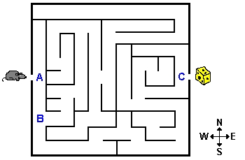
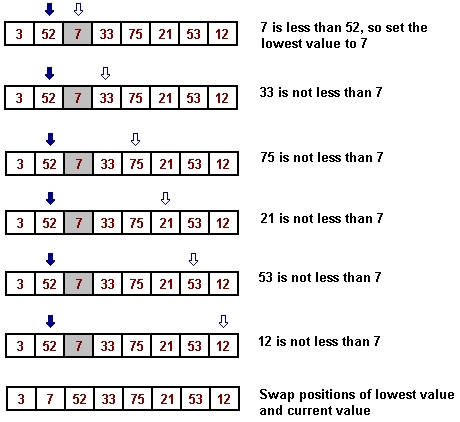

# Unit 1. Transitioning to C++

## 1.1 C++ Introduced 


This module of the course introduces the C++ programming language. An  overview of the key features of C++ follows a discussion of its history and  development as a programming language. This module also demonstrates compilation  and execution of a simple C++ program. 

**Readings:**

- **Required:**

  | Schildt, chapter 11. **Remark:** Remember that this book serves as a general  reference to the C++ language, not a course textbook. Therefore, you should  browse through the assigned sections in order to get a sense of what they have  to offer and where and how they treat important topics. Do not study the  sections assigned in this book as you would assignments from a textbook: your  goal here should be familiarity, not mastery. |
  | ------------------------------------------------------------ |

### 1.1.1 C++ Background

- [History](#History) 
- [Key Features](#key-features) 

#### History

C++ is a modern object-oriented programming language that supports many of  the same features as Java, including classes, inheritance, polymorphism, and  exceptions. As you know and will continue to learn, these features are excellent  tools for creating and maintaining large software systems. Together they allow  the software's design to follow the shape of the problem closely, which reduces  the amount of code that needs to be written while at the same time maximizing  the readability of the code. 

C++ isn't an entirely new language. It is based on the C programming  language. C was designed to be a small, simple language, which programmers could  use to produce very fast code. C++ adds to C many of the Java-like features such  as classes and inheritance. In doing so, C++ became a much larger language than  C, but one better suited for large-scale projects. Because C++ compilers can  compile C programs, C++ gained rapid acceptance in the market. Today, there are  literally millions of lines of C++ code in use by a wide variety of software  applications. 

For those interested in the timeline, C was first invented in 1970. The  language became an ANSI standard in 1980. The first book about ANSI C was  published in 1983. C++, originally called "C with Classes," debuted in 1983. The  name C++ was coined in 1983. The first C++ book was published in 1985. The Java  programming language, in development for several years, debuted in 1995. The C++  language became an ISO standard in 1998. 

> 
>
> `Figure 1`   `History of C, C++, and Java`

#### Key Features

Here is a list of some of the key features of C++. 

- C++ is strongly typed. This simply means that every object must  belong to a certain type and that operations such as assignment or comparison  are only permitted between objects of the same type. 

  

- C++ has the concept of a class, a type of record that combines  data members and the functions that operate on the data. Ignoring various minor  differences, classes in C++ are very similar to classes in Java.  

  

- C++ supports parameterized types, or templates. Templates make it  possible to define, say, a single vector class that works for Booleans,  characters, integers, reals, and so on. This can be done in Java by  leveraging inheritance. For instance, a vector of type  `java.lang.Object` can operate on other types since all classes  eventually inherit from `java.lang.Object`. This Java  approach, however, sacrifices static type checking. The real advantage of C++  templates is that their use does not prohibit the compiler from performing  static, or compile-time, type checking. 

  

- Similar to Java, C++ supports inheritance, a  mechanism that makes it possible to build new classes (called derived  classes) on top of an existing class (called the base class)  without having to reiterate the base class design for each new class. 

  

- C++ supports polymorphism. In C++, polymorphism is achieved  through the use of virtual functions and pointer variables. Together  with inheritance, this turns C++ into a full-fledged object-oriented language.  

  

- C++ comes with two libraries known as the Standard Library and  the Standard Template Library (STL)—both of which extend the  capabilities of the base language. The Standard Library supplies all the old C  libraries as well as new input and output facilities. The STL provides a library  of container types (types that hold or "contain" collections of  objects) as well as a set of attendant algorithms (which are  general-purpose algorithms for common data structures). That is, the STL  supplements the built-in types of C++ with vectors, linked lists, and other  useful types. 

  

- C++ has a very large user base. From all over the world, public and private  companies, government agencies, academics, and hobbyists use C++ in all types of  interesting ways and applications. A major benefit of this large user base is  the wide availability of different tools, libraries, and tutorials, all related  to some aspect of the language. 

### 1.1.2 Compiling and Running a C++ Program

- [Hello World!](#hello-world) 
- [Phases of C++ Program Development](#Phases of C++ Program Development)
  - Edit
  - Preprocess
  - Compile
  - Link
  - Execute
- [Compiling and Running in  Cygwin](#Compiling and Running in  Cygwin) 

#### **Hello World!**

To get an idea of what a C++ program looks like, we can look at a very simple  example. The Hello World! example remains a popular first program  when learning any programming language. What follows is a C++ implementation of  Hello World!

```c++
#include <iostream>
#include <cstdlib>

using namespace std;

int main(int argc, char* argv[]) {

    // Say hello.
    cout << "Hello World!" << endl;

    /* indicate normal termination */
    return EXIT_SUCCESS;
}
```

It is important to notice that C++ source code resembles Java source code.  Many of the keywords in the above listing (`int`, `void`,  `return`) have similar meanings in Java. In C++, as in  Java, a semi-colon is used to terminate the end of a line of code.  Also, curly braces define the beginning and ending of functions much the same  way in Java. 

Source code comments look the same in C++. Actually, in the above listing, we  can see two different types of C++ comments in use. The first, in line 8, uses  the double slash style of comment. In line 11, we see a second style that allows  a comment to span multiple lines. C++ and Java share many other  similarities. In summary, we can say that C++ and Java have similar  syntax. The syntax of a programming language describes the words and  symbols that are important to a programming language. Syntax also describes how  programmers can arrange these words and symbols to achieve some higher-level  meaning. The syntax of C++ and Java Variable declaration and  initialization, operators, control structures, and function declaration are  areas where C++ and Java share other similarities in syntax.

#### Phases of C++ Program Development

C++ programmers must perform five steps, *edit*, *preprocess*,  *compile*, *link*, and *execute*, to produce an executing  copy of a program. 

**Edit**

The first step involved in taking a program from source to execution is the  creation of a file that contains the source code. The program that is used to  create a source code file is called an editor. Editors that  programmers use range from simple and generic text editors (such as  Notepad in Windows or vi in UNIX) to sophisticated  editors that typically come as part of Integrated Development Environments  (IDEs). These sophisticated editors are quite powerful since they provide  functionality that is geared towards the creation and maintenance of source  code. The syntax coloring in Listing 1 is one example of the type of  functionality that sophisticated editors provide.

**Preprocess**

Preprocessing involves the modification of C++ source code files prior to  compilation. The first two lines from Listing 1 contain commands called  *preprocessor directives*, which inform the *preprocessor* to  perform some action. In Listing 1, the first two lines instruct the preprocessor  to include the contents of files into the program source code. Preprocessing  also involves the text substitution of *macros*. A more detailed  discussion of the preprocessor can be found in [1.3.4 The  Preprocessor]().

**Compile**

Preprocessing usually is performed automatically, just before the compile  step. Compiling is a complex process that converts the preprocessed source code  into *object code*. Part of the compile process involves verifying that  the syntax of the source code is valid. Often, when a program is compiled  (especially the first time it is compiled), something is wrong with the syntax.  This is referred to as a "compile error." When faced with a compile error, a  programmer must return to the first step of this process and edit the source  code to remove the error.

The software tool used to compile source code, not surprisingly, is known as  a *compiler*. An example of a C++ compiler is the GNU Compiler  Collection, or GCC. The GNU Compiler Collection actually compiles many different  programming languages, one of which is C++. GCC is also free software. This  compiler can be obtained through the Cygwin environment.

**Link**

Linking is a step that is typically performed by the same tool that compiles  a program. The linking process involves combining the object code produced by  the compiler with other precompiled library code. The result of the operation of  the linker is an executable image. This executable image is a file that contains  the compiled and linked object code of the program, stored in persistent storage  (the hard drive). 

**Execute**

After the program source code has been edited, preprocessed, compiled, and  linked into an executable image, the program is ready to be executed, or run.  Errors encountered at this point are known as "runtime errors," and are  typically more difficult to correct than compile errors, since they may involve  problems in the logic of the program. 

#### Compiling and Running in  Cygwin

Quite often, however, the steps preprocess, compile, and link are often  informally grouped together and referred to as "compiling." It is easy to see  why this is done when we consider that the tools that programmers use often  perform these groups of related tasks together. For example, using GCC through  Cygwin, we can preprocess, compile, and link all in one step. The following  command line assumes the source code file is named hello.cpp.

> `$ g++  hello.cpp`
>
> Example 1 Compiling hello.cpp 

As a result of the execution of the above command, the source-code file  hello.cpp will first be preprocessed, then compiled, and then  linked to produce an executable image named a.exe. The default  filename a.exe can be overridden using the -o compiler  option. 

> `$ g++ hello.cpp -o  hello.exe`
>
> Example 2 Overriding the default output file name 

Additional options (-ansi and -pedantic) inform the  compiler that it should only compile programs that are [ANSI](http://www.ansi.org/) C++ compliant and that it  should issue warnings when it encounters code that violates the [ANSI](http://www.ansi.org/) standard. Using these  options helps to locate and prevent certain types of errors. 

> `$ g++ -ansi -pedantic  hello.cpp -o hello.exe`
>
> Example 3 Conforming to the ANSI standard 

We can run the program now that it has been compiled into an executable. From  the command shell, we issue the following command:

> `$  ./hello.exe`
>
> Example 4 Running the compiled program 

The dot and slash preceding the filename may not be necessary. It simply  instructs the command shell to look for the file hello.exe in the  current directory. The following screen shot depicts the results of the  compilation and execution of the program.

> 
>
> `Figure 1 After compilation and execution` 

The compiling and linking of programs that consist of many files can be  simplified using a makefile. A makefile is a text file that defines  the relationships and dependencies between the files that are used to create a  project. The main advantage of using a makefile is that they allow a programmer  to compile only those source code files that have changed since the last  compile. This can be very time saving when working with projects that consist of  many source code files. Understanding the syntax and rules available in  makefiles is beyond the scope of this course. It is important, though, to know  that once a makefile is defined, the utility make is used to build  the project associated with the makefile. From a command-line prompt, a  programmer issues the command make to build the makefile in the  current directory. As an example, you can use this `Makefile` to build the `Hello  World!` project. 


## 1.2 Data Structures and Algorithms in C++ 


With this module, the course introduces some of the basic concepts of data  structures and algorithms. 

### 1.2.1 What are Data Structures and Algorithms?

- [Data Structures](#Data Structures) 
- [Algorithms](#algorithms) 

#### Data Structures

In just about every aspect of today's modern world, we encounter information  in all shapes and sizes. The amount of information we encounter is sometimes so  large that without an effective method of storage and representation, the  information is rendered useless. Think of all the books contained in your local  library. Without the storage system implemented by the librarians, it would be  virtually impossible to find a specific book. 

Even when faced with just a small amount of information, a structured  representation can prove to be invaluable. For instance, think of the problems  that could arise if people did not stand in line while waiting to purchase  tickets at a movie theater. The line prevents the people waiting from just  standing around arguing over whose turn is next. In a sense, the line serves as  a way to store information.

A data structure, in the simplest terms, is a structured  representation of information. Both the system used to store books in the  library and the line of people at the movie theater are real world instances of  data structures. Considering a larger context, data structures  typically represent, or store, data to facilitate solving some problem. In the  library example, the problem that the data structure helps solve is locating a  specific book. At the movie theater, people wait in a line so it is easy to  determine whose turn is next.

A data structure can be composed of simple pieces of data. Consider your  address as a data structure. There are several items in this data structure, all  of which are simple pieces of data. First, there is the street address, which is  usually a number followed by a street name. Add to that the city name, the state  or province abbreviation, and the postal code, and you have a very useful data  structure composed simply of numbers and words.

Data structures can also be complex in that they can contain other data  structures. For example, a library contains many bookcases, which in turn  contain many books. Sitting on the shelf of one of these bookcases could be a  cardboard box that also contains a few books. In this example, the bookcase is a  data structure composed of books and boxes of books. The boxes are also data  structures, since they store books as well. Here we have a data structure (a  bookcase) that is composed of another data structure (a box). Both data  structures provide a way to store information (the books) to help solve some  problem (finding a specific book). A filing cabinet full of folders of papers is  another good example of how data structures can be composed of other data  structures. In this case, the cabinet as a whole is a data structure. The  cabinet is composed of cabinet drawers, which are composed of folders, which are  composed of files. 

> 
> `Figure 1 A filing cabinet as a data structure` 

#### Algorithms

In addition to having a data structure that represents information, some  sequence of actions, or series of steps, needs to be taken to solve a problem.  The series of steps that manipulate and uses a data structure to solve a problem  is called an algorithm. Let's think back to the example of the line  at the movie theater. Here, the problem at hand is the management of a group of  people waiting to buy tickets. The data structure is a line of people. The  algorithm involves removing a person from the beginning of the line (until the  line is empty) when the ticket cashier becomes available. 

> 1. Wait for the cashier to become available. 
> 2. Remove the customer that is at the beginning of the line. 
> 3. Let the cashier help this removed customer. 
> 4. Go to step 1. 

The steps contained in an algorithm are performed in a mechanical fashion.  From the example above, first we do step 1, then we do step 2, then we do step  3, then we repeat with step 1. Algorithms can involve this type of repetition,  and they can also involve simple branching or decision making (if "this," then  do "that"). Since computers can perform these tasks very rapidly, it should be  no surprise that algorithms play such a prominent role in computers and computer  science.

A recipe for baking a cake is another good example of an algorithm. In a  recipe for a cake there clearly defined steps that are followed. First, the oven  has to be preheated. Then we have to mix the ingredients. The cake batter is  then poured into a pan, which is then placed into the oven, and so on. The  algorithm involved in baking a cake has clearly defined inputs (the ingredients)  and a clearly defined output (the cake). 

### 1.2.2 Problem Solving with Data Structures and Algorithms

- [Multiple Solutions](#multiple-solutions) 
- [Multiple Representations](#multiple-representations) 
- [Refining the Representation](#Refining the Representation) 
- [Decomposing the Representation](#Decomposing the Representation) 

#### Multiple Solutions

One of the prevailing questions we address in this course is how do we use  data structures and algorithms to solve problems? With so many different types  of problems, and so many different possible representations and algorithms,  finding a solution for a problem may seem like a daunting task. One fact that is  on our side is that typically there is not just one solution for any given  problem. Often there are many solutions to a problem, each with advantages and  disadvantages. Sometimes enough solutions exist that the real problem is  determining which approach to take based on these trade-offs. 

A library contains an example of multiple approaches to solving a problem,  and the advantages and disadvantages of each approach. Here we are faced with  the problem of storing a large number of books in a way that allows users of the  library to find specific books easily. 

One solution to this problem involves using a hierarchical system to store  together books on related topics. For example, this approach stores all books on  "Politics" together. It further separates and groups books into sub-topics of  "Politics." One shelf would contain the books on "History of Politics" while  another shelf would contain the books on "Modern Politics." The representation  continues to group the books into more detailed categories. Perhaps it divides  the books in "History of Politics" into "History of Spanish Politics," "History  of Brazilian Politics," "History of Italian Politics," and so on. The algorithm  to find a specific book involves a person walking first to the "Politics"  bookshelf, then to the "History of Politics" shelf, and so on until they find  the book they seek. 

Another representation involves storing books alphabetically by author. In  this system, perhaps only top-level categories exist. Within these categories,  the representation arranges books alphabetically by the name of the book's  author. When we find the book we are looking for in this system, we would also  find all the books written by the same author next to our book on the same  shelf. After we found a book using the first representation, we would find the  other books on the same specific topic, and not the books written by the same  author. This difference could be an advantage or disadvantage, depending on the  reason for locating the book in the first place. For instance, when researching  a specific topic it would be helpful to see all the other books on the  topic.

#### Multiple Representations

We can sometimes solve two (or more) very different looking problems using  the same data structure and algorithm. Consider the list of the following  problems and corresponding solutions: 

> | Problem                                             | Solution                                               |
> | --------------------------------------------------- | ------------------------------------------------------ |
> | Remembering which groceries to buy                  | A grocery **list**                                     |
> | Tracking inventory by category and sub-category     | A category **list** of sub-categories                  |
> | Grading students over an entire semester            | A **list** of students each with a **list** of  grades |
> | Managing your work tasks                            | A **list** of tasks and priorities                     |
> | Performing the pre-flight procedure for an airplane | A check-**list**                                       |
>
> `Table 1 Different problems with similar  solutions`

Each of the problems in the table above essentially is solved using some type  of list to represent the data. The algorithms involved in solving the problems  may vary slightly, but essentially the algorithm traverses each list and  performs some action (updating a grade, marking an item as complete). 

#### Refining the Representation

The refinement of an initial representation can often lead to a more elegant  solution. Consider the problem of garbage removal from an office building. We'll  add a restriction that recyclable materials (we will just consider paper) must  be separated from the non-recyclable garbage.

One way to represent the problem is to simply provide a "recycle" dumpster  and a garbage dumpster outside the building. The algorithm to solve the problem  involves each employee carrying their garbage (with their hands!) outside to  these dumpsters, where they then separate the paper from the rest of the  garbage. This works, and it solves the problem, but it would probably lead to  unhappy employees who will grow tired of the tedious process of walking outside  and back each time they want to throw something away. We can optimize our  representation slightly by placing trashcans on each floor of the office  building. The algorithm for this representation requires each employee to carry  their garbage and paper to the trashcan on their floor. Then, at the end of the  day, someone carries the trashcans from each floor to the dumpsters outside,  where they separate the paper from the garbage. This again solves the problem,  and it probably will make the employees happier, but it still requires employees  to carry their garbage to a central trashcan. It also is a lot of work for the  person who has to empty and sort all the floor trashcans. Let's refine the  representation even further by placing trashcans in each office. We'll also add  wheels to the trashcans that reside on each floor. Now, each employee throws  their garbage and paper into their own office trashcan and at the end of the  day, one person wheels the floor trashcan from office to office, emptying the  office trashcans. They then separate this garbage outside into the two  dumpsters. We've reached an improved solution, but one that still involves a  good deal of sorting and separating of the garbage and recyclable paper. 

What if we optimized by placing, in addition to the garbage can, a recycle  basket in each office? We will also attach a recycling basket to the trashcan on  wheels. This basket collects the paper thrown into the office recycle baskets.  In this representation, each employee throws their unneeded paper into their  recycle basket and their garbage into their garbage can. At the end of the day,  one person walks around each floor with the trashcan on wheels, emptying both  the garbage can and the recycle basket from each office. They then empty the can  and the basket into the appropriate dumpsters outside. This solution keeps the  employees happy, and reduces the work of the person who takes the garbage and  paper outside. Actually, this refined representation eliminates the separating  of garbage altogether. This is really an optimal solution! 

#### Decomposing the Representation

After a representation of a problem has been established, the next step that  can be taken involves identifying the key entities, or objects, that make up the  representation. Just as important as identifying these objects, we will try to  understand the relationship between these objects. This process of identifying  objects and relationships is known as decomposition. Decomposition,  in the basic sense, involves the "breaking down" of a problem representation  into its core components. 

Looking back at our refined representation of the garbage collection problem,  let's try to identify some of the key objects. There are definitely a lot of  office garbage cans and recycle baskets, since every office has one of each. We  also have two cans on wheels for each floor (one for regular garbage, and one  for recyclable paper), and a recycle dumpster and a trash dumpster outside the  office building. Listing these objects, we can see we basically have different  types of things that store garbage.

- outside garbage bin 
- outside recycle bin 
- garbage can on wheels 
- attached recycle basket 
- office garbage can 
- office recycle basket 

All of these objects are just bins of some sort since they essentially store  materials. A bin that stores garbage is just a specific type of a bin. Likewise,  a bin that stores recyclable paper is another type of bin (even though we call  it a "basket"). From our list above, we can get more specific with the types of  bins that our representation uses:

- GarbageBin is a type of Bin 
- RecycleBin is a type of Bin 
- GarbageDumpster is a type of GarbageBin 
- RecycleDumpster is a type of RecycleBin 
- OfficeGarbageCan is a type of GarbageBin 
- OfficeRecycleBasket is a type of RecycleBin 
- FloorTrashCan is a type of Bin, it contains a GarbageBin and a RecycleBin 

Our decomposition now illustrates the relationships between the objects. This  is an important step in solving any problem since understanding relationships  helps allows us to better design a solution.

## 1.3 Basic C++ Programming 


With this module, the course introduces some of the basic concepts and  features of the C++ programming language. Whenever possible, comparisons are  drawn between Java and C++ to introduce and illustrate key  differences and similarities across the languages.

**Readings:**

- **Required:**

  | **Weiss, chapter 2. Remark: Remember that this book supplements the  course's online material. You will be asked questions based on this material.** |
  | ------------------------------------------------------------ |

- **Required:**

  | Schildt, chapters 12, 19 - 21. **Remark:** Remember that this book serves as  a general reference to the C++ language, not a course textbook. Therefore, you  should browse through the assigned sections in order to get a sense of what they  have to offer and where and how they treat important topics. Do not study the  sections assigned in this book as you would assignments from a textbook: your  goal here should be familiarity, not mastery. |
  | ------------------------------------------------------------ |

### 1.3.1 Data Types

- [Fundamental Data Types](#Fundamental Data Types) 
- [Strings](#strings) 
- [Arrays](#arrays) 
- [Vectors](#vectors) 
- [Creating New Data Type Names](#Creating New Data Type Names) 

#### Fundamental Data Types

As in most other programming languages including Java, C++  categorizes data objects into different types. These different data types  describe not only the fundamental operations that the language performs on the  data, but also the range of values that the data types accept. Since different  data types have different allowable values, the language can check to ensure  that a programmer only assigns appropriate values to a data object. An error  occurs if a programmer assigns an inappropriate value, such as a number that is  too large or too small, to a data object. This mechanism is known as type  checking. C++ is considered a strongly typed language since it  is very strict about checking data types and their corresponding values. In the  end, this is good for the C++ programmer, since strongly typed languages can  detect errors that other languages may not detect.

The fundamental data types that C++ supports are similar to the primitive  data types of Java. The following table lists each of the  fundamental data types of C++ and the corresponding Java primitive  data type.

> | C++ type | Java type |
> | -------- | --------- |
> | `bool`   | `boolean` |
> | `char`   | `char`    |
> | `int`    | `int`     |
> | `short`  | `short`   |
> | `long`   | `long`    |
> | `float`  | `float`   |
> | `double` | `double`  |
>
> `Table 1 C++ and Java data types`

The space required to store variables differs across languages. In C++, the  storage space requirements are left to the discretion of the compiler  implementers. Unlike Java, these requirements are not specifically  stated by the language standard. Therefore, on one platform a C++  `int` may be two bytes long, while on another it may be four bytes  long. But, in Java, a variable of type `int` is  guaranteed to require four bytes of memory to store. Usually, the size in bytes  of a variable is unimportant, except that it dictates the range of values that a  variable can accept. As the number of bytes that a language implementation uses  to store a variable increases, so does the range of values that the variable  accepts. The following example program uses the C++ `sizeof` operator  to display the size, in bytes, of the fundamental data types of the particular  C++ implementation used in compilation.

> ```c++
> #include <cstdlib>
> #include <iostream>
> 
> using namespace std;
> 
> int main(int argc, char* argv[]) {
> 
>     cout << "  bool: " << sizeof(bool) << endl;
>     cout << "  char: " << sizeof(char) << endl;
>     cout << " short: " << sizeof(short) << endl;
>     cout << "   int: " << sizeof(int) << endl;
>     cout << "  long: " << sizeof(long) << endl;
>     cout << " float: " << sizeof(float) << endl;
>     cout << "double: " << sizeof(double) << endl;
> 
>     return EXIT_SUCCESS;
> }
> ```
>
> Listing 1 [Data types and the `sizeof` operator](http://www.icarnegie.com/content/SSD/SSD5/2.1.1/normal/pg-transitioning/pg-basic-programming/pg-data-types/datatypes.cpp)

Like Java, C++ contains a mechanism to create "read-only"  variables. C++ uses the keyword `const` to allow programmers to  create "read-only" variables. This keyword signals that the variable being  declared cannot be modified after it is initialized. The keyword  `const` of C++ is analogous to the keyword `final` in  Java. Listing 2 shows the declaration and initialization of some  "read-only" variables, otherwise simply known as "constant variables" or just  "constants."

> ```c++
> const int BOILING_POINT = 100;
> const int FREEZING_POINT = 0;
> const float PI = 3.14159;
> ```
>
> `Listing 2 Constant variables` 

In the above listing, notice that the variable names of the constants appear  in uppercase. This is not required, but is a standard that professional C++  programmers tend to follow. Naming constants in all uppercase allows a  programmer to easily recognize and recall that an identifier is a constant  variable. 

#### Strings

In C++, the `string` data type provides the necessary abstraction  to allow C++ programmers to work with character strings. The Java  counterpart is actually two separate classes. Class  `java.lang.String` and class `java.lang.StringBuffer`  provide Java programmers with character string support, or what we typically  just refer to as "strings." These classes are part of the core  `java.lang` package, and thus are available to all Java  programs by default. Unlike its Java counterparts, the C++  `string` type is not available to all programs by default. If a C++  program requires the `string` type, the programmer must refer to the  library that defines this type. The following listing illustrates the C++  `string` data type in action.

> ```c++
> #include <iostream>
> #include <string>
> #include <cstdlib>
> 
> using namespace std;
> 
> int main(int argc, char* argv[]) {
> 
>     string s1 = "first";   // Initialization
>     string s2;
> 
>     s1 += " string";       // Concatenation
>     s2 = s1;               // Assignment
> 
>     cout << s1 << endl;    // Stream output
>     cout << s1.length() << endl;  // Length
> 
>     return EXIT_SUCCESS;
> }
> ```
>
> Listing 3 [`string` variables in use](http://www.icarnegie.com/content/SSD/SSD5/2.1.1/normal/pg-transitioning/pg-basic-programming/pg-data-types/stringusage.cpp) 

The inclusion of the preprocessor directive found in line 2 in the above  listing is necessary to allow the program access to the `string` data  type. Notice also the various methods and functionality of the  `string` variables that the example demonstrates. In line 9, a string  literal initializes a string object. Lines 12 and 13 demonstrate concatenation  and assignment. To display the contents of a string variable, we can use basic  console output as shown in line 15. This listing demonstrates only some basic  functionality of the `string` data type. Many other useful functions  exist.

#### Arrays

C++ provides basic support for a sequence of homogeneous data objects through  arrays. Both similarities and differences exist between Java arrays  and arrays in C++. Let us first consider the syntax for declaration and  initialization of arrays. In Java, we can declare and initialize an  array of ten `int`s using the following. 

> ```java
> // declare and create two arrays of integers
> int[] javaArray1 = new int[10];
> int javaArray2[] = new int[10];
> ```
>
> > Listing 4 Arrays in Java

The C++ syntax equivalent to the above Java code looks similar,  except for the use of the keyword `new`. The keyword  `new`, in Java, creates an instance of an object. In  C++, the keyword `new` has a different meaning, one that we address  in [1.4.3 Dynamic Memory Management](). The following listing  demonstrates the declaration of an `int` array of size ten in  C++.

> ```c++
> // declare and create an array of integers
> int cpp_array[10];
> ```
>
> `Listing 5 An array in C++` 

The double bracket (`[]`) in the declaration indicates that the  line declares an array. Notice the placement of the double bracket  (`[]`) in each of the examples. In Java, the double  bracket can be placed after the name of the data type or after the name of the  variable. In C++, it can only be placed after the name of the variable.

Accessing the elements stored in an array is done the same way in C++ as it  is in Java. Both languages use the bracket operator  (`[]`). A programmer encloses in brackets an index number of the  element they wish to access. Indexing of arrays in C++, as in Java,  begins with zero. This means that the first element of an array is accessed at  index `0`, the second element at index `1`, the third  element at index `2`, and so on. The following listing demonstrates  accessing the elements of a C++ array.

> ```c++
> #include <iostream>
> #include <cstdlib>
> 
> using namespace std;
> 
> int main(int argc, char* argv[]) {
> 
>     int arr[25];
> 
>     for (int i = 0; i < 25; i++) {
>         arr[i] = i;
>     }
> 
>     cout << "The first element equals: " << arr[0] << endl;
>     cout << "The second element equals: " << arr[1] << endl;
>     cout << "The last element equals: " << arr[24] << endl;
> 
>     return EXIT_SUCCESS;
> }
> ```
>
> Listing 6 [Accessing elements of a C++ array](http://www.icarnegie.com/content/SSD/SSD5/2.1.1/normal/pg-transitioning/pg-basic-programming/pg-data-types/array-access.cpp)

One inherent danger that exists in using C++ arrays is the lack of bounds  checking. In Java, if we attempt to access an index of an array  that is outside the bounds of the array, we generate an exception. This is  because the language actively checks our attempts at array indexing to ensure  that we access only valid array elements. This is not the case in C++, since  boundary checking of arrays is not supported. If we have an array of ten  elements in C++, we can attempt to access the 12th, or 20th, or even 100th index  of the array. Depending on a few different things, the program may or may not  "crash" as a result of our out-of-bounds access. We can be sure, however, that  the data we obtain from an out of bounds access will not be meaningful. The  following listing shows an out-of-bounds array access in C++.

> ```c++
> int arr[10];
> cout << arr[11] << endl;
> ```
>
> Listing 7 Out of bounds access 

The code in the above listing, in the context of an actual C++ program,  definitely compiles, and it may even run without error. What value does line 2  display? It depends on a few things, but typically, that value will be the value  of another variable in the program. This is clearly a dangerous practice, and  one that we will always avoid.

#### Vectors

The `vector` data type provides a much safer alternative to a  basic C++ array. In C++, as in Java, vectors exist as feature-rich  array. For example, unlike an array in C++ a `vector` has a built in  function that returns the size of the vector. Vectors also provide bounds  checking support, and unlike arrays, they automatically increase in size when  the need arises. Page [2.2.2 Using the STL `vector`  Container]() contains a complete discussion of type `vector`. 

#### Creating New Data Type Names

It is possible in C++ for a programmer to create additional names for  existing data types. Creating another name uses the keyword  `typedef`. The syntax to create a new name is as follows. 

> ```c++
> typedef type-expression new-name;
> ```
>
> `Example 1 Usage of typedef`

The following listing contains a few examples of the use of the keyword  `typedef`.

> ```c++
> #include <iostream>
> #include <cstdlib>
> 
> using namespace std;
> 
> typedef int my_int;
> typedef my_int* my_int_ptr;
> 
> int main(int argc, char* argv[]) {
> 
>     my_int i = 10;
>     my_int_ptr ptr = &i;
>     cout << *ptr << endl;
> 
>     return EXIT_SUCCESS;
> }
> ```
>
> `Listing 8  A sample use of typedef` 


### 1.3.2 Specifying Classes

- [Basic Syntax](#basic-syntax) 
- [Constructors](#constructors) 
- [The Destructor](#The Destructor) 
- [Declaration vs. Definition](#Declaration vs. Definition) 

#### Basic Syntax

The class is the basic unit of abstraction in C++. As in  Java, we can use classes to specify and then instantiate  objects. The basic syntax involved in specifying a class and in instantiating an  object differs between Java and C++. Let's look first at a simple  class specified in Java, and then the corresponding version in C++. 

> ```java
> /**
> * The Java BankAccount class
> */
> public class BankAccount {
> 
>     private double sum;
>     private String name;
> 
>     public BankAccount(String nm) {
> 
>         name = nm;
>         sum = 0;
>     }
> 
>     public double balance() { return sum;}
>     public void deposit(double amount) {sum += amount;}
>     public void withdraw(double amount) {sum -= amount;}
>     public String getName() { return name;}
> }
> ```
>
> Listing 1 [A Java BankAccount class](http://www.icarnegie.com/content/SSD/SSD5/2.1.1/normal/pg-transitioning/pg-basic-programming/pg-specifying-classes/BankAccount.java)

The above listing declares a rather basic Java class. The class  represents a bank account, and provides some basic bank account related  operations. The following listing shows the equivalent C++ version of class  BankAccount.

> ```c++
> class BankAccount {
> 
> private:
>     double sum;
>     string name;
> 
> public:
>     BankAccount(string nm) : name(nm), sum(0) {}
> 
>     double balance() { return sum;}
>     void deposit(double amount) {sum += amount;}
>     void withdraw(double amount) {sum -= amount;}
>     string getName() { return name;}
> };
> ```
>
> Listing 2 A C++ BankAccount class 

A few key differences distinguish class specification in C++ and in  Java. First, notice the different use of access  modifiers. The Java example above repeats an access modifier  for each data member and each member function. Access modifiers in C++ do not  repeat for each data member. Instead, C++ uses one access modifier to delimit a  section of the class definition. All data members within that section share the  access level of the delimiting modifier. In the above listing, everything  defined below line 3 and up until the next access modifier in line 7 has  `private` access. 

Unlike Java, there is no notion of a "public" or "private" class  in C++. A C++ program can use any class as long as the class declaration is  included in the program. We cover the various ways of including classes in C++  in page [1.3.4 The Preprocessor]().

Another key difference in class specification is that C++ class declarations  must end with a semicolon. This semicolon appears in line 14 of the above  example. This is a very subtle difference from Java and one that is  often the source of many cryptic compiler error messages.

#### Constructors

Constructors are the methods of a class that define what actions to take when  creating an object. A C++ class can have multiple constructors. This allows  variation in object instantiation since different numbers and types of  parameters can exist in each constructor. The following listing is a modified  version of the C++ `BankAccount` class. This modified version  includes an additional constructor.

> ```c++
> class BankAccount {
> 
> private:
>     double sum;
>     string name;
> 
> public:
>     BankAccount(string nm) : name(nm), sum(0) {}
>     BankAccount(string nm, double bal) :
>     name(nm), sum(bal) {}
> 
>     double balance() { return sum;}
>     void deposit(double amount) {sum += amount;}
>     void withdraw(double amount) {sum -= amount;}
>     string getName() { return name;}
> };
> ```
>
> Listing 3 Initializer lists and multiple constructors 

The use of initializer lists in constructors is the preferred way  to specify initial values for class data members. Initializer lists are  comma-separated variable initializations that appear prior to the body of a  constructor. An example of initializer lists appears in Listing 3. Everything in  line 8 following the colon and preceding the empty curly-braces comprises the  initializer list. This initializer list sets the initial value of the private  data member `name` equal to the value of parameter `nm`.  It also sets the initial value of the data member `sum` equal to  zero. 

In C++, objects are created, or instantiated, using a syntax similar to  regular variable declaration. Unlike Java, C++ does not rely on the  use of the keyword `new` to handle object instantiation. C++ can use  the keyword `new` to instantiate objects, but this has a different  effect, one that we explore in page [1.4.3 Dynamic Memory  Management](). Programmers declare and instantiate objects in C++ using syntax  identical to the declaration of fundamental data types. Listing 4 demonstrates  instantiation of class `BankAccount`.

> ```c++
> BankAccount account1("checking");
> BankAccount account2("savings", 200);
> 
> account2.withdraw(100);
> account1.deposit(100);
> ```
>
> Listing 4 Object instantiation 

C++ instantiates an object when the line of code containing the object  declaration executes. Object instantiation involves the execution of a class  constructor. Listing 4 declares two different `BankAccount` objects.  Instantiation occurs when the code contained in lines 1 and 2 executes. 

#### The Destructor

A destructor is a special member function of a C++ class called  when an object's lifetime ends. Like a copy constructor, only one destructor can  exist for a class. Since they execute when an object's lifetime ends,  destructors typically define the actions necessary to release any resources that  an object may be using. For example, consider an object that opens a connection  to a database. When this object's lifetime ends, the destructor could close the  database connection.

We examine more important uses of destructors in page [1.4.3  Dynamic Memory Management]() when we discuss dynamic memory management. Until  then, we can look at a listing to see at least what the definition of a  destructor looks like in C++.

> ```c++
> ~BankAccount() {
>     if (balance() < 0) {
>         cout << "Warning: negative balance!" << endl;
>     }
> }
> ```
>
> `Listing 5 The destructor` 

The difference between the definition of a destructor and a constructor is  very subtle. Notice in line 1 of Listing 5 that a tilde (~) exists in front of  the name of the class. This signifies that this member function is the  destructor for the class.

#### Declaration vs. Definition

In this discussion on the specification of classes in C++, the term  "definition" has been used regarding functions. When we "define" a function, we  dictate the function's behavior through the code that exists within the curly  braces. The "declaration" of a function, on the other hand, only specifies the  interface of the function. This interface includes the function name, the return  type, and the list of parameters and their types. The following listing shows  both a declaration and definition of the function `average`. 

> ```c++
> #include <iostream>
> #include <cstdlib>
> 
> using namespace std;
> 
> // function declaration
> double average(int, int);
> 
> int main(int argc, char* argv[]) {
> 
>     cout << average(10, 2) << endl;
>     return EXIT_SUCCESS;
> }
> 
> // function definition
> double average(int total, int count) {
>     return (total / count);
> }
> ```
>
> Listing 6 [Declaration vs. definition](http://www.icarnegie.com/content/SSD/SSD5/2.1.1/normal/pg-transitioning/pg-basic-programming/pg-specifying-classes/defdec.cpp)

### 1.3.3 Input and Output

- [Streams](#streams) 
- [Using the Standard Streams](#Using the Standard Streams) 
- [File Input and Output](#File Input and Output) 
- [Some Common Pitfalls](#Some Common Pitfalls) 

#### Streams

Input and output in C++ is based on the concept of a stream. A  stream is a sequence of bytes that flow from something to something else. The  process of output involves moving bytes, one at a time, from a program to a  device. This device could be a monitor, a printer, or even a file on a hard  drive. Input is the opposite. Input involves the flow bytes from a device (a  keyboard, a file, a network connection) into the program.

> ```c++
> #include <string>
> #include <cstdlib>
> #include <iostream>
> 
> using namespace std;
> 
> int main(int argc, char* argv[]) {
> 
>     cout << "Enter your name: ";
> 
>     string name;
>     cin >> name;
> 
>     cout << "Hello " << name;
> 
>     return EXIT_SUCCESS;
> }
> 
> 
> ```
>
> Listing 1 Stream based output

Listing 1 is a simple example of stream based input and output. The above  code first streams data (the characters in the text string "Enter your name: ")  from the program to a device (the console) in line 9. Stream based output  operations use the `<<` operator to indicate the data to write  to the stream. The stream used in this line is the output stream referenced by  object `cout`. This object is of type `ostream`, which is  short for "output stream." 

The program in Listing 1 then streams data from the keyboard into the  program, storing the user entered text in the variable `name`. Stream  input operations use the `>>` operator to specify the variable  where the program should place the data it reads from the stream. The stream  used in this line is the input stream referenced by object `cin`. The  `cin` object is of type `istream`, which is short for  "input stream." The listing then again streams output to the console. In line  14, we see that we can place more than one piece of data into the stream in one  statement. 

We can open and use streams to read and write data to and from many devices  besides the console. For example, a program can use a file output stream to  write data to the file system. Network communication through sockets is also  stream based. 

#### Using the Standard Streams

Three specific streams are always available throughout the lifetime of every  C++ program. These are the standard input, standard  output, and standard error streams. Each of these standard  streams has a specific use. The standard input stream reads data from the  console, the standard output stream writes data to the console, and the standard  error stream displays error messages to the console. 

Programmers access the standard streams through a set of objects. Objects  `cin` and `cout` provide access to the standard input and  output streams, respectively. We have seen their use in previous examples.  Object `cerr` provides access to the standard error stream. Listing 2  demonstrates use of the three standard streams. 

> ```c++
> cout << "Enter your name and age: ";
> 
> string name;
> int age;
> 
> cin >> name >> age;
> 
> if (age < 0) {
>     cerr << "\nInvalid age entered";
> }
> else {
>     cout << "\n" << name << " is " << age;
> }
> ```
>
> Listing 2 Standard output and the `<<`  operator

Programmers do not have to explicitly open and close the three standard  streams. These streams are automatically available for use (through their  respective objects) when a program begins execution. Programmer's must  explicitly open and close all other input and output streams.

C++ programmers can define how the classes they create interact with streams  using the `<<` and `>>` operators. This is  called operator overloading. Remember, stream classes define the  insertion (`<<`) and extraction (`>>`) to  operate in a special way, for many different data types. Whether used with  integers, floating point numbers, or strings, these operators output and format  data accordingly. We can also define the behavior of these operators for classes  that we create. This allows input and output code for user-defined classes to  resemble input and output for built-in types. 

> ```c++
> class Person {
> private:
>     string first_name;
>     string last_name;
>     string job;
> 
> public:
>     Person (string f, string l, string j) :
>     first_name(f), last_name(l), job(j) {}
> 
>     friend ostream& operator<<(ostream& os, Person const& r);
> 
> };
> 
> ostream& operator<<(ostream& os, Person const& r) {
>     os << r.first_name << " " << r.last_name;
>     os << " works as a " << r.job;
>     return os;
> }
> 
> 
> ```
>
> Listing 3 A class that overloads `<<`

Listing 3 defines class `Person`. Since we would like to output  objects of class `Person` the same way that we output integers or  strings, we overload the `<<` operator. Declaring this function  as a "friend" function in line 11 allows the function to access private data  members of class `Person`. This is necessary since the overloaded  operator function is not a member of class `Person`. 

> ```c++
> Person p("Stan", "Dardeviation", "Math Teacher");
> cout << p << endl;
> ```
>
> Listing 4 [Using class `Person`](http://www.icarnegie.com/content/SSD/SSD5/2.1.1/normal/pg-transitioning/pg-basic-programming/pg-input-output/overloaduse.cpp)

The output of line 2 in Listing 4 follows.

> | **`Stan Dardeviation works as a Math Teacher `** |
> | ------------------------------------------------ |
> | Example 1 Output of Listing 4                    |

#### File Input and Output

File based input and output is similar to the mechanisms for keyboard and  screen I/O. The main difference is that programmers must explicitly open and  close files. In pseudocode, a generic program that reads input from a file might  look like this.

> ```伪代码
> open input file
> 
> while( there is input left )  {
> 
>   read next input item 
>   process it
> }
>                                         
> close input file
> ```
>
> Example 2  Pseudocode to read input from a file

Listing 5 contains a typical way to open and read a file of integers. 

> ```c++
> #include <fstream>
> #include <iostream>
> #include <cstdlib>
> 
> using namespace std;
> 
> int main(int argc, char* argv[]) {
> 
>     ifstream inf;
>     inf.open("somefile.txt");
> 
>     if (! inf) { // Check to see if file opened
>         cerr << "Could not open file!" << endl;
>         return EXIT_FAILURE;
>     }
> 
>     int x;
> 
>     // While input remains, read an integer.
>     while (inf >> x) {
>         cout << x << endl;
>     }
> 
>     inf.close();  // Close the input file
> 
>     return EXIT_SUCCESS;
> }
> ```
>
> Listing 5 [File input](http://www.icarnegie.com/content/SSD/SSD5/2.1.1/normal/pg-transitioning/pg-basic-programming/pg-input-output/fileinput.cpp)

The object used in file input is of type `ifstream`. Since this  class is not part of the C++ language by default, we must include its library in  our program. This is done in line 1 in the above listing. Line 9 declares an  object of type `ifstream`, and line 10 calls the member function  `open` to open a file. It is good programming practice to check  whether an attempt to open a file actually succeeded. Also, note the use of the  extraction operator in the conditional of the while-loop in line 20. As long as  the extraction attempt succeeds, `true` is returned (and the value  read from the file is assigned to `x`). A failure to read another  integer is signaled by a value of `false`. This terminates the  while-loop.

File output resembles file input. We still need to include a reference to the  `fstream` library, but we use an `ofstream` object instead  of an `ifstream` object. Here is an example.

> ```c++
> ofstream onf;
> onf.open("output.txt");
> 
> if (! onf) { // Check to see if file opened
>     cerr << "Could not open file!" << endl;
>     return EXIT_FAILURE;
> }
> 
> for (int i = 1; i <= 10; i++) {
>     onf << "This is line " << i << endl;
> }
> 
> onf.close();  // Close the output file
> ```
>
> Listing 6 [File output](http://www.icarnegie.com/content/SSD/SSD5/2.1.1/normal/pg-transitioning/pg-basic-programming/pg-input-output/fileoutput.cpp)

### 1.3.4 The Preprocessor

- [Text Substitution](#purpose) 
- [File Inclusion](#include) 
- [Macro Substitution](#define) 
- [Conditional Compilation](#ifdef) 
- [An Example: Assumption Verification](#assert) 

#### Text Substitution

The preprocessor is a tool that C++ programmers use to manipulate  the contents of source code files prior to compilation. In the most general  sense, the preprocessor performs text substitution and text modification.  Higher-level features emerge when we consider the overall effect of these rather  basic manipulations. File inclusion, macro substitution, and conditional  compilation are three higher-level features the preprocessor provides to a  programmer.

Source code files, as authored by programmers, typically need to be modified  in various ways before compilation can take place. Because programmers rely on  the preprocessor to perform these modifications, knowledge of the basic use of  the preprocessor is essential. Since C++ programs consist entirely of text, a  programmer must use the preprocessor to include the declarations of external  classes or functions. This is known as file inclusion. The use of other  preprocessor features, such as macro substitution, is not necessarily required.  Macros exist as a convenience to the programmer. They also provide backward  compatibility with C programs. 

A programmer interacts with the preprocessor through commands called  preprocessor directives. Beginning with the number sign  (`#`), preprocessor directives are single-line commands a programmer  places into a source code file. Since preprocessor directives are not C++ code,  they do not follow the language's scoping rules and therefore can appear on any  line in a source code file. The appearance of a preprocessor directive in a  source code file instructs the preprocessor to perform some action. The action  the preprocessor takes depends on the directive. For some directives, the  preprocessor makes exactly one modification in the source code file. An example  of this is file inclusion where the preprocessor includes the contents of  another file into the file being processed. Preprocessor directives used to  define other tasks, such as a macro substitution, can cause the preprocessor to  make several modifications in a source code file. 

The Java language does not have a tool similar to the C++  preprocessor. Instead, Java provides language mechanisms that  accomplish the same tasks that the C++ processor performs. One example is the  `import` statement. Using `import` statements, a  Java programmer specifies the external classes and packages a  program requires. 

#### File Inclusion

File inclusion is a feature of the C++ preprocessor that allows a  source code file to use shared code. We consider shared code to be classes or  functions declared in other files. In C++, we can only access a shared class or  function by including its declaration into our program. This must be done since  C++, unlike Java, shares code textually. Imagine having to include  manually the declaration for every function and class used in a program. That  would be quite a cumbersome task. Luckily, the preprocessor automates this  through file inclusion. 

A programmer issues the `#include` preprocessor directive to  instruct the preprocessor to perform file inclusion. This directive takes a file  or library name as a parameter. When processing an `#include`  directive, the preprocessor replaces the line containing the directive with the  contents of the file that the directive specifies. Listing 1 demonstrates file  inclusion. 

> ```c++
> #include <string>
> #include <cstdlib>
> #include <iostream>
> #include <fstream>
> 
> #include "my_functions.h"
> #include "my_class.h"
> 
> #include "..\another_file1.h"
> #include "directory\sub\another_file2.h"
> 
> using namespace std;
> 
> int main(int argc, char* argv[]) {
> 
>     // Rest of program...
> 
> 
> ```
>
> Listing 1 The `#include` directive

The `#include` directive accepts two different forms of its  parameter. The above example demonstrates use of the first form in lines 1  through 4. In this form, angle brackets surround the parameter in the  `#include` directive. This signifies that the preprocessor should  search for the specified file in an implementation dependent set of places.  Typically, this set of places includes system and library directories. Double  quotes surround the parameter in the second form of the `#include`  directive. In this form, the `#include` directive instructs the  preprocessor to look for the specified file in the same directory where the file  being preprocessed exists. Lines 6 through 10 of Listing 1 illustrate this form  of the directive. C++ programmers typically use the first form to include  libraries and the second form to include files they have created. 

#### Macro Substitution

The C++ preprocessor can perform a programmer defined text substitution  throughout an entire source code file. This is known as macro  substitution. Programmers define a macro using the `#define`  preprocessor directive, which can take the following form.

> ```
> #define identifier replacement-text
> ```
>
> Example 1  General form of a `#define`  directive

Using the `#define` directive, a programmer declares an identifier  and specifies its replacement text. Macro substitution in a source code file  involves the preprocessor replacing every occurrence of the  identifier with the replacement-text. Listing 2  illustrates macro definition and usage. 

> ```c++
> #include <iostream>
> #include <cstdlib>
> 
> #define MAXIMUM 20
> 
> using namespace std;
> 
> int main(int argc, char* argv[]) {
> 
>     for (int i = 0; i < MAXIMUM; i++) {
>         cout << i << endl;
>     }
> 
>     return EXIT_SUCCESS;
> }
> ```
>
> Listing 2 [Macro substitution](http://www.icarnegie.com/content/SSD/SSD5/2.1.1/normal/pg-transitioning/pg-basic-programming/pg-preprocessor/define.cpp)

We can use macro substitution to implement a constant variable. In the above  listing, `#define` creates an identifier named `MAXIMUM`,  and associates with it the replacement text `20`. Anywhere in the program  source code that the preprocessor finds `MAXIMUM`, it replaces with  `20`. Macro substitution, in this case, allows the identifier  `MAXIMUM` to function as a constant variable. 

C++ programmers should use the keyword `const` instead of macro  substitution to create constant variables. Because the keyword  `const` is part of the C++ language (and not a preprocessor feature),  constants created with it support type checking better than constants created  using macro substitution. Constants created with macro substitution exist in C++  to provide backward compatibility with C programs. 

The C++ preprocessor also supports parameterized macros. The use of a  parameterized macro looks much like a normal C++ function. The preprocessor  replaces the apparent function call with the macro replacement text. A  parameterized macro definition takes the following form.

> ```
> #define identifier(identifier, identifier, ...) replacement-text
> ```
>
> Example 2 General form of a parameterized macro

The following listing demonstrates the definition and use of a parameterized  macro.

> ```c++
> #include <iostream>
> #include <cstdlib>
> 
> #define max(x,y)   ( ( (x)>(y) ) ? (x):(y) )
> 
> using namespace std;
> 
> int main(int argc, char* argv[]) {
> 
>     int i = 4;
>     int j = 3;
> 
>     cout << max(i, j) << endl;
> 
>     return EXIT_SUCCESS;
> }
> ```
>
> Listing 3 [Parameterized macro](http://www.icarnegie.com/content/SSD/SSD5/2.1.1/normal/pg-transitioning/pg-basic-programming/pg-preprocessor/parameterized.cpp)

In Listing 3, the preprocessor replaces the identifier `max` with  the text "`( ( (x)>(y) ) ? (x):(y) )`". During the replacement, the  preprocessor substitutes into the replacement text the text given as parameters.  In line 13, the parameters given are "i" and "j". The preprocessor substitutes  this text for the parameters `x` and `y` in the  replacement text. 

#### Conditional Compilation

Beyond macro substitution, a more important reason to use  `#define` is to support conditional compilation. Using  `#define`, and some other preprocessor directives, we can instruct  the compiler to compile only certain sections of our source code. This is useful  in many circumstances, one of which is for inserting debugging code that can be  easily enabled and disabled. Below we see an example that uses the  `#define`, `#if`, and `#endif` directives.

> ```c++
> #include <iostream>
> #include <cstdlib>
> 
> #define DEBUG
> 
> using namespace std;
> 
> int main(int argc, char* argv[]) {
> 
> #if defined(DEBUG)
>     cerr << "Debugging enabled" << endl;
> #endif
> 
>     int arr[10];
>     for (int i = 0; i < 10; i++) {
>         arr[i] = i;
> 
> #if defined(DEBUG)
>         cerr << "i = " << i << endl;
>         cerr << "arr[i] = " << arr[i] << endl;
> #endif
> 
>     }
>     return EXIT_SUCCESS;
> }
> ```
>
> Listing 4 [Conditional compilation](http://www.icarnegie.com/content/SSD/SSD5/2.1.1/normal/pg-transitioning/pg-basic-programming/pg-preprocessor/conditional.cpp)

The `#if` preprocessor directive works similar to a regular  if-statement, except that it has to paired with an `#endif`  directive. These two directives partition a section of source code that can be  conditionally compiled. The preprocessor evaluates the value that follows the  `#if`. If this value evaluates to true (non-zero), the preprocessor  includes the source code block. If it evaluates to false, the preprocessor omits  the source code block. In the above listing, `defined(DEBUG)` follows  the `#if` directives. The preprocessor evaluates this to true only if  we have defined an identifier named `DEBUG`. Since we have defined  `DEBUG` in line 4, the source code blocks partitioned by the  `#if` and `#endif` pairs will be compiled. The power of  this technique is apparent when we realize all we have to do to disable the  debugging code found throughout the program is remove the definition of  `DEBUG` from the program. This causes the preprocessor to omit the  debugging code. 

Conditional compilation is also often used to prevent multiple definitions of  classes and functions that are contained in header files. Including a header  file more than once in a program can cause class and function redefinition  problems. We can prevent this with a technique that uses conditional  compilation. Below we see in line 1 the `#if` directive used to check  if the program has defined the identifier `_PERSON_H_`. If it has not  been defined, then the rest of the source code in the example is processed. If  it has been defined, the source code is skipped by the preprocessor. The key to  this technique is in line 2, where the program defines `_PERSON_H_`.  If we had a program that had several source code files that all included the  following header file, the conditional compilation would ensure that the content  of the file is included only once. The first time the file was included would  result in the definition of `_PERSON_H_`, which would then prevent  the inclusion of the contents of the file a second time.

> ```c++
> #if !defined(_PERSON_H_)
> #define _PERSON_H_
> 
> class Person {
> 
>     // Class declaration...
> };
> 
> #endif 
> ```
>
> Listing 5 Preventing multiple declarations

Shortcut conditional compilation constructs exist that we can use in place of  the `defined` operator. The directive `#ifdef  identifier` is equivalent to `#if  defined(identifier)`. Likewise, the directive `#ifndef  identifier` is equivalent to `#if  !defined(identifier)`.

#### An Example: Assumption Verification

Verifying assumptions using assertions is an example of a common use of the  preprocessor and its features. An assertion is a statement placed in  source code to verify an assumption. Usually, programmers place assertions at  the beginning of a function definition to verify assumptions they made when  designing the function. If at run-time the assumption proves to be incorrect,  the `assert` statement displays a notification message and stops the  execution of the program. Used in this manner, assertions are an excellent tool  for error detection. 

All kinds of assumptions are made in programs about the data contained in  variables, especially those found in parameters being passed to a function. When  we design and code a function, we expect the parameters to contain valid data.  If the parameters do not contain valid data, this could signify that an error  exists in some other area of the program. Coding around the invalid data only  serves to hide the error, whereas using an assertion can detect and point out  the existence of that error. 

Consider the function `calculate_average` that calculates the  average of a series of values. We assume the caller of the function passes two  non-zero integer parameters to the function. In the context of a larger program,  if the second parameter were passed as zero, a run-time error would occur as a  result of the divide-by-zero. How can we handle this invalid data? One way, seen  in Listing 6, involves coding defensively to detect the invalid data case. 

> ```c++
> double calculate_average(int total, int count) {
> 
>     // avoid divide by zero error
>     if (count != 0) {
>         return total / count;
>     }
>     else {
>         return 0;
>     }
> }
> ```
>
> Listing 6 [Defensive coding](http://www.icarnegie.com/content/SSD/SSD5/2.1.1/normal/pg-transitioning/pg-basic-programming/pg-preprocessor/defensive.cpp)

The above version of `calculate_average` works in that it prevents  the divide-by-zero error. It does not take into consideration that a zero  `count` could mean that an error occurred in another part of the  program. Perhaps a bug exists in the code that reads the values from the user.  Or, maybe some other code erroneously overwrote the value of `count`.  We really do not know, but using this version of `calculate_average`  will not help us detect and locate this error. 

The following version of `calculate_average` takes a different  approach. Here, the assumption of valid data is verified using an assertion. If  the caller of the function passes invalid data (that is, `count`  equals zero) to the function, the assertion displays an error message and stops  program execution. The programmer can then find the error that caused the  passing of invalid data to function `calculate_average`.

> ```c++
> double calculate_average(int total, int count) {
> 
>     // assume we are given valid data
>     assert (count != 0);
> 
>     return total / count;
> }
> ```
>
> Listing 7 [Verifying an assumption using an assertion](http://www.icarnegie.com/content/SSD/SSD5/2.1.1/normal/pg-transitioning/pg-basic-programming/pg-preprocessor/assert.cpp)

The `assert` statement actually is a macro. Contained in library  `<cassert>`, this macro definition is a little complex, but  worth examining since it incorporates a few different uses of the preprocessor.  The following example lists the definition of the assert macro from a GNU C++  compiler. 

> ```c++
> /*
>     assert.h
> */
> 
> #ifdef __cplusplus
> extern "C" {
> #endif
> 
> #include "_ansi.h"
> 
> #undef assert
> 
> #ifdef NDEBUG           /* required by ANSI standard */
> #define assert(p)      ((void)0)
> #else
> 
> #ifdef __STDC__
> #define assert(e)       ((e) ? (void)0 : __assert(__FILE__, __LINE__, #e))
> #else   /* PCC */
> #define assert(e)       ((e) ? (void)0 : __assert(__FILE__, __LINE__, "e"))
> #endif
> 
> #endif /* NDEBUG */
> 
>     void _EXFUN(__assert, (const char *, int, const char *));
> 
> #ifdef __cplusplus
> }
> #endif 
> ```
>
> Listing 8 The assert macro definition

Notice the use of conditional compilation in the definition of the  `assert` macro. Including a definition of `NDEBUG` into a  program would disable all the assertion checks. When releasing production  versions of software, programmers typically remove assertions.

### 1.3.5 A Side-By-Side Example

We have seen a lot of similarities and differences between C++ and  Java. Until this point in the course, C++ and Java are  more similar than they are different. In [1.4 Memory Management](),  we focus on some of the major differences in the languages. Before we delve into  those topics, now is probably a good time to look at a full-length Java program  and an equivalent C++ version. 

- Java version 

  - [`BankAccount.java`](http://www.icarnegie.com/content/SSD/SSD5/2.1.1/normal/pg-transitioning/pg-basic-programming/pg-language-example/BankAccount.java) 
  - [`BankAccountDriver.java`](http://www.icarnegie.com/content/SSD/SSD5/2.1.1/normal/pg-transitioning/pg-basic-programming/pg-language-example/BankAccountDriver.java) 

  

- C++ version 

  - [`bankaccount.h`](http://www.icarnegie.com/content/SSD/SSD5/2.1.1/normal/pg-transitioning/pg-basic-programming/pg-language-example/bankaccount.h) 

  - [`bankaccount.cpp`](http://www.icarnegie.com/content/SSD/SSD5/2.1.1/normal/pg-transitioning/pg-basic-programming/pg-language-example/bankaccount.cpp) 

  - [`main.cpp`](http://www.icarnegie.com/content/SSD/SSD5/2.1.1/normal/pg-transitioning/pg-basic-programming/pg-language-example/main.cpp) 

  - [`makefile`](http://www.icarnegie.com/content/SSD/SSD5/2.1.1/normal/pg-transitioning/pg-basic-programming/pg-language-example/makefile) 

## 1.4 Memory Management 


With this module, the course introduces some of the basic concepts and features  of the C++ programming language that are related to memory management. Whenever  possible, comparisons are drawn between Java and C++ to introduce  and illustrate key differences and similarities across the languages.

**Readings:**

- **Required:**

  | Weiss, chapter 1. **Remark:** Remember that this book supplements the  course's online material. You will be asked questions based on this material. |
  | ------------------------------------------------------------ |

- **Required:**

  | Schildt, chapters 13 through 15. **Remark:** Remember that this book serves  as a general reference to the C++ language, not a course textbook. Therefore,  you should browse through the assigned sections in order to get a sense of what  they have to offer and where and how they treat important topics. Do not study  the sections assigned in this book as you would assignments from a textbook:  your goal here should be familiarity, not mastery. |
  | ------------------------------------------------------------ |

### 1.4.1 Pointers

- [Pointers and Indirection](#indirection) 
- Basic Operations
  - [Declaration and Initialization](#declaration) 
  - [Dereference](#dereference) 
  - [Pointer Arithmetic](#arithmetic) 

#### Pointers and Indirection

A pointer is a variable that stores the memory address of another  variable. We have seen already in C++ that data types dictate the range and type  of values a variable can store. Variables of data types that we have examined so  far store values such as integer numbers, floating-point numbers, and character  strings. A pointer variable is unique in that it stores the memory address of  another variable. A memory address is the specific location in main memory where  a variable exists during program execution.

Programmers use pointers to indirectly access and manipulate other variables.  This access and manipulation is considered "indirect" since it is accomplished  using a pointer instead of the actual variable being modified. Indirection  allows the creation of complex data structures and powerful algorithms. For  instance, without pointers and indirection it would not be possible to create a  linked list data structure. 

#### Basic Operations

**Declaration and Initialization**

The declaration of a pointer variable requires the use of some unfamiliar  syntax. A pointer declaration must prefix its variable name with an asterisk  (`*`). This signifies to the compiler that the variable declared is a  pointer. Listing 1 demonstrates the declaration of a few pointer variables.

### 1.4.2 Parameter Passing Mechanisms

- [Pass by Value](#value) 
- [Pass by Reference](#reference) 

#### Pass by Value

The Java language creates copies of variables passed to  functions. Even for objects, a copy of the reference to the object is passed to  the function. This parameter passing mechanism is known as pass by  value since effectively, via the copy, the "value" of the parameter is  passed to a function.

Pass by value is the default parameter passing mechanism in C++. Just like  Java, when a parameter is passed by value to a function, a copy of  the parameter is created and given to the function. This is important, since if  we make a change to a parameter that is passed by value, the original variable  will remain unchanged. Our change is made to a copy of the original variable.  Listing 1 illustrates this point. 

> ```c++
> #include <iostream>
> #include <cstdlib>
> 
> using namespace std;
> 
> void increment(int x) {
>     x++;  // Increment x by 1
> }
> 
> int main(int argc, char* argv[]) {
> 
>     int y = 10;
>     increment(y);
> 
>     // Variable y remains unchanged.
>     cout << y << endl;
> 
>     return EXIT_SUCCESS;
> }
> ```
>
> Listing 1 [Pass by value in C++](http://www.icarnegie.com/content/SSD/SSD5/2.1.1/normal/pg-transitioning/pg-memory-management/pg-parameters/byvalue.cpp)

Since parameter to function `increment` in Listing 1 is passed by  value, a copy of variable `y` is created and given to the function.  This copy is incremented to the value of `11`. Once function  `increment` returns, the lifetime of the variable (`x`)  that now stores the value of `11` ends. The variable `y`  remains unchanged and the program outputs the value `10`.

C++ can also pass objects by value. The following listing defines a simple  class and passes an object of that class by value.

> ```c++
> #include <iostream>
> #include <cstdlib>
> #include <string>
> #include <cassert>
> 
> using namespace std;
> 
> class Person {
> private:
>     string name;
>     int age;
> 
> public:
>     Person() : name(""), age(0) {}
> 
>     void set_age(int age) {this->age = age;}
>     int get_age() { return age;}
>     void set_name(string name) {this->name = name;}
>     string get_name() { return name;}
> };
> 
> void increment_age(Person p) {
>     p.set_age(p.get_age() + 1);
> }
> 
> int main(int argc, char* argv[]) {
> 
>     Person person;
>     person.set_name("John Doe");
>     person.set_age(30);
> 
>     increment_age(person);
> 
>     // age remains unchanged
>     cout << person.get_age() << endl;
> 
>     return EXIT_SUCCESS;
> }
> ```
>
> Listing 2 [Passing an object by value](http://www.icarnegie.com/content/SSD/SSD5/2.1.1/normal/pg-transitioning/pg-memory-management/pg-parameters/byvalue2.cpp)

The `main` routine in Listing 2 passes an instance of class  `Person` by value to the function `increment_age`.  Inspecting the output of the example yields the result we expect to see. The  code in function `increment_age` does not change the state of the  object `person` in function `main`, since the object was  passed by value.

#### Pass by Reference

C++ also supports the pass by reference parameter passing  mechanism. Unlike pass by value, copies are not made of variables that are  passed by reference. Instead, a called function receives a reference, or alias,  to the actual parameter supplied by the calling function. For this reason, pass  by reference is used to build functions that can modify the variables in the  calling function. Even when a function does not need to modify the variables in  the calling function, pass by reference is sometimes used to avoid the overhead  of pass by value.

One common use of pass by reference is to create functions that can modify  the variables passed to them by a calling function.

> ```c++
> #include <iostream>
> #include <cstdlib>
> 
> using namespace std;
> 
> void increment(int& x) {
>     x++;  // Increment x by 1
> }
> 
> int main(int argc, char* argv[]) {
> 
>     int y = 10;
>     increment(y);
> 
>     // Variable y is changed.
>     cout << y << endl;
> 
>     return EXIT_SUCCESS;
> }
> ```
>
> Listing 3 [Pass by reference](http://www.icarnegie.com/content/SSD/SSD5/2.1.1/normal/pg-transitioning/pg-memory-management/pg-parameters/reference.cpp)

Listing 3 is the same program presented in Listing 1. The only difference is  in line 6 where the parameter `x` is declared as a reference  parameter using the syntax `int& x`. Do not confuse this use of  the ampersand (&) with the address-of operator. Here the ampersand signals  to the compiler that this parameter is to be passed by reference. Since it is  passed by reference, the increment operation in line 7 affects the original  variable `y` found in `main`. Therefore, this program  outputs the value `11`.

Passing a parameter by reference is also used as a mechanism to pass large  objects to functions. When objects are large, pass by value can result in  time-consuming copy operations. Pass by reference is more efficient because it  does not involve copying. Even when a function does not intend to modify one of  its parameters, pass by reference should be used when the parameter is a large  object. We should declare parameters passed by reference that a function should  not modify as constants. This is a good practice since it provides protection  against accidental modification. Listing 4 demonstrates how to pass an object by  reference while still preserving the safety of pass by value. 

> ```c++
> #include <iostream>
> #include <string>
> #include <cstdlib>
> 
> using namespace std;
> 
> void display_letters(const string& data) {
> 
>     for (int i = 0; i < data.length(); i++) {
>         cout << data[i] << "\n";
>     }
> }
> 
> int main(int argc, char* argv[]) {
> 
>     string s = "This is a demonstration";
>     display_letters(s);
> 
>     return EXIT_SUCCESS;
> }
> ```
>
> Listing 4 [A constant reference](http://www.icarnegie.com/content/SSD/SSD5/2.1.1/normal/pg-transitioning/pg-memory-management/pg-parameters/constref.cpp)

It is sometimes useful to pass a pointer by reference. This is done when a  function needs to change the pointer's stored memory address. In other words, a  pointer is passed to a function by reference when the function needs to  reposition the pointer. 

> ```c++
> #include <iostream>
> #include <cstdlib>
> 
> using namespace std;
> 
> void find_first_greater_than(int*& ptr, int threshold) {
> 
>     while (*ptr <= threshold) {
>         ptr++;
>     }
> }
> 
> int main(int argc, char* argv[]) {
> 
>     int exam_scores[] = {74, 94, 64, 77, 68,
>                          99, 58, 89, 74, 88,
>                          100, 95, 71, 81, 89,
>                          54, 76, 83, 88, 67};
> 
>     int* score = &exam_scores[0];
> 
>     cout << *score << endl;
>     find_first_greater_than(score, 98);
>     cout << *score << endl;
> 
>     return EXIT_SUCCESS;
> }
> ```
>
> Listing 5 [Passing a pointer by reference](http://www.icarnegie.com/content/SSD/SSD5/2.1.1/normal/pg-transitioning/pg-memory-management/pg-parameters/refpointer.cpp)

### 1.4.3 Dynamic Memory Management

- [The Free Store](#The Free Store) 
- [Memory Allocation](#Memory Allocation) 
- [Memory Deallocation](#Memory Deallocation) 
- [Copy Constructors](#Copy Constructors) 
- [Some Common Pitfalls](#Some Common Pitfalls)
  - Memory Leaks
  - Overwrites 
  - Using Deallocated Memory 
  - Deallocating Memory Twice 

#### The Free Store

Every C++ program has what is called the "free store." The free store, which  is sometimes called "the heap," is an area of a program's memory that is used  dynamically. Using memory dynamically means that the amount of memory needed for  some task is specified at run-time, rather than at compile time. For example,  imagine a program that stores in an array a list of numbers input from the user.  If the maximum size of the list of numbers is known ahead of time, there is  little difficulty involved in declaring an array of suitable size. But, what if  the size of the list is unknown? In this situation, we could prompt the user to  enter first the size of the list of numbers. Then, using dynamic memory, we can  create an array of equal size. 

Variables created in the free store have dynamic extent. The  extent of a variable describes how long a variable stays around in a program.  Another term commonly used in place of extent is lifetime. Local  variables in functions have local extent; they are created when the  function is called and they are destroyed when the function returns. Global  variables, which have static extent, are created and available  throughout the entire lifetime of a program. A variable with dynamic extent has  its lifetime specified explicitly by the programmer. The programmer issues a  statement to create the variable and a statement to destroy the variable. This  provides a lot of flexibility in the type of solutions that programmers can  create. Think back to the list of numbers example where we prompted the user for  the size of the list. There is a better solution that takes advantage of the  dynamic extent of variables created from the free store. Instead of prompting  the user to enter the size of the list, we assume the size of the list will not  exceed one hundred elements. Using dynamic memory, we create an array of one  hundred elements. If, during the input process, a user enters a one hundred and  first number, we dynamically create an array of two hundred elements. We copy  the first one hundred elements from the first array to the new array, and then  insert the one hundred and first number. After this is complete, the first array  is no longer needed and we return its memory to the free store. We repeat this  process of dynamically allocated memory each time the capacity of our array is  exceeded.

#### Memory Allocation

The process of obtaining memory from the free store is called memory  allocation. The operator `new` is used in C++ to allocate  memory dynamically.

> ```c++
> // Allocate a single integer
> int* ptr = new int;
> ```
>
> Listing 1 [The `new` operator](http://www.icarnegie.com/content/SSD/SSD5/2.1.1/normal/pg-transitioning/pg-memory-management/pg-dynamic/new.cpp)

The `new` operator always returns a memory address. Remember,  pointers store memory addresses, so we must store the return value of the  `new` operator in a pointer. Using a pointer, we can indirectly  access and modify the variable that we just created.

> ```c++
> // Allocate a single integer
> int* ptr = new int;
> *ptr = 10;
> 
> cout << "Address: " << ptr << endl;
> cout << "Value: " << *ptr << endl;
> ```
>
> Listing 2 Using a variable from the free  store

The `new` operator works for all data types. We can dynamically  allocate integers, floats, strings, and other user created classes. Listing 3  shows the allocation of several different data types.

> ```c++
> int* i_ptr = new int;
> char* c_ptr = new char;
> bool* b_ptr = new bool;
> float* f_ptr = new float;
> double* d_ptr = new double;
> string* str_ptr = new string;
> ```
>
> Listing 3 Allocating different data  types

Arrays can also be dynamically allocated.

> ```c++
> // Dynamically allocate an array of size 100
> float* ptr1 = new float[100];
> 
> // Prompt the user for the size of the second array
> int size = 0;
> cin >> size;
> float* ptr2 = new float[size];
> ```
>
> Listing 4 [Allocating arrays](http://www.icarnegie.com/content/SSD/SSD5/2.1.1/normal/pg-transitioning/pg-memory-management/pg-dynamic/new3.cpp)

Objects can also be dynamically allocated. The `new` operator, in  addition to allocating the memory for an object, will call a constructor for the  object. Listing 5 shows objects allocated using `new`.

> ```c++
> #include <iostream>
> #include <cstdlib>
> 
> using namespace std;
> 
> class my_class {
> private:
>     int x;
> public:
>     my_class() : x(0) {}
>     my_class(int p) : x(p) {}
>     int value() { return x;}
> };
> 
> int main(int argc, char* argv[]) {
> 
>     // Allocate a single object
>     my_class* ptr1 = new my_class(4);
> 
>     // Allocate an array of objects
>     my_class* ptr2 = new my_class[10];
> 
>     cout << ptr1->value() << endl;
>     cout << ptr2->value() << endl;
> 
>     return EXIT_SUCCESS;
> }
> ```
>
> Listing 5 Allocating objects

Listing 5 defines a simple class and illustrates allocation of both a single  instance and an array of objects of the class. In line 18, the single instance  is allocated. After allocating memory for the object, the `new`  operator invokes the single parameter constructor. In line 21, the  `new` operator allocates an array of ten elements of type  `my_class`. In this case, the default constructor is called for each  of the ten objects in the array. 

#### Memory Deallocation

The `delete` operator deallocates memory that is  allocated using the `new` operator. 

To release, or deallocate, memory, the `delete` operator needs to  know what location in memory we want to deallocate. To this end, we supply it  with a pointer, which is really just the address that we obtained from the  `new` operator. 

> ```c++
> // Dynamically allocate a variable.
> double* ptr1 = new double;
> 
> // ... use the variable ...
> 
> // The variable is no longer needed,
> // so we return its memory to the Free Store.
> delete ptr1;
> ```
>
> Listing 6 The `delete` operator

A special syntax exists for the `delete` operator for use in  deallocating arrays. The keyword `delete` is followed by the double  bracket (`[]`) operator. This signals to the run-time environment  that what `delete` needs to deallocate is actually an array, and not  just a variable.

> ```c++
> // Allocate two arrays.
> int* ptr1 = new int[100];
> 
> int n = 0;
> cin >> n;
> int* ptr2 = new int[n];
> 
> // When they are no longer needed,
> // we deallocate them.
> delete [] ptr1;
> delete [] ptr2;
> ```
>
> Listing 7 Deallocating arrays

It might be surprising that the size of the array does not have to be  specified when using `delete []`. This is not necessary since the  run-time environment automatically maintains the size of allocated arrays.

We have already seen that the `new` operator invokes a constructor  when used to allocate objects. Similarly, when deallocating an object the  `delete` operator calls the object's destructor. 

#### Copy Constructors

A copy constructor defines the actions that need to be taken to  create a copy of an object. Unlike regular constructors, a class can contain  only one copy constructor. If a C++ class does not define a copy constructor,  the language provides to the class a default copy constructor. This default copy  constructor makes a byte-by-byte copy of the object. 

Copy constructors are invoked whenever a copy of an object has to be made.  There are three situations when copies of objects are made. 

1. During declaration that involves initialization 
2. When objects are passed by value 
3. When objects are returned by value 

Using the default copy constructor provided by the runtime system can be  dangerous in a program that uses dynamic memory. Situations can arise where two  or more objects incorrectly maintain pointers to the same data. Consider the  following listing.

> ```c++
> #include <iostream>
> #include <cstdlib>
> 
> using namespace std;
> 
> class Array {
> 
> private:
>     int *ptr;
> 
> public:
>     Array(void) : ptr(new int[10]) {}
>     ~Array(void) {delete ptr;}
>     void display_ptr(void) {cout << ptr << endl;}
> };
> 
> int main(int argc, char* argv[]) {
> 
>     // Create two Array objects. The
>     // second should be a copy of the
>     // data of the first.
>     Array arr1;
>     Array arr2 = arr1;
> 
>     arr1.display_ptr();
>     arr2.display_ptr();
> 
>     return EXIT_SUCCESS;
> }
> ```
>
> Listing 8 [Dynamic memory and the need for a copy constructor](http://www.icarnegie.com/content/SSD/SSD5/2.1.1/normal/pg-transitioning/pg-memory-management/pg-dynamic/copyconstructorneed.cpp)

The intent of function `main` in the above listing is to create  two objects of type `Array`. Each of these objects is to have ten  elements. The ten elements in the second object (`arr2`) should  contain copies of the values of the ten elements from the first object  (`arr1`). This copy takes place when `arr1` is assigned to  `arr1`. In reality, only a copy of the pointer variable  `ptr` is made during this assignment. Since class `Array`  does not define a copy constructor, a byte-by-byte copy of the object is made.  This byte-by-byte copy of the object results in each `Array` object  having the same value for `ptr`. This is not a true copy of the  object since the elements in the array, since they exist in the heap, are not  copied at all. This type of copy is known as a shallow copy. The  opposite of a shallow copy is a deep copy. 

> ```c++
> #include <iostream>
> #include <cstdlib>
> 
> using namespace std;
> 
> class Array {
> 
> private:
>     int *ptr;
> 
> public:
>     Array(void) : ptr(new int[10]) {}
> 
>     Array(const Array& src) {
> 
>         cout << "Copy Constructor Invoked!\n";
> 
>         ptr = new int[10];
>         for (int i = 0; i < 10; i++) {
>             ptr[i] = src.ptr[i];
>         }
>     }
> 
>     ~Array(void) {delete ptr;}
>     void display_ptr(void) {cout << ptr << endl;}
> };
> 
> int main(int argc, char* argv[]) {
> 
>     // Create two Array objects. The
>     // second should be a copy of the
>     // data of the first.
>     Array arr1;
>     Array arr2 = arr1;
> 
>     arr1.display_ptr();
>     arr2.display_ptr();
> 
>     return EXIT_SUCCESS;
> }
> ```
>
> Listing 9 [Class Array copy constructor](http://www.icarnegie.com/content/SSD/SSD5/2.1.1/normal/pg-transitioning/pg-memory-management/pg-dynamic/copyconstructor.cpp)

A copy constructor can be used to ensure the creation of a deep copy of an  object. The above listing contains a copy constructor for class  `Array`. This copy constructor allocates a new array in memory and  copies into it the values from the source array. 

#### Some Common Pitfalls

The basic rule for dealing with dynamic allocation and deallocation is  straightforward: for each call to `new` (which consumes memory),  there must be a corresponding call to `delete` (which releases the  memory). Moreover, if at all possible, the matching calls should be close to  each other, say, in the same function. Following this principle, allocations are  made in the first few lines, and all the corresponding deallocations are  performed in the last few lines of the function body. In practice, however, it  is often not possible to match up closely allocations and deallocations in code.  But, it is always important to think carefully ahead of time about where and  when memory should be allocated and deallocated. Do not allocate memory at  random throughout your code or deep inside nested function calls, because doing  so makes it hard to keep track of those allocations. In general, errors relating  to dynamic memory allocation are hard to deal with, and it is best to avoid them  from the start.

## 1.5 Mechanisms for Code Reuse and Abstraction


This module of the course presents the mechanisms available in the C++ language  that facilitate code reuse and abstraction.

**Readings:**

- **Required:**

  | Weiss, chapters 3 and 4. |
  | ------------------------ |

- **Remark:**

  | Remember that this book supplements the  course's online material. You will be asked questions based on this material. |
  | ------------------------------------------------------------ |

- **Required:**

  | Schildt, chapters 16 through 18. |
  | -------------------------------- |

- **Remark:**

  | Remember that this book serves  as a general reference to the C++ language, not a course textbook. Therefore,  you should browse through the assigned sections in order to get a sense of what  they have to offer and where and how they treat important topics. Do not study  the sections assigned in this book as you would assignments from a textbook:  your goal here should be familiarity, not mastery. |
  | ------------------------------------------------------------ |

### 1.5.1 Inheritance

- [A Mechanism for Abstraction and Code Reuse](#A Mechanism for Abstraction and Code Reuse) 
- [C++ Syntax](#C++ Syntax) 

#### A Mechanism for Abstraction and Code Reuse

Inheritance is a mechanism in C++ (as well as in Java) that  facilitates abstraction and code reuse. Inheritance establishes the "is-a"  relationships between the classes contained in a program. Using inheritance, new  classes can be built based on old classes, allowing child classes to share data  members and functions of the parent class. It is through these relationships  that the advantages of data abstraction (generalization and specialization)  emerge. 

#### C++ Syntax

The C++ language syntax for specifying inheritance resembles that of  Java. In Java, the first line of a class declaration  can specify a class to inherit. This is the same in C++, with one exception.  Instead of using the keyword `extends` to denote the parent/child  relationship, C++ uses a colon (`:`). 

> ```c++
> class Employee { /* declaration of parent */ };
> class Manager : Employee { /* declaration of child */ };
> ```
>
> Listing 1 C++ inheritance syntax

The above listing declares class `Employee` and class  `Manager`. Programmers and literature often use the terms "parent"  and "child" to refer to the classes involved in the "is-a" relationship that  inheritance models. Other terms used to describe the classes are "base" and  "derived," respectively. As a standard, we use the terms "parent" and "child"  throughout this course.

C++ and Java differ slightly in the data members that child  classes inherit from their parents. In C++, a child class inherits all  non-private data members including constructors. A child class in  Java, however, inherits from its parent class all non-private data  members except constructors. In both languages, child classes inherit all the  non-private data members. In C++, this includes public and protected data  members. In Java, this includes data members declared using public, protected,  and default access. Unlike Java, C++ does not have a separate,  default access. In C++, data members declared without an access modifier default  to use private access. 

> ```c++
> class BankAccount {
> 
> protected:
>     double sum;
>     string name;
> 
> public:
> 
>     BankAccount(string nm) : name(nm), sum(0) {}
> 
>     double balance() { return sum;}
>     void deposit(double amount) {sum += amount;}
>     void withdraw(double amount) {sum -= amount;}
>     string get_name() { return name;}
> };
> 
> class SavingsAccount: public BankAccount {
> protected:
>     double rate;
> 
> public:
>     SavingsAccount(string nm)
>             : BankAccount(nm),  // Call base class constructor
>     rate(0.055) {}
> 
>     void add_interest() {sum *= (1 + rate);}
>     double get_rate() { return rate;}
> };
> ```
>
> Listing 2 Invoking parent class methods

Listing 2 contains an example of C++ inheritance that demonstrates how to  invoke methods of a parent class. In this listing, we have defined a class  `SavingsAccount` that inherits from class `BankAccount`.  Our `SavingsAccount` class provides a way to add interest to the  money present in an account. Line 23 is interesting in that it invokes the  parent class constructor. In Java, we could accomplish this same  task using the keyword `super()`. In C++, we instead use the name of  the parent class followed by the constructor's parameters in parentheses. 

C++ contains three types, or levels, of inheritance: public, private, and  protected. Public inheritance is the most common type of inheritance used in  C++. The examples we have seen so far all use public inheritance to model the  "is-a" relationship of two classes. Private and protected inheritance model a  different type of relationship, namely the "uses-a" relationship. For example,  to model that a car uses an engine, we could privately inherit from a class  `Engine` when defining a class `Car`. The more appropriate  way to model this relationship, however, would be to have our class  `Car` contain an instance of class `Engine`. Modeling the  "uses-a" relationship in this manner is known as composition. All  uses of inheritance in this course focus on modeling "is-a" relationships.  Therefore, we do not use private or protected inheritance.

### 1.5.2 Polymorphism

- [A Mechanism for Abstraction](#A Mechanism for Abstraction) 
- [Polymorphism in Java](#Polymorphism in Java) 
- [Polymorphism in C++](#Polymorphism in C++) 

#### A Mechanism for Abstraction

A fundamental feature of object-oriented programming languages,  polymorphism is the ability of an object to take on several different  forms. Put another way, polymorphism allows a programmer to refer to an object  of one class as an object of another class. This has two primary uses. First, we  can create collections of heterogeneous objects. We can operate on the  individual objects in these collections as if they were all of the same type,  without the objects losing their real identities. Second, we can code algorithms  that make only minimal assumptions about the objects they manipulate. This can  allow an algorithm to continue to function correctly even when a programmer  introduces new child classes into the system. Both of these uses help create  more maintainable solutions. 

#### Polymorphism in Java

Polymorphism in Java is achieved by referring to an overridden method of an  object via a reference of an ancestor type. This allows simple code to replace  what could be an ugly looking switch-statement. The following listing  demonstrates polymorphism in Java. 

> ```java
> Account[] accounts =
> {
> 	new CheckingAccount("Fred", 500, 100),
> 	new SavingsAccount("Wilma", 1000, 0.03),
> 	new CheckingAccount("Barney", 200, 100),
> 	new BondAccount("Betty", 2000, 0.07)
> };
> 
> for (int i = 0; i < 4; ++i) {
>     System.out.println(accounts[i].showBalance());
> }
> ```
>
> Listing 1 Polymorphism in Java

The above listing assumes a definition of class `Account` that has  immediate child classes of type `CheckingAccount` and  `SavingsAccount`. Class `BondAccount` is a child class of  class `SavingsAccount`. Polymorphism exists in the for-loop in the  above listing where the overridden method `showBalance` is called for  each object. Even though the array `accounts` is of type  `Account`, the method `showBalance` that is invoked is the  `showBalance` method for the individual child classes. Without  polymorphism, the single call to `showBalance` in the for-loop would  have to be replaced by a switch-statement that casts the Account object to the  correct child class.

#### Polymorphism in C++

In C++, polymorphism yields the same benefit as it does in Java:  programmers can refer to objects in a way that facilitates elegant solutions.  The approach taken to achieve this goal in C++ is the same as in  Java. Programmers invoke overridden methods of a child class via an  ancestor class. In Java, this is accomplished by defining a class  hierarchy and using parent class references with instances of child classes. In  C++, we use virtual functions in conjunction with pointers to access  objects polymorphically. 

To illustrate what virtual functions are and why we need to use pointers in  conjunction with them, let's step through an extended example. Suppose we wish  to implement a graphics system that can display various geometric shapes on the  screen. It is natural to start with a small hierarchy of graphics objects. 

> ```c++
> class Shape { /* ... */ };
> class Circle: public Shape { /* ... */ };
> class Rectangle: public Shape { /* ... */ };
> ```
>
> Listing 2 A class hierarchy

We can assume that in our application we need to be able to keep track of a  collection of such shape objects. Suppose we want to maintain an array of shapes  of either kind. We could try an array of type `Shape`. This is  reasonable, since it is legitimate to make an assignment from a child class to a  variable of the base class. 

> ```c++
> Circle C(3);   // radius 3
> Shape S[10];
> S[0] = C;   // syntactically correct, but ...
> ```
>
> Listing 3 The slicing problem

Unfortunately, the additional parts of the child class are simply stripped  off during the assignment. This is known as the slicing problem. We  lose all the additional data members of the child class. Slicing, however, does  not occur when we deal with pointers. Hence, we can salvage our project by using  an array of pointers to shapes. 

> ```c++
> Shape *layout[10];
> layout[0] = new Circle(3);       // radius 3
> layout[1] = new Rectangle(2, 4); // width 2, height 4
> ```
>
> Listing 4 Using pointers

Shapes have several methods associated with them. For example, we want be  able to calculate the area a shape takes up on the screen. The  `Shape` class, therefore, would have to contain an  `area()` method if we wish to invoke `area()` from an  array of `Shape*`. Since `Shape` is a "generic" class, we  could define its `area()` method as follows.

> ```c++
> class Shape {
> private:
>     /* ... */
> 
> public:
>     float area(void) { return 0;}
>     /* ... */
> };
> ```
>
> Listing 5 More of the `Shape` class

Next we need class `Circle` and `Rectangle` to override  the inherited `area()` method of class `Shape` to provide  specific details on how to calculate their respective areas. Once this is done,  we can try the following.

> ```c++
> cout << layout[0]->area() << endl;   // prints 0
> cout << layout[1]->area() << endl;   // prints 0
> ```
>
> Listing 6 Calling the wrong `area()`  function

This implementation doesn't work as intended. The problem is that the static  type of `layout[0]` is `Shape*`, and, therefore, the  `area()` method belonging to class `Shape` is invoked,  rather than the specific `area()` method for each of those array  objects. What we need is a mechanism that checks the dynamic type of  `layout[0]`, for example, determine that it is `Circle*`,  and then call the `area()` method from class `Circle`.  This is accomplished in C++ using virtual functions. Below is the proper  redefinition of the `Shape` class, particularly its  `area()` method. The `area()` method in the child classes  need not be redefined (though it is good style to attach the keyword  `virtual` to those methods as well). 

> ```c++
> class Shape {
> private:
>     /* ... */
> 
> public:
>     virtual float area(void) { return 0;}
>     /* ... */
> };
> ```
>
> Listing 7 A virtual function

Assuming that `Circle` and `Rectangle` provide their  own `area()` method overriding the one in `Shape`, we  obtain the correct output. 

> ```c++
> cout << layout[0]->area() << endl;   // prints 28.2743
> cout << layout[1]->area() << endl;   // prints 8
> ```
>
> Listing 8 Calling the correct `area()`  function

We could also have modified `Shape` by making `area()`  not just virtual but also totally undefined. A function of this sort is called a  pure virtual function. 

> ```c++
> class Shape {
> private:
>     /* ... */
> 
> public:
>     virtual float area(void) = 0; // totally undefined
>     /* ... */
> };
> ```
>
> Listing 9 A pure virtual function

A class that contains a pure virtual function is known as an abstract  class. Implementations in C++ only use abstract classes in conjunction  with inheritance. Put another way, programmers never create instances of  abstract classes. They exist merely to specify the common interface of child  classes and to access these child classes polymorphically. 

By way of summary, in order to obtain polymorphic behavior, we need to: 

- deal with pointers rather than direct objects because of slicing 
- declare member functions to be virtual 

### 1.5.3 Templates

- [Template Functions](#Template Functions) 
- [Template Classes](#Template Classes) 

#### Template Functions

Template functions allow a programmer to apply the logic of a function to  more than one data type. An ordinary C++ function declaration dictates the data  types of its parameters. There are situations, however, when the logical  structure of a function makes sense for many different types. For example, to  compute the maximum of two values, we perform the same type of calculation  regardless of whether the values are integers, floats, or strings. Template  functions allow the programmer to create functions independent of the data types  of their parameters. 

> ```c++
> int max(int x, int y) { return x < y ? y : x;}
> float max(float x, float y) { return x < y ? y : x;}
> string max(string& x, string& y) { return x < y ? y : x;}
> ```
>
> Listing 1 Function overloading 

Listing 1 contains a valid but undesirable approach to creating a family of  functions that accomplish the same logical task, yet work on different data  types. In this listing, the implementations for each version of function  `max` are identical. The only differences between the three function  definitions are the data types of the parameters and the data types of the  return values. This approach is undesirable since it is tedious and leads to  serious maintenance problems. If we ever need to change the function, we have to  edit every single copy by hand. If we would like the function to support  additional data types other than `int`, `float`, or  `string`, we have to create those versions manually. 

Using a template function, a C++ programmer creates the logic of a function  around a generic data type. The compiler then creates versions of the function  for specific data types. Listing 2 shows a template version of function  `max`. 

> ```c++
> template <class T>
> T my_max(T x, T y) {
>     return x < y ? y : x;
> }
> ```
>
> Listing 2 A template function 

Template functions require a new and unique syntax. In line 1 of the above  listing, the keyword `template` specifies that the function is a  template function. It is followed in the angle brackets by the keyword  `class` and a generic data type name `T`. The generic data  type name `T` is then used throughout the implementation of the  function `max`. The compiler replaces this generic data type name  with the specific data types used by the program.

Instead of the keyword `class`, C++ also accepts the keyword  `typename`. To avoid confusion, this course consistently uses the  keyword `class` when defining templates. 

> ```c++
> #include <iostream>
> #include <cstdlib>
> #include <string>
> 
> using namespace std;
> 
> template <class T>
> const T& my_max(const T& x, const T& y) {
>     return x < y ? y : x;
> }
> 
> int main(int argc, char* argv[]) {
> 
>     int i1 = 1;
>     int i2 = 2;
>     cout << "Maximum is: " << my_max(i1, i2) << endl;
> 
>     float f1 = 34.4;
>     float f2 = 24.2;
>     cout << "Maximum is: " << my_max(f1, f2) << endl;
> 
>     string s1 = "test1";
>     string s2 = "test2";
>     cout << "Maximum is: " << my_max(s1, s2) << endl;
> 
>     return EXIT_SUCCESS;
> }
> ```
>
> Listing 3 [Creating and using a template function](http://www.icarnegie.com/content/SSD/SSD5/2.1.1/normal/pg-transitioning/pg-mechanisms-codereuse-abstraction/pg-templates/templatefull.cpp)

We refer to a template function as a "template" because the compiler actually  creates multiple versions of the function based on the generic or "template"  definition. To know which versions it needs to create, the compiler looks  through the source code of a program, examining the data types of the actual  parameters passed to the template function. When compiling the above example  program, the compiler creates three versions of function `my_max`,  one for type `int`, one for type `float`, and one for type  `string`. If we included a call to function `my_max` that  used variables of type `double`, the compiler would create a version  of function `my_max` that supported type `double`.

When defining and using template functions, a programmer must consider that  the actual data types supplied to a template function must support the operators  and data members used with the generic data type. Even though the  `my_max` function from Listing 3 is a template function, it will not  support all possible data types. Function `my_max`, because of its  implementation in line 9, can only be used with data types that define the  `<` operator. This is an important principle programmers must  follow when designing and using template functions. Listing 4 illustrates a  violation of this principle. 

> ```c++
> #include <iostream>
> #include <cstdlib>
> #include <string>
> 
> using namespace std;
> 
> template <class GenericType>
> void display_length(const GenericType& x) {
>     cout << "Length is: " << x.length();
> }
> 
> int main(int argc, char* argv[]) {
> 
>     string s = "string";
>     int i = 0;
> 
>     display_length(s);
> 
>     // int does not support function length()
>     // which results in compile error!
>     display_length(i);
> 
>     return EXIT_SUCCESS;
> }
> ```
>
> Listing 4 [Incorrectly using a template function](http://www.icarnegie.com/content/SSD/SSD5/2.1.1/normal/pg-transitioning/pg-mechanisms-codereuse-abstraction/pg-templates/error.cpp)

Template functions can utilize more than one generic data type. Listing 5  shows a template function, `some_function`, that has two generic  types. This function takes two parameters. The first parameter is of the generic  type `X`, and the second is of the generic type `Y`.

> ```c++
> #include <iostream>
> #include <string>
> 
> using namespace std;
> 
> template <class X, class Y>
> void output(X x, Y y) {
>     cout << x << " " << y << endl;
> }
> 
> int main(int argc, char* argv[]) {
> 
>     output(2, "test");
>     output(4.5, true);
>     output("test", 3);
> 
>     return EXIT_SUCCESS;
> }
> ```
>
> Listing 5 Multiple generic types 

#### Template Classes

In addition to template functions, programmers can use C++ to create template  classes. A template class in C++ is a class whose definition is independent of a  specific data type. For example, we could define a template class  `Array` that works for integers, floats, characters, strings, and  user defined classes. 

The syntax involved in a template class definition is similar to that of a  template function. 

> ```c++
> template <class ElementType>
> class Array {
> 
> private:
>     ElementType arr[SIZE]; // fixed size array
> 
> public:
>     // Constructor
>     Array(ElementType e) {
>         for (int i = 0; i < SIZE; i++) {
>             arr[i] = e;
>         }
>     }
> 
>     // Element access
>     ElementType& operator[](int i) {
>         assert (0 <= i && i < SIZE);
>         return arr[i];
>     }
> };
> ```
>
> Listing 6 [A template class](http://www.icarnegie.com/content/SSD/SSD5/2.1.1/normal/pg-transitioning/pg-mechanisms-codereuse-abstraction/pg-templates/array.cpp) 

Looking at both Listing 5 and Listing 6, we can see that the syntax of a  template class definition resembles the syntax of a template function  definition. In both cases, a line containing the keyword `template`  and a list of the generic data type names precedes the definition. Listing 7  demonstrates instantiation of template classes. Notice the programmer specifies  the specific type of the generic class inside angle brackets.

### 1.5.4 Exception Handling

- [C++ and Java Exception Handling](#C++ and Java Exception Handling) 
- [C++ Exception Handling Fundamentals](#C++ Exception Handling Fundamentals) 
- [The C++ Standard Exception Hierarchy](#stdexcept) 
- [Using Intermediate Handlers](#intermediate) 
- [Summary of Best Practices](#bestpractices) 

#### C++ and Java Exception Handling

In many respects, exception handling in C++ closely resembles exception  handling in Java. First of all, C++ uses the same  `try`-`catch` block mechanism used in Java.  Also, both languages also provide an exception class hierarchy that programmers  can use and extend. There are a few differences, however, in C++ and  Java exception handling. In this page, we examine the fundamentals  of C++ exception handling, paying careful attention to the differences from  Java exception handling. Also, we examine how explicit memory  management complicates handling exceptions.


#### C++ Exception Handling Fundamentals

C++ exception handling centers around the use of the `try` keyword  and the `catch` keyword. A programmer encloses code that may trigger  an exception within a `try` block. One or more `catch`  blocks immediately follow the `try` block. When an exception occurs  in a `try` block, the program execution point is transferred to a  `catch` block corresponding to the type of exception thrown. The  `catch` block performs the necessary tasks to recover from the  exceptional condition. In other words, it "handles" the exception. Listing 1  demonstrates the use of `try` and `catch` blocks in  C++.

> ```c++
> #include <iostream>
> #include <cstdlib>
> #include <stdexcept>
> 
> using namespace std;
> 
> void calculate_fibonacci(int);
> 
> int main(int argc, char* argv[]) {
> 
>     try {
> 
>         if (argc != 2) {
>             cerr << "Usage: " << argv[0] << " num" << endl;
>             return EXIT_FAILURE;
>         }
>         int number_fib = atoi(argv[1]);
>         calculate_fibonacci(number_fib);
> 
>         return EXIT_SUCCESS;
> 
>     }
>     catch (exception& e) {
>         cerr << e.what() << endl;
>     }
> 
>     return EXIT_FAILURE;
> }
> 
> void calculate_fibonacci(int number_fib) {
> 
>     int* array = new int[number_fib];
>     array[0] = 1;
>     array[1] = 1;
> 
>     // populate the elements with Fibonacci numbers
>     for (int i = 2; i < number_fib; i++) {
>         array[i] = array[i - 1] + array[i - 2];
>     }
> 
>     delete [] array;
> }
> ```
>
> Listing 1 [The try and catch blocks](http://www.icarnegie.com/content/SSD/SSD5/2.1.1/normal/pg-transitioning/pg-mechanisms-codereuse-abstraction/pg-exceptions/trycatch.cpp)

C++ programmers trigger exceptions using the `throw` statement. In  a `throw` statement, a programmer specifies the exception to trigger  following the keyword `throw`. Listing 2 randomly triggers one of two  exceptions using `throw` statements. 

> ```c++
> #include <iostream>
> #include <cstdlib>
> #include <stdexcept>
> #include <ctime>
> 
> using namespace std;
> 
> int main(int argc, char* argv[]) {
> 
>     try {
> 
>         srand(time(0));
>         if (rand() % 2 == 0) {
>             throw out_of_range("out of range");
>         }
>         else {
>             throw length_error("length error");
>         }
> 
>         return EXIT_SUCCESS;
>     }
>     catch (out_of_range e) {
>         cerr << "caught out_of_range exception" << endl;
>     }
>     catch (length_error e) {
>         cerr << "caught length_error exception" << endl;
>     }
> 
>     return EXIT_FAILURE;
> }
> ```
>
> Listing 2 [Triggering exceptions](http://www.icarnegie.com/content/SSD/SSD5/2.1.1/normal/pg-transitioning/pg-mechanisms-codereuse-abstraction/pg-exceptions/throw.cpp)


# Unit 2. Linear Structures

## 2.1 Using the Standard `string` Class

- [C-style Strings](#C-style Strings) 
- [Advanced String Operations](#Advanced String Operations) 

### C-style Strings

The standard `string` class provides support for character  strings. We have already examined the basic properties and use of the standard  `string` class in page [1.3.1 Data Types](). Before  examining it in more detail, we consider another more primitive mechanism that  provides support for character strings. This mechanism is C-style  strings. C-style strings are neither as safe nor as easy to use as the  `string` class. We discuss C-style strings only because they are  occasionally encountered in C++ programming. 

In the C programming language, arrays of type `char` provide  support for character strings. With the introduction of C++, this mechanism  became known as C-style strings. The following figure illustrates how a C-style  string stores the individual characters of the "apple".

> 
> Figure 1 A C-style string is an array of type  `char` 

The null character, or null terminator, is a special  character that terminates the array to indicate the end of a C-style string.  C-style strings therefore require one extra byte of storage in addition to the  number of characters in the string. For example, to store the five-letter word  "apple", a C-style string uses a six-element array. The array uses five elements  to store the letters of "apple" and one element to store the null character.

During the remainder of this course, we manipulate character strings using  the standard `string` class. This class provides ease of use,  convenience, and safety that C-style strings lack. Any discussion further into  the topic of C-style strings is beyond the scope of this course, except for how  to convert a C-style string to a `string` object. A constructor of  the `string` class converts a C-style string into a  `string` object. Listing 1 demonstrates the use of this  constructor.

> ```c++
> int main(int argc, char* argv[]) {
> 
>     string s1(argv[0]);  // convert from char*
> 
>     char apple[] = "apple";
>     string s2(apple);    // convert from char[]
> 
>     cout << s1 << endl;
>     cout << s2 << endl;
> 
>     return EXIT_SUCCESS;
> }
> ```
>
> Listing 1 Converting from a C-style string

### Advanced String Operations

Class `string` also provides advanced character string support.  Beyond the basic support of initialization, concatenation, length, input and  output, class `string` provides a set of higher-level string handling  functions. While a list of some of these follows, please refer to chapter 36 of  the Schildt reference for a complete list.

- erase 
  Removes a sequence of characters from a string 
- find 
  Searches a string for the occurrence of another string 
- substr 
  Returns, as a string, part of another string 
- replace 
  Replaces a substring of characters with another string 
- insert 
  Inserts a string into another string 

The following listing demonstrates the above member functions. 

> ```c++
> string s1("Demonstrating all the advanced");
> string s2("string functions!!!");
> 
> // erase the exclamation marks
> s2.erase(16, 3);
> 
> // replace 'all the' with 'some'
> s1.replace(14, 7, "some");
> 
> // insert a space at the beginning of s2
> s2.insert(0, " ");
> 
> // extract everything after "some" from s1
> int index = s1.find("some");
> string s3 = s1.substr(index);
> 
> cout << s1 << s2 << endl << s3 << endl;
> ```
>
> Listing 2 [Some advanced string functions](http://www.icarnegie.com/content/SSD/SSD5/2.1.1/normal/pg-linear/pg-stl-string/advanced.cpp)

The above listing yields the following output:

> | **`Demonstrating some advanced string functions some advanced `** |
> | ------------------------------------------------------------ |
> | Figure 2 Output of listing 2                                 |

## 2.2 The STL and Basic Containers 


With this module, the course introduces the Standard Template Library and two  of its basic containers.

- **Required:**

  | Weiss, sections 1.2, 2.6. **Remark:** Remember that this book supplements the  course's online material. You will be asked questions based on this material. |
  | ------------------------------------------------------------ |

### 2.2.1 Introduction to the Standard Template Library

- [STL Overview](#STL Overview) 
- [Containers](#containers) 
- [Iterators](#iterators) 
- [Algorithms](#algorithms) 

#### STL Overview

Standard C++ includes a fairly extensive set of libraries and, in particular,  the *Standard Template Library (STL)*. The STL provides general-purpose  components for common programming tasks. These components are characterized by  their flexibility, efficiency, and theoretical soundness. The library is  organized into three main abstractions.

- Containers 
- Iterators 
- Algorithms 

The containers include strings, vectors, lists, sets, stacks, and the like.  The containers are organized as a collection of independent C++ classes. All the  STL containers classes are template classes, and therefore can accommodate items  of arbitrary types. The user interfaces of the individual container classes are  surprisingly small. Instead, there is a large and well-organized collection of  STL algorithms that perform many of the tasks one might expect to see handled by  a member function. For example, there is a universal `remove()`  function that works on all kinds of containers. Other examples of STL algorithms  are methods for searching, sorting, replacement, and various functional  operations. Another interesting conceptual feature in the STL is that iterators  form the link between containers and algorithms. Access to the items held in a  container is always mediated by iterators, a sort of generalized array index or  pointer.

Unlike similar libraries, the STL focuses strongly on algorithmic  abstractions. Its implementation relies heavily on templates, but it uses little  inheritance and virtual functions. As a consequence, the efficiency of STL  components often equals that of components developed using traditional C++ code. 

### 2.2.2 Using the STL `vector` Container

- [Vector as an Array Class](#Vector as an Array Class) 
- [Vector as an STL Container](#Vector as an STL Container) 

#### Vector as an Array Class

Class `vector` provides a safe and feature-rich alternative to an  array. Similar to an array, a vector sequentially stores a series of objects of  identical data types. Since it is an STL container, class `vector`  supports generic programming. We can create a `vector` that stores  integers, or one that stores strings, or one that stores any other primitive or  user defined type.

Arrays can be dangerous to use because they provide no functionality to the  programmer. When using arrays, the programmer is responsible for creating any  higher-level functionality, such as resizing or reversing the array. These  implementations can be tricky and, if not coded correctly, can introduce subtle  bugs into an application. Vectors provide a safer alternative to arrays since  they provide member functions that implement these (and other) higher-level  tasks. 

> ```c++
> #include <string>
> #include <cstdlib>
> #include <iostream>
> #include <vector>
> 
> using namespace std;
> 
> int main(int argc, char* argv[]) {
> 
>     vector<int> v1;
>     vector<double> v2;
>     vector<bool> v3;
>     vector<string> v4;
> 
>     return EXIT_SUCCESS;
> }
> ```
>
> Listing 1 [Declaring `vector` objects](http://www.icarnegie.com/content/SSD/SSD5/2.1.1/normal/pg-linear/pg-stl-vector-deque/pg-stl-vector/declare.cpp)

Listing 1 demonstrates the declaration of objects of class  `vector`. Notice that in order to use objects of type  `vector`, we have to include the library that defines the vector  class. This is done in line 4 in the above listing. 

It is interesting to note that we can also declare a `vector` of  `vector` objects. This provides an implementation for a  two-dimensional data structure such as a matrix. Listing 2 illustrates the  declaration of a vector of vectors. To avoid confusion with the  `>>` operator, most compilers require a space following the  first greater-than symbol. This applies to any nested template declaration, not  just vectors of vectors.

> ```c++
> vector<vector<int> > matrix;
> ```
>
> Listing 2 A `vector` of `vector`  objects

Class `vector` contains a set of constructors programmers can use  to set the initial size of the vector and the initial values of the elements.  Listing 3 demonstrates these constructors.

> ```c++
> #include <string>
> #include <cstdlib>
> #include <iostream>
> #include <vector>
> 
> using namespace std;
> 
> int main(int argc, char* argv[]) {
> 
>     vector<int> v1;         // initially empty
>     vector<int> v2(5);      // 5 elements, initialized to 0
>     vector<int> v3(10, 1);  // 10 elements, initialized to 1
>     vector<int> v4(v3);     // v4 is a copy of v3
> 
>     return EXIT_SUCCESS;
> }
> ```
>
> Listing 3 [`vector` constructors](http://www.icarnegie.com/content/SSD/SSD5/2.1.1/normal/pg-linear/pg-stl-vector-deque/pg-stl-vector/vectorconstructors.cpp)

We can access the elements stored in a vector in a few different ways. First,  class `vector` overloads `operator[]`. This allows us to  access elements using syntax similar to array subscripting. Just like array  subscript access, the overloaded bracket operator of class `vector`  does not provide out-of-bounds access checking. When bounds checking is  required, we must use the `at()` method. There are also special  access methods for the first and last element in the array, as demonstrated in  Listing 4.

> ```c++
> vector<int> v(10);
> 
> v[1] = 2;
> v.at(2) = 45;
> v.front() = v.back();
> ```
>
> Listing 4 Element access

In addition to providing the standard member functions discussed above, class  `vector` also supplies some other functions that you may not expect  as part of an array class. For example, method `push_back` appends a  data item to the end of the vector. This method automatically resizes the vector  to accommodate the new element. Method `pop_back` performs the  opposite task. This member function removes the last element from the vector,  decreasing the size of the vector by one. The `empty` function  returns `true` if the vector contains zero elements, and  `false` otherwise.

### 2.2.3 Using the STL `deque` Container

- [Interface](#interface) 
- [Implementation](#implementation) 

#### Interface

An object of type `deque` (pronounced "deck") can store and  provide access to a linear sequence of elements. In this respect, a deque is  similar to a vector. In fact, the two classes share nearly identical class  interfaces. 

> ```c++
> #include <cstdlib>
> #include <iostream>
> #include <vector>
> #include <deque>
> 
> using namespace std;
> 
> int main(int argc, char* argv[]) {
> 
>     vector<int> v(10, 1);
>     deque<int> d(10, 1);
> 
>     v[9] = 2;
>     d[9] = 2;
> 
>     cout << v.front() << " " << v.back() << endl;
>     cout << d.front() << " " << d.back() << endl;
> 
>     v.push_back(3);
>     d.push_back(3);
> 
>     v.pop_back();
>     d.pop_back();
> 
>     cout << v.size() << endl;
>     cout << d.size() << endl;
> 
>     ostream_iterator<int> out(cout, " ");
>     copy(v.begin(), v.end(), out);
>     copy(d.begin(), d.end(), out);
> 
>     return EXIT_SUCCESS;
> }
> ```
>
> Listing 1 [Deques and Vectors](http://www.icarnegie.com/content/SSD/SSD5/2.1.1/normal/pg-linear/pg-stl-vector-deque/pg-stl-deque/deque.cpp)

In the listing above, we can see that both classes provide similar  constructors, element access methods, insertion and removal methods, and  iterator support. Deques and vectors differ, however, in their ability to handle  element insertions and removals from the front of the respective structures. In  class `vector`, element insertion and removal from the end of the  vector is accomplished using functions `push_back` and  `pop_back`. For implementation reasons we examine shortly, vectors  contain no corresponding `push_front` and `pop_front`  methods. Instead, programmers must use `vector` class member  functions `insert` and `erase`. As we examined in [2.2.2 Using the STL `vector` Container](), these functions  introduce overhead of element copying. Class `deque`, on the other  hand, does provide methods `push_front` and `pop_front`.  These methods do not require the element copying overhead. 

> ```c++
> deque<int> d(10);  // 10 elements, initialized to 0
> 
> d.push_front(2);
> cout << d.front() << endl; // Outputs "2"
> 
> d.pop_front();
> cout << d.front() << endl; // Outputs "0"
> ```
>
> Listing 2 `push_front` and  `pop_front`

Counting the number of items that possess certain properties can be done  using the `count` and `count_if` functions. The  `count` function accepts a range of elements in a container (through  a beginning and ending iterator) and a value to count. The function returns  number of occurrences of the value within the specified range. The  `count_if` function uses a programmer supplied function to determine  if an element in the specified range is counted. This programmer supplied  function must take a single argument and return a value of type  `bool`. The data type of the argument must match the type of the  element stored in the specified range. The following listing demonstrates both  the `count` and `count_if` functions used with a  `deque`.

> ```c++
> // a predicate
> bool is_odd(int i) {
>     return ((i % 2) == 1);
> }
> 
> int main(int argc, char* argv[]) {
> 
>     deque<int> numbers;
>     for (int i = 0; i < 20; i++) {
>         numbers.push_back(i);
>     }
> 
>     cout << count(numbers.begin(), numbers.end(), 10) << endl;
>     cout << count_if(numbers.begin(), numbers.end(), is_odd)
>     << endl;
> 
>     return EXIT_SUCCESS;
> }
> ```
>
> Listing 3 [The `count` and `count_if`  functions](http://www.icarnegie.com/content/SSD/SSD5/2.1.1/normal/pg-linear/pg-stl-vector-deque/pg-stl-deque/count.cpp)

#### Implementation

Class `deque` and `vector` differ in their  implementation. As we have seen in [2.2.2 Using the STL  `vector` Container](), class `vector` essentially wraps a  C++ array, providing a safe and feature-rich interface. To accommodate efficient  insertions and deletions of elements from both the front and back, a deque  implementation is typically based on a series of arrays. While this  implementation is interesting, we will ignore the details. Comparing element  storage strategies between the two containers is enough to illustrate the main  difference between deques and vectors. 

> 
> Figure 1 Element storage in a `vector` 

Figure 1 represents how elements are stored in a vector. In this figure, the  shaded squares represent the elements of the vector (the size) and the  non-shaded squares represent the reserved memory (the capacity). This vector  contains three elements, and has four reserved memory locations. In this  arrangement, inserting an element at the beginning of the vector is not a  trivial task since all the elements need to be moved to make room for the newly  added element. 

> 
> Figure 2 Element storage in a `deque` 

Deques reserve memory locations at both the front and back of their stored  elements. Figure 2 illustrates this fundamental difference between vectors and  deques. Reserving memory at both the front and back of the structure allows for  efficient insertion and removal of elements at both ends, at the cost of a more  complex implementation. 

## 2.3 Linked Lists 


With this module, the course introduces the linked list data structure.

- **Required:**

  | Weiss, chapter 2. **Remark:** Remember that this book supplements the  course's online material. You will be asked questions based on this material. |
  | ------------------------------------------------------------ |

### 2.3.1 A Linked Structure

- [A Non-Contiguous List](#A Non-Contiguous List) 
- [Linking Elements Together](#Linking Elements Together) 

#### A Non-Contiguous List

A linked list stores a linear sequence of elements. Using a linked  list and its associated operations, we can build, manipulate, and maintain a  list of elements. Recall that vectors also store a sequence of elements. Linked  lists share many of the same operations as vectors. For example, both data  structures support element insertion and removal, element traversal, and other  basic operations.

The efficiency of certain operations differs between linked lists and  vectors. For example, the operation associated with removing the first element  is more efficient in a linked list than it is in a vector. On the other hand,  accessing a random element in a sequence stored in a vector is more efficient  than it is in a linked list. These differences in efficiency are rooted in how  each data structure stores elements in memory. Vectors use contiguous storage  whereas a linked list stores elements arbitrarily in memory. All the elements in  a vector, for instance, appear one after another in memory. Figure 1 illustrates  the elements of a vector in memory. 

> 
> Figure 1 A vector in memory 

Linked lists store elements in non-contiguous memory locations. This means  that adjacent elements in the sequence the list maintains are not stored in  adjacent memory locations. Figure 2 shows a linked list in memory.

> 
> Figure 2 A linked list in memory 

Storing elements in non-contiguous memory locations is only possible if each  element somehow references the next element in the list. The reference from one  element to the next appears in Figure 2 as an arrow. The linked list in this  figure begins with the element whose value is `1`. This element  references the next element (value `2`) which references the third  element (value `3`). The reference is typically known as a "link," which  explains the name "linked list." It is important to notice that extra memory is  required to store the link for each item in the list. This additional memory  requirement per list element is a fundamental difference between linked lists  and vectors.

Storing elements in contiguous or non-contiguous memory affects the  efficiency of certain operations. When elements are stored in contiguous memory  locations, random element access is efficient because the implementation can  compute directly the location of any element. Storing elements in contiguous  memory locations has an adverse impact on other operations. We have already seen  the overhead involved in inserting an element in the middle of a vector. This  overhead exists since the implementation must move values in memory to create  "space" for the inserted item.

Non-contiguous storage also has its advantages and disadvantages. One  advantage of a linked list is that we can remove or add an element by simply  rearranging the links. For example, we can easily remove the second element from  the list in Figure 2. To do this we update the link that points from element one  to point it to element three. If the memory where element two exists was  allocated dynamically (using `new`), then we also must deallocation  this memory. This element removal process is the same regardless of the size of  the list. Figure 3 represents the state of the list in Figure 2 after the  removal of the second element.

> 
> Figure 3 After removing element two 

On the other hand, random element access in a linked list is not as efficient  as it is in a vector. To access a specific element in a linked list, we must  traverse all the elements from the beginning until we reach the item we seek.  This is because the use of non-contiguous storage prevents the implementation  from easily calculating where a specific element is stored.

#### Linking Elements Together

As we noted above, storing in memory only the element data is not sufficient  to maintain the structure of a linked list. Each element must also indicate  where in memory the next element is located. Since we are dealing with memory  locations, linking together the elements contained in a linked list is a perfect  application for pointers. With this in mind, we can build a mental model of a  linked list that resembles Figure 4. 

> 
> Figure 4 Pointers as links 

In Figure 4 we see a linked list containing five elements. The data from each  list item is paired with a pointer (represented by the arrows) that indicates  the location in memory of the next element. Notice that the pointer associated  with the last item is set to the null pointer. This is a standard technique used  to denote the last item in a list.

A node in a linked list contains the data for one element and any  bookkeeping information necessary to maintain the list representation. In the  example in Figure 4, the node contains an integer (the data), and a pointer to  the next node in the list. The structure represented in Figure 4 is known as a  singly-linked list since only one link exists for each node. Because  only one link exists for each node, we can traverse a singly-linked list only  from front to back.

To facilitate traversal of a list in either direction, we can add an  additional pointer to each node that points to the previous node in the  list.

> 
> Figure 5 Doubly-linked lists 

In Figure 5, one additional pointer has been added to each node. This new  pointer references the previous node in the list. This type of linked list is a  doubly-linked list. A doubly-linked list allows one to move forward  and backward through a list.

### 2.3.2 A C++ Implementation

- [A Template List Class](#A Template List Class) 
- [Implementation](#Implementation)
  - [Node Representation](#Node Representation) 
  - [Simple Member Functions](#simple) 
  - [Inserting and Removing from the Beginning](#beginning) 
  - [Inserting and Removing from the End](#end) 
  - [The Destructor](#destructor) 
  - [The Copy Constructor](#copyconstructor) 
  - [Displaying the List Contents](#printing) 
- [Testing the Implementation](#testing) 

#### A Template List Class

In this page, we examine the implementation of a linked list class.

We start by examining some high-level requirements that we want our class to  support. Let's assume that this list class, which we name  `LinkedList`, needs to support only forward traversal. For this  reason, we can implement the class as a singly-linked list. We can also assume  that class `LinkedList` needs to support insertion and removal of  elements at both the front and back of the list. To support this requirement,  our class will maintain pointers to both the beginning and end of the list.  Finally, we would like to use this class to store lists of integers, floats,  strings, or any data type. This requires the class to be a template class.

The following C++ declaration contains the public members of our class.

> ```c++
> template <class T>
> class LinkedList {
> 
> public:
>     LinkedList();   // Default constructor
>     LinkedList(const LinkedList<T>& src);  // Copy constructor
>     ~LinkedList();  // Destructor
> 
>     T& front();  // Element access for front of list
>     T& back();   // Element access for back of list
>     int size();  // count of elements in list
>     bool empty(); // Size > 0
> 
>     void push_front(const T&);  // Insert element at beginning
>     void push_back(const T&);   // Insert element at end
>     void pop_front();  // Remove element from beginning
>     void pop_back();  // Remove element from end
> 
>     void dump();  // Output contents of list
> };
> ```
>
> Listing 1 Public interface of class  `LinkedList` 

#### Implementation

**Node Representation**

Now that we have an idea of the member functions that the class implements,  let's shift our focus and think about how we can represent a node of the linked  list. We know a node must store the element data and any bookkeeping information  necessary to maintain the structure of the linked list. Since this is a  singly-linked list implementation, a pointer to the next node in the list is the  only bookkeeping information required. 

> ```c++
> template <class T>
> class LinkedList {
> 
> private:
>     class Node {
>         T data;
>         Node* next;
>     };
> 
> public:
>     // rest of public members ...
> ```
>
> Listing 2 Class `Node` 

The above class is an adequate representation for a node in a singly-linked  list. It contains a member to store the data for the node and a pointer to the  next node. Within the context of our linked list class, however, class  `Node` needs to be augmented with a few more features. First, we add  a constructor that allows initialization of the data members of the class. We  also add a `friend` statement that allows the member functions of  class `LinkedList` to access the private data members of class  `Node`.

### 2.3.3 Using the STL `list` Container

- [The Interface](#The Interface) 
- [Traversing a List](#Traversing a List) 
- [Inserting and Removing Elements](#Inserting and Removing Elements) 

#### The Interface

The `list` container is the Standard Template Library's linked  list class. Page 819 of the Schildt reference book contains a complete listing  of the member functions that comprise the interface of class `list`. 

The container class `list` supports element insertion and removal  from both the front and back. In class `list`, member functions  `push_front`, `pop_front`, `push_back`, and  `pop_back` accomplish these tasks. Class `list` also  provides access to the data in the first and last elements via methods  `front` and `back`. Furthermore, similar to our class  `LinkedList`, method `size` returns the number of elements  in a list and method `empty` reports whether or not a list is  empty.

> ```c++
> #include <iostream>
> #include <string>
> #include <cstdlib>
> #include <list>
> 
> using namespace std;
> 
> int main(int argc, char* argv[]) {
> 
>     list<int> l1;
>     l1.push_front(10);
>     cout << l1.size() << endl; // count of 1
> 
>     list<string> l2(10);
>     cout << l2.size() << endl; // count of 10
> 
>     list<double> l3(1, 2.3);   // initial value of 2.3
>     cout << l3.back() << endl;
>     l3.pop_back();
>     cout << l3.empty() << endl;
> 
>     return EXIT_SUCCESS;
> }
> ```
>
> Listing 1 [The STL `list` container](http://www.icarnegie.com/content/SSD/SSD5/2.1.1/normal/pg-linear/pg-linked-lists/pg-stl-list/familiar.cpp)

In addition to the default constructor, the STL `list` class  provides a constructor that specifies an initial number of elements in a list.  Line 14 of the above listing uses this constructor to declare a list that  initially contains ten elements. This constructor also has an optional second  parameter. A programmer can use this second parameter to specify the default  value for the initial elements. An example of this usage is demonstrated in line  17 of Listing 1. This line declares a list that initially contains one element  with the value `2.3`. Omitting the second argument invokes the default  constructors of the initial elements. 

#### Traversing a List

Traversing through the elements contained in a `list` is a common  application of iterators. Using the iterator returned by function  `begin` and the iterator returned by function `end`, a  loop construct can visit all the elements in a list.

> ```c++
> // Populate
> list<int> l;
> for (int i = 1; i <= 10; i++) {
>     l.push_back(i);
> }
> 
> // Traverse
> list<int>::iterator it;
> for (it = l.begin(); it != l.end(); it++) {
>     cout << *it << endl;
> }
> ```
>
> Listing 2 Traversing a list 

Listing 2 works correctly because the iterator returned by function  `end` points to the one position past the last element in the list.  The iterator returned by function `begin`, on the other hand, points  to the first element in the list. 

The STL `list` is a doubly-linked list. This means the list should  support traversal from back to front. At first thought, one might attempt the  following for a reverse traversal.

> ```c++
> // Populate
> list<int> l;
> for (int i = 1; i <= 10; i++) {
>     l.push_back(i);
> }
> 
> // Reverse Traverse
> list<int>::iterator it;
> it = l.end();
> do {
>     --it;
>     cout << *it << endl;
> }
> while (it != l.begin());
> ```
>
> Listing 3 Wrong way to traverse in reverse 

The code in Listing 3 does traverse the entire list in reverse, but it is  clearly not as readable as the forward traverse listing. To implement a more  readable version of a reverse traverse, we need iterators that point to the last  element in the list and one position before the first element. These iterators  exist, and are returned by functions `rbegin` and `rend`,  respectively. 

> ```c++
> // Populate
> list<int> l;
> for (int i = 1; i <= 10; i++) {
>     l.push_back(i);
> }
> 
> // Reverse Traverse
> list<int>::reverse_iterator it;
> for (it = l.rbegin(); it != l.rend(); it++) {
>     cout << *it << endl;
> }
> ```
>
> > Listing 4 Reverse iterators 

The iterators returned by functions `rbegin` and `rend`  are reverse iterators and are used for reverse traversals. Reverse  iterators operate much the same way as regular iterators, except they handle  increment operations in reverse. Notice the use of the increment operator  (`++`) in the for-loop in Listing 4. Incrementing the reverse  iterator moves it backwards through the list. Reverse iterators, found also in  the other STL containers (`string`, `vector`, and  `deque`) that we have examined, provide an effective and intuitive  way to traverse a structure in reverse order. 

#### Inserting and Removing Elements

Linked lists perform efficient element insertions and removals, regardless of  the positions of elements with the list. This is due to the linked nature of the  structure. Member functions `insert` and `erase` perform  this functionality in STL `list` class. To indicate the range of  elements to insert or remove, both of these functions use iterators. Function  `erase` either takes one argument indicating the element to remove,  or two arguments that indicate the range of elements to remove. Listing 5  demonstrates the single argument use of function `erase`. 

> ```c++
> // Erase the second element from a list
> list<int> l(10);
> list<int>::iterator second = l.begin();
> second++;
> l.erase(second);
> ```
>
> Listing 5 Using function `erase` 

Method `insert` is used similar to method `erase`.  Listing 6 inserts an element with the value 5 after the first list element.

> ```c++
> // Insert an element after the first element
> list<int> l(10);
> list<int>::iterator it = l.begin();
> it++;
> l.insert(it, 5);
> ```
>
> Listing 6 Function `insert` 

Using function `insert`, we can insert an entire sequence of  elements into a list. Listing 7 demonstrates this use of the function.

> ```c++
> // Insert a range of elements
> list<double> l1(10, 2.14);
> list<double> l2(5, 0.0);
> 
> list<double>::iterator it = l1.begin();
> it++;
> 
> l1.insert(it, l2.begin(), l2.end());
> cout << l1.size() << endl;
> ```
>
> Listing 7 Inserting a range of elements 

## 2.4 Queues 


With this module, the course introduces the queue abstract data type.

- **Required:**

  | Weiss, section 7.2.3 and chapter 16. **Remark:** Remember that this book  supplements the course's online material. You will be asked questions based on  this material. |
  | ------------------------------------------------------------ |

### 2.4.1 First-In, First-Out

A queue is a linear data structure that utilizes a first-in, first-out  element insertion and removal policy. First-in, first-out means that the first  element added to a queue is the first element removed from a queue. Put another  way, things are only removed from the beginning and only added to the end of  queues.

Queues are used in the real world in many places. Remember from [1.2.1 What are Data Structures and Algorithms?]() we discussed a line  at a movie theater as a data structure. This line is really just a queue. People  enter the line at the back and leave the line only when they reach the front and  buy their tickets. Airplanes waiting to land and take off from an airport also  wait in queues. Anywhere a "First Come, First Served" sign is seen, a queue is  at work. 

Queues have many different applications in computer science and software  development. A queue can be used to provide a buffer. A buffer  provides temporary storage for information that needs to be processed later.  Network routers buffer incoming data packets in a queue to give the routers time  to process outgoing packets. Operating systems can use a queue to implement a  scheduling policy that decides which program to run next. Applications that  stream audio and video across the Internet buffer a certain number of packets in  a queue to account for temporary slow downs in connection speeds. 

### 2.4.2 Using the STL `queue` Adapter

The Standard Template Library contains adapters that provide a  new, but similar interface to an existing container. The `queue`  adapter provides the interface suitable for a queue data structure. It is based,  by default, on the `deque` container. When an object of type  `queue` is used, an object of type `deque` is actually  instantiated, just with an interface more suitable for a queue. Listing 1  illustrates the entire, small interface of the `queue` adapter.

> ```c++
> #include <iostream>
> #include <string>
> #include <cstdlib>
> #include <queue>
> 
> using namespace std;
> 
> int main(int argc, char* argv[]) {
> 
>     queue<int> q;
> 
>     // push and pop
>     q.push(1);
>     q.pop();
> 
>     // front and back
>     q.push(1);
>     q.push(2);
>     cout << q.front() << endl;
>     cout << q.back() << endl;
> 
>     // size and empty
>     cout << q.size() << endl;
>     cout << q.empty() << endl;
> 
>     return EXIT_SUCCESS;
> }
> ```
>
> Listing 1 [The `queue` interface](http://www.icarnegie.com/content/SSD/SSD5/2.1.1/normal/pg-linear/pg-queues/pg-stl-queue/queue.cpp)

Only six member functions exist in the `queue` adapter interface.  Methods `push` and `pop` insert and remove elements from a  queue, and methods `front` and `back` provide access to  the data stored in the beginning and end of a queue. Similar to the other STL  containers we have examined, method `size` returns the number of  elements stored in a queue and method `empty` returns  `true` if a queue is empty and `false` if a queue is  storing at least one element. Notice from line 4 in the above listing that  inclusion of the `<queue>` library is necessary to use the  `queue` adapter.

One thing that the `queue` adapter lacks is support for iterators.  Without iterators, a method to traverse the elements stored in a  `queue` does not exist. Essentially, a queue hides all the elements  it stores except for the first and last. If an application requires a queue, but  also requires access to the elements stored in the queue, a `deque`  should be used instead. Table 1 shows the member functions of class  `queue` and their `deque` equivalents.

> | `queue` member | `deque` equivalent |
> | -------------- | ------------------ |
> | `push`         | `push_back`        |
> | `pop`          | `pop_front`        |
> | `front`        | `front`            |
> | `back`         | `back`             |
> | `size`         | `size`             |
> | `empty`        | `empty`            |
>
> Table 1 `queue` member functions and their  `deque` equivalents

## 2.5 Stacks 


With this module, the course introduces the stack abstract data type.

- **Required:**

  | Weiss, sections 7.2.1 - 7.2.2 and chapter 16. **Remark:** Remember that this  book supplements the course's online material. You will be asked questions based  on this material. |
  | ------------------------------------------------------------ |

### 2.5.1 Last-In, First-Out

- [Stacks Introduced](#Stacks Introduced) 
- [Applications of Stacks](#Applications of Stacks) 

#### Stacks Introduced

A stack is a linear data structure that provides access to only the most  recently added element. In a stack, items can only be added at and removed from  one end of the sequence. This amounts to a "Last-in, First-Out" element  insertion and removal policy. Put another way, the next item that can be removed  from a stack is always the element that was most recently added to the stack. We  can always add more elements to a stack, but each time we do, the newly added  element becomes the element that can be removed first. 

A stack of plates or dishes in a kitchen is a real world example of a stack  data structure. Consider how one uses a stack of plates. When a plate is needed  for dining, one is taken from the top of the stack of plates. It is not a good  idea to try to take a plate from the bottom, since this probably would topple  the entire stack. When plates are put away, they are placed on top of the stack.  Because we only take plates from the top, a plate placed on top of the stack  becomes the next plate that we use. 

Real world examples like the stack of plates make it is easy to think of a  stack as a vertical structure. With this mental model in mind, let's step  through adding a few elements to an initially empty stack. First we add  (typically referred to as "pushing" onto the stack) an element with the value  `1`. Figure 1 represents our stack with this lone element.

> 
> Figure 1 After adding element `1` 

Things become more interesting after we push a second element onto the stack.  Figure 2 shows the state of the stack after we add an element with the value  `2`.

> 
> Figure 2 After adding element `2` 

The element shaded in gray is now at the top of the stack. Adding this second  element effectively hides the first element since the second element is now the  only element that can be removed. Also, it is the only element in the stack  whose value we can access. This is an important property of the stack data  structure that differs from vectors and deques. In a stack, we have access to  the number of elements stored in the data structure, but we do not have access  to all the values of the elements. We can "peek" into the stack to return the  value of the element that sits at the top. A peek operation performed on the  stack in Figure 2 would return the value `2`.

> 
> Figure 3 After adding element `3` 

Figure 3 shows the stack after we push a third element onto the stack. The  element added contains the value `3`. If we were to remove an element  from the stack (often referred to as "popping" an element), our stack would then  look like Figure 2.

We have examined how stacks operate and have seen the primary operations  associated with stacks. Summarizing, "pushing" adds an element to the top of a  stack, "popping" removes the element at the top of a stack, and "peeking"  returns the value of the element at the top of a stack. 

#### Applications of Stacks

An important data structure in Computer Science, stacks have many different  applications. These applications range from simple tasks such as reversing the  characters in a string to seemingly more complex tasks such as the evaluation of  arithmetic expressions or the navigation of mazes. It is important to gain a  solid understanding of the concept of a stack since later in this course we  encounter many uses of stacks in the context of other data structures and  algorithms. 

### 2.5.2 Using the STL `stack` Adapter

The STL `stack` adapter provides an interface suitable for use as  a stack. Listing 1 demonstrates all the member functions of the  `stack` adapter.

> ```c++
> #include <iostream>
> #include <string>
> #include <cstdlib>
> #include <stack>
> 
> using namespace std;
> 
> int main(int argc, char* argv[]) {
> 
>     stack<int> s;
> 
>     // push and pop
>     s.push(1);
>     s.pop();
> 
>     // top
>     s.push(10);
>     s.push(11);
>     cout << s.top() << endl;
> 
>     // size and empty
>     cout << s.size() << endl;
>     cout << s.empty() << endl;
> 
>     return EXIT_SUCCESS;
> }
> ```
>
> Listing 1 [The `stack` adapter](http://www.icarnegie.com/content/SSD/SSD5/2.1.1/normal/pg-linear/pg-stacks/pg-stl-stack/stack.cpp)

Only six member functions exist in the `stack` adapter interface.  Methods `push` and `pop` insert and remove elements from a  stack respectively, and method `top` returns a reference to the data  stored at the top of the stack. As with the `queue` adapter, method  `size` returns the number of elements stored in a stack and method  `empty` returns `true` if a stack is empty and  `false` if a stack is not empty. 

To use the STL `stack` adapter in a program, a programmer must  include the `<stack>` library. This is done in line 4 of  Listing 1.

Listing 2 shows a more practical example of the `stack` adapter.  This listing displays the lines of a text file in reverse order. A stack  provides a natural data structure to solve this problem.

> ```c++
> // open file specified by command-line argument
> ifstream inf(argv[1]);
> 
> if ( !inf ) {
>     cerr << "cannot open " << filename << " for input" << endl;
>     return EXIT_FAILURE;
> }
> 
> stack<string> s;
> string line;
> 
> // read file line by line
> while (getline(inf, line)) {
>     s.push(line);
> }
> 
> inf.close();
> 
> // print lines in reverse
> while (!s.empty()) {
>     cout << s.top() << endl;
>     s.pop();
> }
> ```
>
> Listing 2 [Displaying lines of a file in reverse](http://www.icarnegie.com/content/SSD/SSD5/2.1.1/normal/pg-linear/pg-stacks/pg-stl-stack/tac.cpp)


# Unit 3. Recursion


## 3.1 The Basic Concept of Recursion 

- [Recursive Functions](#functions) 
- [The Call Stack](#callstack) 
- [Removing Recursion](#removing) 

- **Required:**

| Weiss, section 8.1 - 8.3. |
| ------------------------- |

- **Remark:**

| Remember that this book supplements the  course's online material. You will be asked questions based on this material. |
| ------------------------------------------------------------ |

### Recursive Functions

A recursive function is a function that calls itself. The use of  recursive functions, called recursion, can yield elegant solutions to  otherwise complex problems. C++, like many other programming languages, supports  recursion. 

A programmer must define recursive functions carefully in order to avoid  creating a function that repeatedly calls itself forever. A pseudocode version  of a typical recursive function looks like the following example.

> ```
> if (simplest case) then
>     solve directly
> else
>     make recursive call to a simpler case
> ```
>
> Example 1 A typical recursive function

A key to creating and using effective recursive functions is learning to  think of a problem in terms of a similar, but smaller problem. Eventually, a  problem becomes small enough that a function can solve it without using  recursion. This is called the base case. 

Calculating factorials is one example of a problem that we can solve using  recursion. The factorial of a number is the product of all the integers from  that number to one. For example, the factorial of five (often called "five  factorial") equals `5 * 4 * 3 * 2 * 1`. This evaluates to `120`.  Three factorial (`3 * 2 * 1`) equals the value `6`. An exclamation  point denotes the factorial of a number. Thus, "five factorial" can be expressed  as `5!`. Example 2 lists some of the first several positive integers and  the calculation of their factorials. The factorial for zero is a special case  and is defined to equal `1`.

> ```
> 5! = 5 * 4 * 3 * 2 * 1 = 120
> 4! = 4 * 3 * 2 * 1 = 24
> 3! = 3 * 2 * 1 = 6
> 2! = 2 * 1 = 2
> 1! = 1
> 0! = 1
> ```
>
> Example 2 Some factorials

We can express factorials recursively, that is, in terms of other factorials.  Consider the factorial calculation for the value `5`. From Example 2, the  calculation is `5! = 5 * 4 * 3 * 2 * 1`. But, from examining the  factorial calculation for `4`, we know that `4! = 4 * 3 * 2 * 1`.  Recursively then, `5! = 5 * 4!`. Example 3 lists the recursive  definitions of the same numbers from Example 2. Since we cannot express zero  factorial recursively, it is the base case.

> ```
> 5! = 5 * 4!
> 4! = 4 * 3! 
> 3! = 3 * 2! 
> 2! = 2 * 1!
> 1! = 1 * 0!
> 0! = 1
> ```
>
> Example 3 Recursive factorials

Listing 1 contains C++ code that recursively calculates factorials. Notice  that function `factorial` follows the recursive function pattern  outlined in Example 1.

> ```c++
> #include <iostream>
> #include <cstdlib>
> #include <string>
> 
> using namespace std;
> 
> int factorial(int n) {
> 
>     if (n == 0) {
>         // base case
>         return 1;
>     }
>     else {
>         // recursive call
>         int value = factorial(n - 1);
>         return n * value;
>     }
> }
> 
> int main(int argc, char* argv[]) {
> 
>     cout << factorial(5) << endl;
>     return EXIT_SUCCESS;
> }
> ```
>
> Listing 1 [Calculating a factorial recursively](http://www.icarnegie.com/content/SSD/SSD5/2.1.1/normal/pg-recursion/pg-recursion-concept/rec-factorial.cpp)

Execution of the program in Listing 1 outputs the expected value of  `120`. We know this is correct, but how did the function achieve this  result? Adding output statements to function `factorial` gives us a  better idea how this example works. Listing 2 contains an updated function  `factorial` that outputs a line indicating when an instance of the  function begins and when an instance of the function is about to end. This  modified version also outputs the return value of function  `factorial`.

> ```c++
> int factorial(int n) {
> 
>     cerr << "factorial(" << n << ") begin" << endl;
> 
>     if (n == 0) {
>         cerr << "factorial(" << n << ") returns 1" << endl;
>         return 1;  // base case
>     }
>     else {
>         int ret = n * factorial(n - 1); // recursive call
>         cerr << "factorial(" << n << ") returns " << ret << endl;
>         return ret;
>     }
> }
> ```
>
> Listing 2 A verbose function  `factorial`

Example 4 contains the output of the factorial program after the addition of  the output statements to function `factorial`.

> `factorial(5) begin `
>
> `factorial(4) begin `
>
> `factorial(3) begin`
>
> ` factorial(2) begin ` 
>
> `factorial(1) begin`
>
> ` factorial(0) begin` 
>
> ` factorial(0) returns 1` 
>
> ` factorial(1) returns 1` 
>
> ` factorial(2) returns 2` 
>
> ` factorial(3) returns 6` 
>
> ` factorial(4) returns 24` 
>
> ` factorial(5) returns 120` 
>
> ` 120 `
>
> | Example 4 Output of Listing 2 |
> | ----------------------------- |

The output in Example 4 shows that the program first calls function  `factorial` with the argument `5`. Function `main`  performs this initial call. During the execution of `factorial(5)` it  makes a call to function `factorial` with an argument value of  `4`. The instance of `factorial(4)` then begins execution and  makes a call to `factorial(3)`, which in turn makes a call to  `factorial(2)`. This behavior continues until  `factorial(0)` begins and returns the value `1`. After this,  `factorial(1)` returns to `factorial(2)` the value  `1`, `factorial(2)` returns to `factorial(3)` the  value `2`, and so on until `factorial(5)` returns to  `main` the value `120`. 

### The Call Stack

The call stack is an area of a program's memory used to manage the  currently executing function and all pending function calls. Figure 3 lends some  insight into what is meant by a "pending function call." Looking back at figure  3, we can see that even though the instance of function `factorial`  with the parameter `5` was the first to begin execution, it is the last  to finish execution. The program pauses the execution of  `factorial(5)` "pending" the completion of the function call to  `factorial(4)`. Likewise, the program pauses the execution of  `factorial(4)` pending the completion of the function call to  `factorial(3)`. This series of nested function calls is managed using  the call stack. Consider the following example C++ program. 

> ```c++
> #include <iostream>
> #include <cstdlib>
> 
> using namespace std;
> 
> void method3(void) {
>     cout << "Method 3" << endl;
> }
> 
> void method2(void) {
>     method3();
> }
> 
> void method1(void) {
>     method2();
> }
> 
> int main(int argc, char* argv[]) {
>     method1();
>     return EXIT_SUCCESS;
> }
> ```
>
> Listing 3 [A program with nested function calls](http://www.icarnegie.com/content/SSD/SSD5/2.1.1/normal/pg-recursion/pg-recursion-concept/callstack.cpp)

Stepping through the function calls in Listing 3 demonstrates how a program  uses the call stack to manage the function calls in a program. As in all C++  programs, the first function that executes in the program in Listing 3 is  function `main`. Figure 1(a) represents the state of the call stack  after function `main` begins execution, but before it calls  `method1`. Since function `main` is the routine currently  in execution, the information needed to run this function sits on the top of the  call stack. This information, which includes among other things the local  variables of the function, is known as an activation record.

> 
> Figure 1 The call stack during various points of Listing  3 

When `main` calls function `method1`, the run-time  system pushes an activation record for `method1` onto the top of the  call stack. The run-time system then halts execution of function  `main`, pending the completion of `method1`. At this point  in the program, Figure 1(b) represents the state of the call stack. Function  `method1` then immediately calls `method2`. The run-time  system pauses execution of `method1` and pushes an activation record  for `method2` onto the top of the stack. This state of the call stack  at this point in the program corresponds to Figure 1(c). 


After function `method2` calls `method3`, the call  stack resembles Figure 1(d). 


At this point during the execution of the program, function calls are nested  four levels deep. The program currently is executing function  `method3`, with functions `method2`, `method1`,  and `main` all suspended. After the program finishes execution of  function `method3`, the run-time system pops off the activation  record for `method3` from the top of the stack. Execution of  `method2` then resumes. The call stack would then again resemble  Figure 1(c). When execution of `method2` completes, the run-time  system pops it off the stack also, putting the call stack back to the state  represented in Figure 1(b). As the nested functions in the program end, the call  stack grows shorter and shorter. Eventually, function `main` finishes  and the run-time system pops its activation record off the stack, ending the  execution of the program. 

The call stack operates in the same manner when dealing with recursive  functions as it does with regular functions. Revisiting the factorial example,  let's trace the call stack as it manages the recursive calls to function  `factorial`. The program execution begins with function  `main`. Function `main` then calls function  `factorial` with the parameter `5`. The run-time system pushes  the information needed to execute `factorial` with the parameter  `5` on top of the stack. The call stack, at this point resembles Figure  2. 

> 
> Figure 2 The call stack while factorial(5)  executes 

The function call `factorial(5)`, as we know from earlier  examination, makes a call to `factorial(4)`, which makes a call to  `factorial(3)`, and so on until `factorial(0)` begins  execution. At this point, the call stack resembles Figure 3.

> 
> Figure 3 The call stack while factorial(0)  executes 

Function `factorial(0)` is the base case of the recursion. When  this instance of the function finishes, it returns the value `1` to the  function whose activation record sits below it. Then the run-time system pops  the activation record for `factorial(0)` off the stack and resumes  execution with function `factorial(1)`. The nested functions continue  to "unwind" in this manner, passing values back to their calling functions,  until function `main` completes and the program terminates. 

Debuggers often provide a feature that allows programmers to inspect the call  stack of a program. This feature can prove invaluable when trying to debug a  recursive function. Figure 4 shows an example call-stack window from Microsoft  Visual C++. 

> 
> Figure 4 Microsoft Visual C++ call stack window 

### Removing Recursion

Recursion comes with a price: the run time system has to maintain a  complicated call stack, on top of having to perform the usual evaluations  contained in the function. Often, we can eliminate recursion in favor of  iteration, which does not make similar demands on the run-time system.

For example, the following loop-based factorial function is guaranteed to  execute faster and consume less memory (in the call stack) than the recursive  version presented earlier.

> ```c++
> int factorial(int n) {
> 
>     int x = 1;
>     for (int i = 2; i <= n; ++i) {
>         x *= i;
>     }
>     return x;
> }
> ```
>
> Listing 4 Non-recursive factorial calculation

It is always possible to eliminate recursion, and it is worthwhile to think  about replacing recursion by loops. In some cases, however, recursion may well  be the superior method. Non-recursive versions of certain algorithms may be so  much more complicated to program that the gain in efficiency is not worth the  added effort.

## 3.2 Problem Solving with Recursion 

With this module, the course introduces some problem solving techniques that  use recursion. As we will see, recursion is a powerful tool that can be used to  create elegant solutions.

**Reading:**

- **Required:** 

| Weiss, sections 8.5, 8.7. **Remark:** Remember that this  book supplements the course's online material. You will be asked questions based  on this material. |
| ------------------------------------------------------------ |

### 3.2.1 Divide and Conquer

Divide and conquer is a problem solving technique that utilizes  recursion to solve a problem by "dividing" the problem into smaller and smaller  sub-problems. The base case of the recursion solves the group of the smallest  sub-problems. The "conquer" portion of this problem solving technique then  combines these solutions to create the solution to the original problem. 

> 
> Figure 1 Dividing a problem 

Generally, divide and conquer algorithms utilize two recursive function  calls. Having two recursive calls continually divides the problem space into two  parts. Figure 1 illustrates a typical "divide" step that uses two recursive  calls. When the recursion reaches the base case, the sub-problems are solved  directly. The solutions to these sub-problems are then combined together (as the  recursion unwinds) and eventually form the solution to the original problem.  Figure 2 shows the solved sub-problems combined into a solution for the original  problem. 

> 
> Figure 2 The combined solution 

Consider the problem of calculating the sum of the squares of a range of  integers. We can apply the divide and conquer approach to reduce the range  continually until we reach a sub-problem size that is easily calculated. Listing  1 contains the source code for this recursive, divide-and-conquer based  algorithm. 

> ```c++
> #include <iostream>
> #include <cstdlib>
> 
> using namespace std;
> 
> int ssq(int m, int n) {
> 
>     if (m == n) {
>         return m * m; // base case
>     }
>     else {
>         int middle = (m + n) / 2;
>         // recursive divide
>         return ssq(m, middle) + ssq(middle + 1, n);
>     }
> }
> 
> int main(int argc, char* argv[]) {
> 
>     cout << "ssq(1,10) = " << ssq(1, 10) << endl;
> 
>     return EXIT_SUCCESS;
> }
> ```
>
> Listing 1 [Finding the sum of the squares of a range of integers](http://www.icarnegie.com/content/SSD/SSD5/2.1.1/normal/pg-recursion/pg-problem-solving-with-recursion/pg-divide-conquer/sumsquares.cpp)

Another example of a simple and effective divide and conquer based algorithm  appears in Listing 2. 

> ```c++
> #include <iostream>
> #include <cstdlib>
> 
> using namespace std;
> 
> int find_smallest(int a[], int size) {
> 
>     if (size == 1) {
>         return a[0]; // base case
>     }
>     else {
> 
>         // Search the first half of the array for the smallest element.
>         int s1 = find_smallest(a, size / 2);
> 
>         // Search the second half of the array for the smallest element.
>         int s2 = find_smallest(a + size / 2, size - size / 2);
> 
>         return (s1 < s2) ? s1 : s2;
>     }
> }
> 
> int main(int argc, char* argv[]) {
> 
>     int arr[] = {13, 19, 12, 11,
>                  15, 19, 23, 12,
>                  13, 22, 18, 19,
>                  14, 17, 23, 21};
> 
>     cout << "smallest: " << find_smallest(arr, 16) << endl;
> 
>     return EXIT_SUCCESS;
> }
> ```
>
> Listing 2 [Finding the smallest element in an array](http://www.icarnegie.com/content/SSD/SSD5/2.1.1/normal/pg-recursion/pg-problem-solving-with-recursion/pg-divide-conquer/smallest.cpp)

Function `find_smallest` determines the smallest element stored in  an array by continually dividing the array into two smaller pieces. When these  pieces are small enough that they only contain one element, the algorithm then  compares the elements stored in two pieces and returns the smaller of the two  elements. 

### 3.2.2 Backtracking

- [The Concept](#The Concept) 
- [An Example: Eight Queens](#An Example: Eight Queens)
  - [The Problem](#The Problem) 
  - [The Solution](#The Solution) 

#### The Concept

Backtracking is a problem solving technique that involves  examining all possibilities in the search for a solution. An example of  backtracking can be seen in the process of finding the solution to a maze.  During the exploration of a maze, we have to make decisions involving which path  to explore. When faced with a choice of paths to explore, we decide whether to  go north, south, east, or west. A backtracking approach to find our way through  a maze involves considering all possible paths until we find a solution.

> 
> Figure 1 A maze 

Backtracking involves pursuing one possible solution until the algorithm  determines that it is or is not a solution. If a backtracking algorithm  discovers a chosen possibility is not a solution, the algorithm "backs up" and  chooses to pursue another possibility from the set of possible solutions. For  example, the mouse needs to find the solution to the maze in order to get to the  cheese in Figure 1. Let's place ourselves in the mouse's situation and see how  we can use backtracking to find the solution. Immediately, at position A, we  have a choice between moving north or south. For the sake of the example, we  will choose north, but we will remember that there is another path leading south  that we have not explored. Going north, we find out quickly that the path leads  to a dead end. In this situation, we must backtrack to position A and visit the  path we did not choose. Moving south from position A, another choice appears at  position B where we can continue to move south or change direction and explore  the path to the east. If we choose to go east, we will surely have to make many  other decisions on which paths to take as we continue to explore. If one of  these paths leads to the solution, our search is complete. If all paths  branching off to the east lead to dead ends, we must backtrack to position B and  explore the path that leads south. This process is guaranteed to find a solution  to the maze since it considers all possible paths. 

Backtracking algorithms that use recursion operate basically the same way as  other recursive algorithms. Similar to any other recursive algorithm,  programmers design backtracking algorithms around base cases that are solved  without recursion. In the maze example, the base case exists when the mouse is  adjacent to the exit of the maze (at position C). In this situation, the choice  to go east is obvious and a recursive search is not needed. Recursive  backtracking algorithms also reduce a problem to a smaller sub-problem. The  recursion, applied in the maze example, effectively makes the maze smaller and  smaller until it reaches the base case.

#### An Example: Eight Queens

##### The Problem

A classic problem that we can solve using backtracking is the Eight  Queens problem. This difficult problem deals with placing eight queens on  a chessboard such that no two queens are attacking each other.

The game of chess is played on a board containing 64 squares of alternating  color. Two players take turns moving a set of pieces on these squares. The  object of the game is to capture the opponent's most important piece, the  "king." While the king is the most important piece, the "queen" is the most  powerful piece. In the game of chess, queens can "attack" or "capture" other  pieces in two different ways. First, a queen can attack pieces on those squares  that are in the same row or the same column as the queen. Second, a queen can  attack pieces occupying the squares that run diagonally through the square that  the queen occupies. Figure 2 shows the two different ways that queens attack.  Note that the squares highlighted in red indicate the squares that the queen in  the figure can attack.

> 
> Figure 2 Queens attack in two different ways 

Combining these two methods together, we see (again in red) all the squares  on a chessboard that a queen can attack in Figure 3. We consider the queen in  Figure 3 to be "attacking" any piece that occupies a red square. 

> 
> Figure 3 All the squares a queen can attack 

A queen is considered the most powerful chess piece since it attacks the  largest number of squares out of any other piece. Are queens so powerful that  eight of them cannot be placed on a board without any two of them attacking each  other? Spend some time and see if you can create a solution. If you do not have  access to a chessboard, printing a copy of this page will give you, from the  following figure, an empty board and eight queens.

> 
> Figure 4 An empty board and eight queens 

Remember, when considering a solution to this problem you must make sure not  to place two queens in the same row or in the same column. To complicate  matters, you also cannot place two queens on the same diagonal. An example of a  non-solution appears in Figure 5. This is a non-solution since the queen in the  upper left corner attacks the queen in the lower right corner, and vice-versa. 

> 
> Figure 5 A non-solution 

##### The Solution

To solve the Eight Queens problem, we use a backtracking  algorithm. The algorithm involves placing queens, column by column, onto the  chessboard. The algorithm terminates when it places all eight queens on the  board with no two queens attacking each other. The algorithm backtracks when it  reaches a situation where a new queen cannot be placed on the board without  attacking a queen already on the board. When the algorithm reaches this  situation, it moves the piece that it most recently added to the board to  another location. The idea here is that moving this piece may create a  combination that allows the algorithm to add more pieces. For example, consider  the chessboard in Figure 6. Here, we have placed seven queens successfully in  the first seven columns such that no two queens are attacking each other. We  must backtrack, however, since no legal space in column eight exists where we  can place the eighth queen. 

> 
> Figure 6 Seven queens placed, but we must  backtrack 

The backtracking portion of the algorithm would  then attempt to move the seventh queen to another spot in the seventh column to  open a spot in the eighth column for the eighth queen. If the seventh queen  cannot be moved because no other legal spaces exist in column seven, the  algorithm must remove that queen and back up and consider moving the queen in  column six. Eventually, the algorithm repeats this process of placing queens and  backing up until it finds a combination that solves the problem. 


- [`queens.cpp`](http://www.icarnegie.com/content/SSD/SSD5/2.1.1/normal/pg-recursion/pg-problem-solving-with-recursion/pg-backtracking/queens.cpp) - Includes  `main` and the backtracking algorithm 
- [`Queenboard.h`](http://www.icarnegie.com/content/SSD/SSD5/2.1.1/normal/pg-recursion/pg-problem-solving-with-recursion/pg-backtracking/Queenboard.h) - Defines a class  that models a chessboard of only queens 

The above implementation of the Eight Queens problem outputs the first  solution it finds and then terminates. As an exercise, can you extend it to find  and display all possible solutions?


# Unit 4. Sorting, Searching and Complexity

## 4.1 Sorting and Searching 


With this module, the course introduces some of the basic concepts of sorting  and searching.

**Readings:**

- **Required:**

  | Weiss, chapter 9 and 20. |
  | ------------------------ |

  **Remark:**

  | Remember that this book supplements the course's online material. You will be  asked questions based on this material. |
  | ------------------------------------------------------------ |


- **Required:**

  | Schildt, chapters 33 through 37. Remark: Remember that this book serves as a  general reference to the C++ language, not a course textbook. Therefore, you  should browse through the assigned sections in order to get a sense of what they  have to offer and where and how they treat important topics. Do not study the  sections assigned in this book as you would assignments from a textbook: your  goal here should be familiarity, not mastery. |
  | ------------------------------------------------------------ |


### 4.1.1 Linear vs. Binary Search

- [Searching: A Common Task](#Searching: A Common Task) 
- [Linear Search](#Linear Search) 
- [Binary Search](#Binary Search) 

#### Searching: A Common Task

Searching for data is a common task found not just in computer science but  also in the real world. In the most basic sense, finding an element stored in a  vector is similar to searching for a person's name in a telephone book. In both  cases, we want to find one piece of data that exists somewhere in a larger set  of similar data. 

In both computer science and in the real world, the process involved in  searching differs depending on the arrangement of the data set being searched.  If a set is arranged in no particular order, the best search process we can use  is a simple pass through the set. This process involves examining every item in  the set until we find the item we are seeking. This is probably an adequate  solution for only small sets of data. Imagine looking for a specific card from a  completely shuffled deck of cards. With only fifty-two total cards in the deck,  a front-to-back pass through the deck is a valid approach to finding a specific  card. 

Larger sets of data require a more efficient searching approach. Imagine  trying to find a person's telephone number using a telephone book that lists  people in random order. Examining every listing during a front-to-back pass  through the book probably would take a few days. This is definitely not an  efficient approach, and is the reason why telephone book listings are  alphabetized. Leveraging our knowledge of how the telephone book arranges its  listings, we can perform a more efficient search. This search involves opening  the telephone book and comparing the listings on the page to the listing we are  seeking. If we are searching for "Doe, John", and the page we opened the book to  contains only listings for "Smith", we know we must flip to another page closer  to listings for "Doe". We continue this approach until we reach the page  containing our listing. This search probably only takes a minute to complete.  This is fast compared to the time that a front-to-back pass through the book  would take.

Both of these real world approaches to searching have computer-science  algorithm analogues. A front-to-back pass through a data set is known as a  linear search. A more formal variant of searching through the  telephone book is known as a binary search. 

#### Linear Search

A linear search is a simple search algorithm that finds an item by examining  a data set in order. A linear search is sometimes known as a sequential search.  In C++, we can implement a linear search as a for-loop using only a few lines of  code.

> ```c++
> // Finding an element in a vector using linear search
> template <class T>
> int linear_search(const vector<T>& v, const T& item) {
> 
>     for (int i = 0; i < v.size(); i++) {
>         if (v[i] == item) {
>             return i; // item found
>         }
>     }
>     return -1; // item not found
> }
> ```
>
> Listing 1 [Finding an element in a vector using a linear search](http://www.icarnegie.com/content/SSD/SSD5/2.1.1/normal/pg-sorting-searching-complexity/pg-sorting-searching/pg-linear-vs-binary/linear.cpp)

Besides the simplicity of its implementation, the main advantage of a linear  search is that it does not require sorted data. Even if the data contained in a  data set is stored in random order, a linear search still works as expected.  This is because a linear search makes no assumption on the arrangement of the  data. It simply examines every item in a data set until it finds the desired  item. 

The main disadvantage of a linear search is its suitability for only small  data sets. Remember, a linear search examines all items in a set until it finds  the item. In the best case, this happens when the first item examined by a  linear search is the item. In the worst case, the search terminates when the  last item is examined. In this situation, the search examines every item in the  data set. For a vector or array that contains several million elements, this  could take a considerable amount of time, especially if the search is repeated  many times. On average, a linear search examines half the items in a data  set.

The STL `find` function performs a linear search on a container.  This function accepts three arguments. The first two arguments are iterators  that specify a range to search. The third argument is the value that the  function attempts to find. This function returns an iterator to the first  position that contains the value sought. If the search is unsuccessful, the  `find` function returns an iterator equal to the second iterator. An  example usage of the `find` function appears in [find.cpp](http://www.icarnegie.com/content/SSD/SSD5/2.1.1/normal/pg-sorting-searching-complexity/pg-sorting-searching/pg-linear-vs-binary/find.cpp). This program populates a vector with the first  twenty-five Fibonacci numbers. It then allows the user to enter a number and  reports whether or not the number is one of those Fibonacci numbers.

#### Binary Search

A binary search is a fast search algorithm suitable for data sets of any  reasonable size encountered. Unlike a linear search, it is suitable even for  very large data sets because it eliminates large numbers of comparisons. A  binary search differs from a linear search in that it requires sorted data to  operate successfully. 

We can explore how a binary search operates by considering how it would find  an element in the following vector.

> 
> Figure 1 A vector containing nine elements 

Given the vector pictured in Figure 1, we can use a binary search to find the  element that contains the value `9`. All binary searches begin by  comparing the item being sought against the item in the middle of the data set.  In this example, the middle element contains the value `21`.

> 
> Figure 2 Selecting the middle element 

The value we are seeking is `9`. Since `9` is less than  `21`, we know that `9` must be stored in an element somewhere to  the left of the middle element. With this in mind, we can safely ignore the  right half of the vector and continue our search, only considering the left half  of the vector. Figure 3 demonstrates this partitioning of the vector. 

> 
> Figure 2 Partitioning the vector 

After we partition the vector, the middle element changes. We then compare  the value stored here to the value we seek. Since `5` is less than  `9`, we know that `9` must be stored in the right half of this  partition. We can then ignore the left half of this partition, and compare  against the midpoint of the right half. 

> 
> Figure 4 Partitioning the vector, again 

Figure 4 highlights the midpoint of the current vector partition in green.  The value stored here equals the value we seek so our search is complete. For  this vector, which contains nine elements, only three comparisons were needed to  find the element that stored the value `9`. Starting from the left side  of the vector, a linear search needs only three comparisons also to find the  element that stores the value `9`. The real advantage of binary search  appears when we consider larger data sets. The following table lists the maximum  number of comparisons a binary search algorithm has to make to find any element  in vectors of various sizes.

> | Size of vector | Max comparisons |
> | -------------- | --------------- |
> | 10             | 4               |
> | 100            | 7               |
> | 1,000          | 10              |
> | 10,000         | 13              |
> | 100,000        | 17              |
> | 1,000,000      | 20              |
> | 10,000,000     | 23              |
> | 100,000,000    | 27              |
> | 1,000,000,000  | 30              |
>
> Table 1 Maximum comparisons of binary search

### 4.1.2 Basic Sorting Algorithms

- [Sorting Overview](#Sorting Overview) 
- [Selection Sort](#Selection Sort) 

#### Sorting Overview

Many different basic sorting algorithms exist. Each of these algorithms has  unique characteristics, behaviors, and requirements. For example, for the same  set of data, one algorithm may perform far fewer comparisons than another  algorithm. Similarly, during execution another algorithm may swap the positions  of data items far less often than another algorithm. The behavior of some  algorithms differ when presented with data that is almost sorted as opposed to  data that is completely shuffled. It is the differences between the set of these  properties that make each sorting algorithm unique. These characteristics also  make an algorithm more or less applicable in certain situations.

Because professional programmers rarely use basic sorting algorithms, we  examine only one algorithm in this page. In page [4.1.3 Fast Sorting  Algorithms](), we examine a sorting algorithm that is typically faster than all  basic sorting algorithms. 

#### Selection Sort

Selection sort is a basic sorting algorithm that works by making iterations,  or passes, through the data being sorted. Each pass results in the placement of  one element into its correct location. As a result, each subsequent pass has to  inspect one fewer item than the previous pass.

> 
> Figure 1 An unsorted array 

Figure 1 contains an unsorted array. Since this array contains eight  elements, a selection sort must make seven passes to sort the data. Each pass  places one element into the position that will result in a sorted array. The  next two figures represent the first two passes, respectively. In each figure,  the filled arrow indicates the position that the pass is seeking to fill. During  each pass, the algorithm looks for the smallest remaining element. The pass ends  with the algorithm swapping the smallest element into the position under  consideration. 

> 
> Figure 2 The first pass 

After the first pass, the lowest element is placed into the first position of  the array. The next pass, illustrated by Figure 3, places the second lowest  element into the second position of the array.

> 
> Figure 3 The second pass 

The selection sort algorithm always makes one fewer passes than the number of  elements in the array. This is true even if the original array is already  sorted. The algorithm has no mechanism to detect when the array is sorted, so it  must make all required passes. A C++ implementation of the selection sort  appears in Listing 1. 

> ```c++
> // Sorting using selection sort
> template <class T>
> void selection_sort(vector<T>& v) {
> 
>     for (int i = 0; i < v.size() - 1; i++) {
>         int best = i;
>         for (int j = i + 1; j < v.size(); j++) {
>             if (v[j] < v[best]) {
>                 best = j;
>             }
>         }
> 
>         if (best != i) {
>             T temp = v[i];
>             v[i] = v[best];
>             v[best] = temp;
>         }
>     }
> }
> ```
>
> Listing 1 [Selection Sort](http://www.icarnegie.com/content/SSD/SSD5/2.1.1/normal/pg-sorting-searching-complexity/pg-sorting-searching/pg-basic-sort-algorithms/selection.cpp)

### 4.1.3 Fast Sorting Algorithms

- [Basic and Fast Sorting Algorithms](#Basic and Fast Sorting Algorithms) 
- [Quicksort](#Quicksort)
  - [The Algorithm](#The Algorithm) 
  - [An Implementation](#An Implementation) 
- [Using the STL Sorting Functions](#stl) 

#### Basic and Fast Sorting Algorithms

There exists a set of general-purpose sorting algorithms that typically  outperform the basic algorithms we examined in [4.1.2 Basic Sorting  Algorithms](#4.1.2 Basic Sorting  Algorithms). These "fast" sorting algorithms include mergesort, quicksort,  and Shellsort. Since quicksort is perhaps the most widely used of the  general-purpose sorting algorithms, we examine it here in detail. Chapter 9 of  the Weiss textbook discusses and presents implementations of  mergesort and Shellsort. 


#### Quicksort

##### The Algorithm

Quicksort is a fast sorting algorithm that uses a divide-and-conquer problem  solving approach. Unlike the basic sorting algorithms we have already examined,  quicksort uses recursion. Given an array of elements to sort, the algorithm  recursively divides the array into smaller and smaller arrays. Quicksort then  sorts these very small arrays and combines the results to create a sorted  version of the original array. Because of its recursive nature, the quicksort  implementation can be hard to understand. Before examining an implementation, we  consider the idea behind the algorithm.

The quicksort algorithm can be summarized in four basic steps. Presented in  the context of sorting an array, these steps are as follows.

> 1. If the size of the array is zero or one, then return the array. This is the  base case. 
> 2. Select an element from the array to be used as the pivot element. This is  the pivot selection step. 
> 3. Create two new arrays. Place all the elements from the original array that  are less than the pivot element into one of these sub-arrays and all the  elements that are greater than the pivot element into the other sub-array. This  is the partitioning step. 
> 4. Return the array that contains the result of the quicksorted sub-array that  contains the elements less than the pivot, followed by the pivot, followed by  the result of the quicksorted sub-array that contains the elements greater than  the pivot. This is the recursive divide step. 

Stepping through an example illustrates how these four steps sort a set of  data. Consider the array presented in Figure 1.

> 
> Figure 1 An unsorted array 

Since the array in Figure 1 contains more than one element, quicksort enters  step two and selects a pivot element. There are many different strategies we can  use to pick this pivot element. One that is simple involves choosing the middle  element of the array as the pivot element. This element contains the value  `33`. After selecting the pivot element, quicksort partitions the  remaining elements into two sub-arrays. One sub-array contains the elements of  the partitioned array whose values are less than `33`, and the other  sub-array contains the elements whose values are greater than `33`.  Figure 2 illustrates this first pivot and partition step. In this figure, a  circle denotes the pivot element. 

> 
> Figure 2 Pivot selection and partition 

The first partition creates two smaller arrays. The quicksort algorithm then  recursively calls itself on these arrays. Notice that both of these arrays  contain two or more elements. Therefore, the algorithm selects pivot elements  for each array and partitions their remaining elements into smaller arrays. The  result of this appears in Figure 3. 

> 
> Figure 3 Second level partitioning 

The quicksort algorithm only needs to select pivot elements and partition  sub-arrays that contain more than one element. From Figure 3, we see after two  partitions we are left with four sub-arrays. These arrays appear in the bottom  row of the figure. Starting from the left side of the figure, the first  sub-array contains only one element (the value `3`). The second sub-array  contains elements `12` and `21`, and the third sub-array contains  elements `52` and `53`. The fourth sub-array contains zero  elements. The empty set sign (a circle with a diagonal line through it) denotes  that this sub-array contains zero elements. The quicksort algorithm does not  need to pivot and partition the first and fourth arrays since they each contain  less than two elements. At this point, these two sub-arrays are sorted. Since  the second and third arrays each contain more than one element, there is the  possibility they are not in sorted order. Quicksort must recursively pivot and  partition these arrays. This is demonstrated in Figure 4. 

> 
> Figure 4 After last necessary partition 

The recursive nature of quicksort breaks down the original array into smaller  and smaller sub-arrays. The pivoting and partitioning of these sub-arrays  eventually results in the sorting of the entire array. Figure 5 depicts the  sorted version of the original array from our ongoing example.

> 
> Figure 5 The sorted array 

##### An Implementation

A quicksort implementation appears in Listing 1. This quicksort  implementation uses a basic pivot selection strategy of selecting the middle  element. This is a simple approach to implement, but one that can lead to  efficiency problems when the algorithm selects either the smallest or largest  value as the pivot. In these cases, the performance of the algorithm degrades  since the algorithm can only recursively quicksort one sub-array instead of two. 

> ```c++
> template <class T>
> void quick_sort(vector<T>& v, int low, int high) {
> 
>     // Do not solve recursively when faced with
>     // only 1 or 2 elements
>     if (low == high) {
>         return ;
>     }
>     else if (low + 1 == high) {
>         if (v[low] > v[high]) {
>             swap(v[low], v[high]);
>             return ;
>         }
>     }
> 
>     // select pivot
>     int middle = (low + high) / 2;
>     T pivot = v[middle];
>     swap(v[middle], v[high]);
> 
>     // partition
>     int i;
>     int j;
>     for (i = low, j = high - 1; ;) {
> 
>         while (v[i] < pivot && i < j) i++;
>         while (pivot < v[j] && i < j) j--;
> 
>         if (i < j) {
>             swap(v[i], v[j]);
>         }
>         else {
>             break;
>         }
>     }
> 
>     // place pivot in correct location
>     if (i != high - 1 && j != high - 1) {
>         swap( v[i], v[high]);
>     }
> 
>     // quicksort sub-vectors
>     if (i == low && j == low) {
>         quick_sort(v, low + 1, high);
>     }
>     else if (i == high - 1 && j == high - 1) {
>         quick_sort(v, low, high - 1);
>     }
>     else {
>         quick_sort(v, low, i - 1);
>         quick_sort(v, i + 1, high);
>     }
> 
> }
> ```
>
> Listing 1

### 4.1.4 Using Hash Tables

- [Overview of Hash Tables](#Overview of Hash Tables) 
- [Hash Functions](#Hash Functions) 
- [Memorizing: An Application of Hash Tables](#Memorizing: An Application of Hash Tables) 
- [A Hash Table Implementation](#A Hash Table Implementation) 

#### Overview of Hash Tables

A hash table is a data structure that supports very fast element  insertion, removal, and retrieval. A hash table that is properly configured for  the elements it contains can support these operations in a fixed amount of time.  This is unlike any other data structures and algorithms that we have  examined.

A hash table is a type of map. Maps are associative structures.  Conceptually, associative data structures store data in key-value pairs. This  means that for every value stored there is a corresponding key used to access  the value. A real world example of an associative data structure is a  dictionary. In a dictionary, data is stored in key-value pairs. The keys are the  words, and the values are the definitions. To access a definition, one must use  the corresponding key. 

Hash maps and hash sets are two different types of hash tables. Hash maps are  associative structures that store key-value pairs, whereas hash sets are  structures that keep track of the membership of items within a collection. Hash  sets do not map keys to values. They merely store a collection of keys. A list  of commonly misspelled words, for instance, could be stored using a hash set. In  this example, there is no mapping of a key to a value like there was in the  dictionary example. Each word serves as only a key. A hash set is then used to  report whether or not a word exists in this list of words.

#### Hash Functions

Operations using hash tables are efficient because the position of a stored  value can be calculated using the key. Hash tables are implemented typically as  an array of values. A hash function is used to map a key to an index  within this array. This index is where the key's corresponding value is stored.  Other search algorithms, such as a linear or binary search, cannot map a key to  its value's position as quickly as hash tables. These algorithms must perform  more comparisons to find the index of the stored value. The time this search  takes to complete increases as the number of stored items increases. 

> 
> Figure 1 A sample hash function 

A mapping of keys to indexes is demonstrated in Figure 1. In this figure, the  hash function generates an index based on the rightmost digit of the ASCII value  of the second letter of the person's last name. For example, in the name  "Hanson, Bob", the second letter is an "a". The ASCII value of "a" is  `97`. The rightmost digit of `97` is `7`. Therefore, the  record for "Hanson, Bob" is stored at index `7` of the hash table.

> 
> Figure 3 A sample hash table 

The hash table in Figure 2 shows each name in its mapped position. The  advantage of a hash table is that to find an entry, one only has to apply the  hash function to the key. 

A popular method used in implementing a hash function is the division  method. Like all hash functions, the division method maps a key to an  index within the hash table. The division method implementation involves the  conversion of a key to a variable of type `unsigned int`. Then, this  value is divided by the size of the hash table. The remainder of this division  is used as the index.

> ```c++
> class hash_function {
> 
> public:
> 
>     unsigned int mm;
> 
>     hash_function(unsigned int m = 6151)
>             : mm(m) {}
> 
>     unsigned int operator()(const string& s) const {
>         unsigned int res = 0;
>         for (int i = 0; i < s.size(); i++) {
>             res = res * mm + s[i];
>         }
>         return res;
>     }
> };
> ```
>
> Listing 1 A hash function based on the division  method

A problem arises when we consider that there are typically many more keys  than there are locations within a hash table. This means that a hash function  can potentially map two or more distinct keys to the same index. Consider if we  tried to add the name "Anderson, Jeff" to the hash table pictured in Figure 2.  Applying the hash function yields an index of `0`. The name "Adderly,  Maria", however, already exists at index `0`. When a hash function maps  more than one key to the same index a collision occurs. 

Hash table implementations are complicated by the fact that they must handle  potential collisions. These mechanisms to handle collisions are discussed in  detail in chapter 20 of the Weiss textbook. Basically, collisions  decrease the performance of hash table operations. The best way to reduce the  number of collisions, and thus increase the efficiency of a hash table, is to  use a good hash function. A good hash function evenly distributes the mapping of  keys throughout the positions in the hash table.

It is good software engineering practice to separate the hash function from  the implementation of the hash table. This allows a programmer to customize a  hash function to the data stored by a particular instance of a hash table.  Listing 1 defines a hash table as a class that overloads operator  `()`. 

#### Memorizing: An Application of Hash Tables

When  it is computationally expensive to calculate a function value `y =  f(x)`, it may be a good idea to store the value for future use. In other  words, we calculate `f(x)` only the first time the function value on  this particular input `x` is required, and then store `( x, f(x)  )` in a hash table. Any future requests for `f(x)` will then  result in a table lookup and be much faster than a recalculation. This technique  is called memoizing. 

Note that we have to modify the function a bit to take advantage of the  stored values. Here is the structure of a memoized function.

> ```
> int  f_memo(int  x)  {
> 
>   if ( there is an entry (x,y) in hash table )  {
>     return  y;
>   }
>   else  {
>     compute  y = f(x)  directly
>     store  (x,y)  in table
>     return  y;
>   }
> }
> ```
>
> Example 1  A typical memorized function

Since the hash table has to persist between function calls, it would be  natural to organize this as a class that overloads operator `()`. 

### A Hash Table Implementation

The following header file and implementation file declares and defines a  template hash map class. The class takes four template parameters. The first is  the key type and the second is the value type. The third parameter specifies the  hash function and the fourth parameter specifies how to compare two objects of  the key's data type.

- `hashmap.h` - declaration of class  `HashMap` 
- `hashmap.cpp` - definition of class  `HashMap` 

The return type of the `search` member function of class  `HashMap` is an STL class that we have not yet encountered. Function  `search` returns an object of type `pair`. Class  `pair` is an STL class that contains two data members. These members  are named `first` and `second`. This class is used often  by functions that need to return more than one piece of data. The search member  function needs to return whether or not the item was found and what position it  was found in. Thus, function `search` returns an object of type class  `pair<bool, int>`. 

The file `hash-driver.cpp` demonstrates use of class  `HashMap` and its member functions.

## 4.2 Complexity 


This page introduces complexity. Complexity is the measure of an  algorithm's use of some resource. This resource can be storage requirements,  memory requirements, or time requirements. Typically, the amount of time an  algorithm takes to complete is the resource most often encountered in the  context of complexity.

**Readings:**

- **Required:**

  | Weiss, chapter 6. |
  | ----------------- |

  **Remark:**

  | Remember that this book supplements the course's online material. You will be  asked questions based on this material. |
  | ------------------------------------------------------------ |

- **Required:**

  | Schildt, chapters 33 through 37. Remark: Remember that this book serves as a  general reference to the C++ language, not a course textbook. Therefore, you  should browse through the assigned sections in order to get a sense of what they  have to offer and where and how they treat important topics. Do not study the  sections assigned in this book as you would assignments from a textbook: your  goal here should be familiarity, not mastery. |
  | ------------------------------------------------------------ |

## 4.2.1 Asymptotic Analysis

- [Physical vs. Logical Running Time](#Physical vs. Logical Running Time) 
- [Determining the Logical Running Time](#Determining the Logical Running Time) 
- [Big-Oh Notation](#Big-Oh Notation) 
- [Basic Rules](#Basic Rules) 

### Physical vs. Logical Running Time

Asymptotic analysis is the determination of the amount of resources used by  an algorithm. Usually, this resource is the running time of the algorithm. The  running time of a program is above all a physical quantity. In principle, we can  use a stopwatch and determine how long the program takes to execute. In fact,  all computer systems support an internal clock, and one can measure the running  time even without resorting to an external timing device. 

The first thing to note is that running time is not a fixed quantity; rather,  the running time in almost all programs depends on the particular input given to  the program. For example, a sorting algorithm will obviously take longer on a  list of one million numbers than on a list of one hundred numbers. Hence, we  really need to express running time as a function of input. This is much too  tedious, and in practice, it is quite impossible to describe the running time of  a program for all conceivable inputs. As the example of sorting algorithms  shows, one can lump together a whole class of inputs, such as a list of a given  length. Note also, though, that a sorting algorithm may behave quite differently  when presented with an already sorted list, a reverse sorted list, or a random  list. The running times may differ quite drastically. Nonetheless, it is  customary to refer to the running time of a program on input of size  `n`, meaning the worst possible running time for all such inputs.  This measure is called worst case complexity. Alternatively, one can  analyze the average amount of time it takes to process input of a certain size,  which is called the average case complexity. Unfortunately, the  latter is much harder to deal with than the former, so we will focus on worst  case complexity. 

Another problem with measuring running time is that it obviously depends very  much on the machine used to execute the program. Additionally, it depends on the  compiler used, the level of optimization, the load of the computer, and so on.  In order to avoid these numerous complications, one uses a different measure:  logical running time, which is the number of steps in the execution  of the algorithm. By "one step," we mean essentially one CPU cycle. Assignments  of built-in types, arithmetic operations, logical tests, and so on can all be  performed in "one step." Filling an array with zeros, on the other hand, will  take as many steps as the size of the array.

Counting the number of steps produces a good and helpful measure of running  time. Nonetheless, if an algorithm is to be executed on a specific computer, it  is still necessary to perform measurements of the physical running time in a few  cases. In conjunction with the theoretical analysis, one can then predict the  real running time on arbitrary inputs fairly accurately. 

### Determining the Logical Running Time

As one might imagine, counting the number of steps is a daunting task in all  but the most simple-minded programs. It is important to ignore small details and  look at the large-scale behavior. As an example, consider the selection sort  algorithm. 

Setting up the local variables takes a small, constant number of steps. The  body of the outer loop is executed `v.size() - 1` times, where  `v.size()` is the number of vector elements. The number of steps  performed by the inner loop decreases with each iteration of the outer loop. For  the sake of this discussion, we will let n equal the number of  elements in the vector. During its first execution, the inner loop iterates  `(n - 1)` times. During its second execution (when i  equals `1`), the inner loop iterates `(n - 2)` times. The body  of this inner loop contains a single if-statement. This statement can be  executed in a constant amount of time. Hence, we have the following sum that  represents the number of operations performed by selection sort. Each term in  this sum represents the number of steps performed by each iteration of the outer  loop. 

> `(n - 1) + (n - 2) + (n - 3) + ... + 3 + 2 + 1`
>
> Example 1The number of steps performed by selection  sort

The sum of this expression equals `(n2 - n) / 2`. We  summarize this result by saying that selection sort is a quadratic  algorithm. Note that quadratic means that a doubling in input size will  result in a four-fold increase in running time. A ten times larger input will  take a hundred times longer to process. In other words, quadratic algorithms do  not scale up very well to large inputs.

The opposite of quadratic algorithms are logarithmic algorithms. In  logarithmic algorithms, the number of steps required to solve a problem does not  increase significantly even when the number of inputs increases dramatically.  One example of a logarithmic algorithm is a binary search. In a binary search,  the items to search (the input) are halved during each iteration. This allows a  binary search to work very well even on very large data sets.

### Big-Oh Notation

Big-Oh notation provides a good way to compare the running time of  algorithms. In asymptotic analysis, we use Big-Oh notation to refer to the  highest order, or most dominant term from a function's runtime analysis. 

The most important property of Big-Oh notation is that it allows one to  ignore lower order terms and constants, as in the following example.

> ```
> 500n3 + 10n2 + 17n + 121345 = O(n3)
> ```
>
> Example 2  Using Big-Oh notation

In the above example, the highest order term in the runtime equation is  `500n3`. As we did the lower order terms, we can also  ignore the constant in this term and state that the running time is  *O(n3)*.

Most algorithms one encounters fall into one of the following classes.

- *O(1)* – constant time 
- *O(log(n))* – logarithmic time 
- *O(n)* – linear time 
- *O(n log(n))* – "n-log-n" time 
- *O(n2)* – quadratic time 
- *O(n3)* – cubic time 
- *O(2n)* – exponential time 

Algorithms that have running time up to *O( n log(n))* scale very well  to large problem instances. Quadratic algorithms and cubic algorithms even more  so, show severely degraded performance when the input becomes large. Lastly,  exponential algorithms can be used only on very small inputs. 

It is important to express logical running time in terms of physical time,  using familiar units such as seconds, minutes, hours, and so forth to get a feel  for what these characterizations really mean. First, let's consider an *O(n  log(n))* algorithm that takes 1 second on an input of size 1000. 

> | input size | running time |
> | ---------- | ------------ |
> | 1000       | 1 second     |
> | 2000       | 2.2 seconds  |
> | 5000       | 6.2 seconds  |
> | 10000      | 13.3 seconds |
> | 100000     | 2.77 minutes |
> | 106        | 33.3 minutes |
> | 107        | 6.48 hours   |
>
> Table 1
>
> An *O(n log(n))* algorithm that takes 1  second on an input of size 1000

By comparison, here is a quadratic algorithm that also takes 1 second on an  input of size 1000. 

> | input size | running time |
> | ---------- | ------------ |
> | 1000       | 1 second     |
> | 2000       | 4 seconds    |
> | 5000       | 25 seconds   |
> | 10000      | 1.66 minutes |
> | 100000     | 2.77 hours   |
> | 106        | 11.5 days    |
> | 107        | 3.25 years   |
>
> Table 2
>
> An *O(n2)* algorithm that takes  1 second on an input of size 1000

For very large inputs of size ten million, the quadratic algorithm becomes  entirely useless. Even for one million, it may be useless: suppose it is part of  some bank accounting system that needs to be updated on a daily basis. On the  other hand, quadratic performance is superb when compared with exponential  running time. To see how really catastrophic exponential running time is,  suppose that an exponential algorithm takes 1 second on input of size 10. We  then can expect approximately the following running times for larger instances. 

> | input size | running time    |
> | ---------- | --------------- |
> | 10         | 1 seconds       |
> | 15         | 32 seconds      |
> | 20         | 17.1 minutes    |
> | 25         | 9.1 hours       |
> | 30         | 12.1 days       |
> | 35         | 1.09 years      |
> | 40         | 34.9 years      |
> | 50         | 35700 years     |
> | 100        | 4.02 1019 years |
>
> Table 3
>
> An *O(2n)* algorithm that takes  1 second on an input of size 1000

The last figure greatly exceeds the age of the universe (about 15 x  109 years), and the algorithm is already useless at inputs of size  30. We only have acceptable performance up to size 25 or so. Thus, in some  sense, an exponential algorithm is almost as bad as no algorithm at all. 

Unfortunately, there are some famous computational problems that seem to  require exponential running times. Finding out whether a Boolean circuit with  `n` inputs can ever yield true as output is one of them: there are  2n possible input combinations, and no shortcuts are known to  simplify the computation. In practice, one often has to deal with circuits of  several hundred inputs. 

### Basic Rules

How does one determine the asymptotic running time of an algorithm? Since we  ignore constants, any sequence of basic statements, such as 1) assignments of  built-in types or 2) operations on built-in types (addition, multiplication,  comparison, increment, decrement, Boolean operations, etc.), takes constant time  (*O(1)*). 

Note, though, that function calls have to be accounted for separately. First,  there is the cost of organizing the function call. If only reference parameters  are used, that cost is *O(1)*. But, if call-by-value is used, we have to  count the cost of copying the input. The same comment applies to returning the  result of the computation. And, of course, we have to count the evaluation of  the function body. 

A for-loop takes time *t(0) + t(1) + ... + t(n-1)* where  *t(k)* is the time needed by the body of the loop when `i`  equals *k*, in other words, the time needed to complete iteration *k*  of the for-loop.

> ```
> for (int  i = 0; i < n; ++i)  { 
>   body
> }
> ```
>
> Example 3   A for-loop

If the body takes time *O(1)*, that comes out to *O(n)*. But, if  the body takes time *O(i)*, we get *O(n2)* for the whole  loop. Lastly, if the body takes time *O(i2)*, we get  *O(n3)* for the whole loop.

Other loop constructs can be handled the same way. Add up the cost of each  single execution of the loop body, taking into account that that cost may well  depend on the values of some loop parameters.


# Unit 5.Trees and Graphs

## 5.1 Trees 


With this module, the course introduces trees and the tree based STL  containers.

**Readings:**

- **Required:**

  | Weiss, chapter 18, sections 7.7 - 7.9, 19.1. |
  | -------------------------------------------- |

  **Remark:**

  | Remember that this book supplements the course's online material. You will be  asked questions based on this material. |
  | ------------------------------------------------------------ |


- **Required:**

  | Schildt, chapters 33 through 37. Remark: Remember that this book serves as a  general reference to the C++ language, not a course textbook. Therefore, you  should browse through the assigned sections in order to get a sense of what they  have to offer and where and how they treat important topics. Do not study the  sections assigned in this book as you would assignments from a textbook: your  goal here should be familiarity, not mastery. |
  | ------------------------------------------------------------ |

### 5.1.1 Introduction to Trees

- [A Tree as a Data Structure](#A Tree as a Data Structure) 
- [Types of Trees](#Types of Trees) 
- [Trees as Search Structures](#Trees as Search Structures) 

#### A Tree as a Data Structure

A tree is a data structure that generally supports element  insertion, access, and removal in less than linear time. Trees consist of an  arrangement of nodes such that the following conditions hold.

- Only one node has no predecessor: the root. 
- Every node other than the root has a unique predecessor. 
- Starting at any node, one can reach the root by repeatedly stepping from a  node to its predecessor. 

> 
> Figure 1 A basic tree 

All nodes other than the root node have a predecessor, or parent  node. These nodes are said to be child nodes of the parent. Nodes  that have no children are leaf nodes. The height of a tree  is the number of levels of nodes, including the root node, which exist in the  tree. The tree in Figure 1 has a height of three and contains four leaf  nodes.

Trees have many applications in Computer Science. The representation of  categories and sub-categories for an online bookstore, for instance, is a common  application of trees. Programmers use trees to represent file systems. Trees are  also used in the implementation of compilers and in file compression  algorithms.

#### Types of Trees

Tree implementations can be categorized into different types. This  categorization process takes into account several properties and characteristics  of trees. A property that categorizes a tree implementation is the maximum  number of children that can exist in any given node. If the maximum number of  children in any given node is not limited in an implementation, we consider the  tree to be a general hierarchy. 

> 
> Figure 2 A general tree structure 

Tree implementations that limit the number of child nodes for any given node  form a separate class of trees. The most common type of these implementations  limits the number of nodes to two. These types of trees are known as binary  trees. Less commonly used implementations that limit the number of child  nodes to three is known as a ternary trees. 

> 
> Figure 3 A binary tree 

Binary trees can be further categorized based on the ordering of elements  within the tree. A heap is a binary tree that maintains elements in  either increasing or decreasing order. At each level in a heap, the value at a  node is either less than or greater than the values at all nodes below it. Two  types of heaps exist: min heaps and max heaps. A min heap  contains elements that always have increasingly larger values at each level in  the tree. This means the root node of the tree contains the smallest element in  the tree. Max heaps have their largest element stored at the root and store  their remaining elements in decreasing order.

> 
> Figure 4 A min heap and a max heap 

#### Trees as Search Structures

Binary search trees are another type of binary tree characterized  by the ordering of the elements with the tree. Binary search trees maintain  elements in a sorted order. Because of this, binary search trees effectively  support searching for individual elements.

Binary search trees maintain items in a sorted order. All elements less than  the element at the root of the tree are stored in the tree rooted at the root's  left child. All elements greater than the root are stored in the tree rooted at  the root's right child. This principle is applied recursively to all nodes in  the tree. For any node in a binary search tree, all elements in the sub-tree in  the left child are less than the element in the node. Also, all elements in the  sub-tree in the right child are greater than the element in the node. 

> 
> Figure 5 A binary search tree 

Not all binary search trees have all leaf nodes at the same level in the  tree. Binary search trees can be unbalanced. An unbalanced tree is a  tree that has left and right sub-trees whose heights differ by more than one  level. Binary search trees become unbalanced when elements of either increasing  or decreasing size are continually added to the structure. The performance of a  binary search tree approaches linear time as the structure becomes too  unbalanced.

> 
> Figure 6 An unbalanced binary search tree 

The nodes in a binary search tree do not have to contain two child nodes. A  binary search tree limits, but does not require the number of child nodes to be  two. A node in a binary search tree can contain only one child. A binary search  tree that contains one or more of these types of nodes is an  incomplete tree.

> 
> Figure 7 An incomplete binary search tree 

### 5.1.2 Using Tree Structures

- [Using Binary Search Trees](#Using Binary Search Trees)
  - [The BSTree Class Interface](#The BSTree Class Interface) 
  - [An Application: Customer Database](#An Application: Customer Database) 
- [Using Heaps](#Using Heaps) 

#### Using Binary Search Trees

##### The BSTree Class Interface

A binary search tree is a tree based data structure that maintains an ordered  collection of items. Because of how they maintain the ordering of their stored  items, binary search trees can perform certain tasks more efficiently than other  data structures. For example, traversing items in sorted order (or in reverse  sorted order) is an efficient operation in a binary search tree. This is not the  case for a hash table. The ability to search for a range of items is another  task easily accomplished using a binary search tree, but not using a hash table. 

The implementation of a binary search tree class is covered in chapter 19 of  Weiss. This page focuses on the use of binary search trees to solve  problems relating to storing a collection of items. As such, we examine the  interface of an existing binary search tree class.

> ```c++
> template <class T>
> class BSTree {
> 
> protected:
>     BSTNode<T> *root;    // root of tree
>     int count;        // size of tree
> 
> public:
>     BSTree() : root(NULL), count(0) {}
>     BSTree(const BSTree&);
>     virtual ~BSTree() {if (root) delete root;}
> 
>     virtual int size() const { return count; }
>     virtual bool insert( const T& x );
>     virtual const T* const search( const T& x );
>     virtual bool remove( const T& x );
> 
> protected:
>     virtual BSTNode<T>* copy_tree(BSTNode<T>* nodep);
>     virtual bool insert_helper(BSTNode<T> *&nodep, const T &x);
>     virtual const T* const search_helper(BSTNode<T> * nodep, const T &x);
>     virtual bool remove_helper(BSTNode<T> *&nodep, const T &x);
>     virtual BSTNode<T>* remove_leftmost_child(BSTNode<T> *&nodep);
> 
> };
> ```
>
> Listing 1 The `BSTree` interface

Listing 1 contains the declaration of class `BSTree`. This is a  binary search tree class that supports operations for element insertion, access,  and removal. It also contains a method that returns the number of elements  currently stored in the binary search tree.

Class `BSTree` is a template class. This allows us to create  instances of the class that can store different data types. There is an  important consideration we must make before using this class. Internally, some  of the methods of the class use operators `==`, `<`,  and `>` to perform the element insertion, access, and removal  tasks. Thus, any object we store in this binary search tree class must provide  these operators. 

> ```c++
> template <class T>
> const T* const BSTree<T>::search_helper(BSTNode<T> *nodep, const T &x) {
>     if (nodep == 0) {
>         return NULL;
>     }
> 
>     if (x == nodep->data) {
>         return &(nodep->data);
>     }
> 
>     if (x < nodep->data) {
>         return search_helper(nodep->left, x);
>     }
>     else {
>         return search_helper(nodep->right, x);
>     }
> }
> ```
>
> Listing 2 Internal use of operators of type  `T`

The public data members of class `BSTree` that we use the most  have rather straightforward usage. We use the `insert` and  `remove` operations to add and delete elements to and from the binary  search tree. Both of these functions return a `bool` value. The  `insert` function returns `true` when the element is  successfully added and `false` when the element already exists. The  `remove` function returns `true` if the element is  successfully removed and `false` if the element is not found in the  binary search tree. Function `size` returns the count of the number  of elements in the binary search tree.

The `search` function provides a way to access elements that exist  in the binary search tree. If the requested element is not found in the binary  search tree, the function returns the null pointer. Otherwise, the function  returns a constant pointer to a constant version of the element. The pointer  must be constant to prevent a user from attempting to gain access to another  portion of memory through pointer arithmetic. The element the pointer points to  must be constant to ensure that the integrity of the tree is maintained.  Changing the value of a stored element could possibly change where the element  should be stored in the binary search tree. The correct process of updating a  stored element involves first removing the element, then updating a copy of the  element, then inserting the updated copy.

##### An Application: Customer Database

The following files comprise a program that manages a list of customer  contacts. A binary search tree is a good choice to use in this implementation  since it allows for efficient element insertion and access. 

- [`main.cpp`](http://www.icarnegie.com/content/SSD/SSD5/2.1.1/normal/pg-trees-graphs/pg-trees/pg-using-tree-structures/main.cpp) - Main application source  code 
- [`Customer.h`](http://www.icarnegie.com/content/SSD/SSD5/2.1.1/normal/pg-trees-graphs/pg-trees/pg-using-tree-structures/Customer.h) - Declaration of a  customer class 
- [`Customer.cpp`](http://www.icarnegie.com/content/SSD/SSD5/2.1.1/normal/pg-trees-graphs/pg-trees/pg-using-tree-structures/Customer.cpp) - Implementation of  class `Customer` 
- [`CustomerDatabase.h`](http://www.icarnegie.com/content/SSD/SSD5/2.1.1/normal/pg-trees-graphs/pg-trees/pg-using-tree-structures/CustomerDatabase.h) - Declaration  of a customer database class 
- [`CustomerDatabase.cpp`](http://www.icarnegie.com/content/SSD/SSD5/2.1.1/normal/pg-trees-graphs/pg-trees/pg-using-tree-structures/CustomerDatabase.cpp) -  Implementation of class `CustomerDatabase` 
- [`bst.h`](http://www.icarnegie.com/content/SSD/SSD5/2.1.1/normal/pg-trees-graphs/pg-trees/pg-using-tree-structures/bst.h) - A binary search tree  implementation 
- [`contacts.dat`](http://www.icarnegie.com/content/SSD/SSD5/2.1.1/normal/pg-trees-graphs/pg-trees/pg-using-tree-structures/contacts.dat) - A sample data file 

#### Using Heaps

Heaps are often used to provide efficient access to either the minimum or  maximum of a set of values. One use of this functionality is the implementation  of a priority queue. A priority queue is a data structure that behaves similar  to regular queue in that it provides `push`, `pop`,  `size`, and `empty` methods. Priority queues differ from  regular queues since the element that a priority queue `pop` removes  depends on an assigned priority, and not the "First-In First-Out" principle.  Priority queues are used often enough that STL provides a  `priority_queue` adapter. The `priority_queue` adapter is  covered in detail in [5.1.3 Using the Tree Based STL  Containers]()

### 5.1.3 Using the Tree Based STL Containers

- [Sets](#sets) 
- [Maps](#maps) 
- [Priority Queues](#Priority Queues) 

#### Sets

The STL `set` container stores unique items in an ordered  collection. The tasks of element addition, removal, and access are guaranteed by  the STL standard to take logarithmic time in a `set`. Inserting items  in sorted order will not degrade these operations to linear time, as is the case  with binary search trees.

Declaring objects of class `set` is similar to declaring other STL  containers. A programmer specifies the data type that the set can contain as a  template parameter. To access the `set` container, a programmer must  include the `<set>` library. 

> ```c++
> set<int> s1;
> set<int> s2;
> ```
>
> Listing 1 [Declaring `set`  objects](http://www.icarnegie.com/content/SSD/SSD5/2.1.1/normal/pg-trees-graphs/pg-trees/pg-using-tree-based-stl-containers/set.cpp)

Adding items to a `set` is done using the `insert`  member function.

> ```c++
> set<int> s1;
> set<int> s2;
> 
> for (int i = 0; i < 20; i++) {
>     s1.insert(i);
>     s2.insert(30 - i);
> }
> ```
>
> Listing 2 [Adding items to a set](http://www.icarnegie.com/content/SSD/SSD5/2.1.1/normal/pg-trees-graphs/pg-trees/pg-using-tree-based-stl-containers/set.cpp)

The member function `size` returns the number of items stored in a  set.

> ```c++
> set<int> s1;
> set<int> s2;
> 
> for (int i = 0; i < 20; i++) {
>     s1.insert(i);
>     s2.insert(30 - i);
> }
> 
> cout << "size of s1: " << s1.size() << endl;
> cout << "size of s2: " << s2.size() << endl;
> ```
>
> Listing 3 [Reporting the number of items stored in a set](http://www.icarnegie.com/content/SSD/SSD5/2.1.1/normal/pg-trees-graphs/pg-trees/pg-using-tree-based-stl-containers/set.cpp)

The `find` function searches for an item in a `set`.  This function returns an iterator to the found item. If the item is not found,  function `find` returns an iterator equal to the iterator returned by  function `end`.

> ```c++
> if (s1.find(10) != s1.end()) {
>     cout << "s1 contains 10\n";
> }
> ```
>
> Listing 4 [Searching for an item in a set](http://www.icarnegie.com/content/SSD/SSD5/2.1.1/normal/pg-trees-graphs/pg-trees/pg-using-tree-based-stl-containers/set.cpp)

The STL `set` container can be used in conjunction with the STL  generic algorithms. Four of the STL generic algorithms are geared specifically  for use with sets. These are functions `set_intersection`,  `set_union`, `set_difference`, and  `set_symmetric_difference`. The following listing demonstrates the  use and effect of these functions. It is important to understand that these four  functions can also be used on other STL containers (such as `vectors`  and `deques`). They are more efficient, however, when used with sets.  This is because the STL `set` container maintains items in sorted  order.

> ```c++
> ostream_iterator<int> out(cout, " ");
> 
> // Set intersection
> cout << "\nset intersection: ";
> set_intersection(s1.begin(), s1.end(),
>                  s2.begin(), s2.end(),
>                  out);
> 
> // Set union
> cout << "\nset union: ";
> set_union(s1.begin(), s1.end(),
>           s2.begin(), s2.end(),
>           out);
> 
> // Set difference
> cout << "\nset difference: ";
> set_difference(s1.begin(), s1.end(),
>                s2.begin(), s2.end(),
>                out);
> 
> // Set symmetric difference
> cout << "\nset symmetric difference: ";
> set_symmetric_difference(s1.begin(), s1.end(),
>                          s2.begin(), s2.end(),
>                          out);
> ```
>
> Listing 5 [The set STL algorithms](http://www.icarnegie.com/content/SSD/SSD5/2.1.1/normal/pg-trees-graphs/pg-trees/pg-using-tree-based-stl-containers/set.cpp)

#### Maps

The STL `map` container is an associative structure that stores  data in key-value pairs. The `map` container is considered  associative since it maps, or associates, one piece of data (a key) with another  piece of data (a value).

Declaring an object of type `map` involves specifying both the key  and value data types. The key is specified with the first template parameter,  and the value is specified with a second template parameter. For instance, the  following listing declares two `map` objects. The first is a map of  type `string` to `string`. The second is a map of type  `string` to `int`. 

> ```c++
> // A map of strings to strings
> map<string, string> m1;
> 
> // A map of strings to ints
> map<string, int> m2;
> ```
>
> Listing 6 [Declaring STL `map` objects](http://www.icarnegie.com/content/SSD/SSD5/2.1.1/normal/pg-trees-graphs/pg-trees/pg-using-tree-based-stl-containers/map.cpp)

Inserting elements into a map requires both the key and value. The following  listing inserts two key-value pairs into a map. In this listing, the keys are  "apple" and "orange". They map to the values "a small red fruit" and "a small  orange fruit", respectively. Note that the version of the `insert`  method used here takes only one parameter. To use this method correctly, we have  to place the key and value into an object of type `pair<string,  string>`. If we were inserting data into a map of type `int`  to `double`, for instance, we would have to place our keys and values  in objects of type `pair<int, double>` to use the  `insert` method. 

> ```c++
> // A map of strings to strings
> map<string, string> m1;
> 
> // A map of strings to ints
> map<string, int> m2;
> 
> m1.insert(pair<string, string>("apple", "a small red fruit"));
> m1.insert(pair<string, string>("orange", "a small orange fruit"));
> ```
>
> Listing 7 [Using the `insert` function](http://www.icarnegie.com/content/SSD/SSD5/2.1.1/normal/pg-trees-graphs/pg-trees/pg-using-tree-based-stl-containers/map.cpp)

Using the `insert` method of the STL `map` container is  an effective but cumbersome method to add data to a map. An alternative  mechanism for adding items to a map is the overloaded double bracket operator.  The following listing uses this operator to insert an item into a map.

> ```c++
> m1["banana"] = "a long yellow fruit";
> ```
>
> Listing 8 [A second way to add items to a map](http://www.icarnegie.com/content/SSD/SSD5/2.1.1/normal/pg-trees-graphs/pg-trees/pg-using-tree-based-stl-containers/map.cpp)

The overloaded double bracket operator also provides a way to access values  based on their keys.

> ```c++
> cout << m1["apple"] << endl;
> cout << m1["orange"] << endl;
> cout << m1["banana"] << endl;
> ```
>
> Listing 9 [Accessing items in a map](http://www.icarnegie.com/content/SSD/SSD5/2.1.1/normal/pg-trees-graphs/pg-trees/pg-using-tree-based-stl-containers/map.cpp)

Similar to the `set` container, the `map` container  provides `size`, `find`, and `count` member  functions. A programmer can also iterate through the items stored in a map. The  implementation of a map iteration warrants examination since it is slightly more  complex than a standard container iteration.

> ```c++
> map<string, string>::iterator it = m1.begin();
> for ( ; it != m1.end(); it++) {
> 
>     cout << it->first << ": " << it->second << endl;
> }
> ```
>
> Listing 10 [Traversing the items in a map](http://www.icarnegie.com/content/SSD/SSD5/2.1.1/normal/pg-trees-graphs/pg-trees/pg-using-tree-based-stl-containers/map.cpp)

The above listing iterates through the elements of the map object  `m1`. The important aspect to notice is how the key and value of each  object is accessed. Internally, a map stores the key and value for each data  item in an object of type `pair<key, value>`. Therefore, an  iterator pointing to an item in a map points to an object of the same  `pair<key, value>` type. To access an item's key through an  iterator, one must dereference the iterator and then use the `pair`  object's `first` data member. The data member `second`  provides access to the value. 

Keys stored in a `map` must be unique. Put another way, a key can  only map to one value. There is another STL container, a `multimap`,  which allows keys to map to more than one value.

#### Priority Queues

The STL `priority_queue` adapter provides to programmers an  interface suitable for as a priority queue. As their name suggests, priority  queues behave similar to regular queues. Priority queues, however, allow access  to only the item with the highest priority. 

> ```c++
> #include <iostream>
> #include <cstdlib>
> #include <queue>
> 
> using namespace std;
> 
> int main(int argc, char* argv[]) {
> 
>     priority_queue<int> pq;
> 
>     pq.push(1);
>     pq.push(4);
>     pq.push(2);
> 
>     cout << pq.top() << endl; // outputs '4'
>     pq.pop();
>     cout << pq.top() << endl; // outputs '2'
>     pq.pop();
>     cout << pq.top() << endl; // outputs '1'
> 
>     cout << pq.size() << endl; // outputs '1'
> 
>     return EXIT_SUCCESS;
> }
> ```
>
> Listing 11 [Basic use of the `priority_queue`](http://www.icarnegie.com/content/SSD/SSD5/2.1.1/normal/pg-trees-graphs/pg-trees/pg-using-tree-based-stl-containers/priority_queue.cpp)

The `priority_queue` adapter requires some mechanism to determine  the relative priority of elements. By default, the `priority_queue`  adapter uses the `<` operator of the elements to determine  priority. Many data types and classes define this operator, but many classes,  especially user-defined classes, do not. To use a `priority_queue`  with objects that define the < operator is straightforward. The above listing  does exactly this. As long as the semantics of the supplied `<`  make sense for the application at hand, the implementation is relatively  painless. 

There is an alternative mechanism that a programmer can implement to use a  `priority_queue` with objects that do not provide a `<`  operator. This mechanism involves providing the `priority_queue`  adapter with a compare function. This compare function dictates how the  `priority_queue` adapter should determine the priority of the stored  items.

> ```c++
> #include <iostream>
> #include <cstdlib>
> #include <string>
> #include <queue>
> 
> using namespace std;
> 
> class StringCompare {
> public:
>     bool operator()(const string& s1, const string& s2) {
> 
>         if (s1.length() < s2.length()) {
>             return true;
>         }
>         else {
>             return false;
>         }
>     }
> };
> 
> int main(int argc, char* argv[]) {
> 
>     // Create a priority queue that assigns longer
>     // strings a higher priority.
>     priority_queue<string, vector<string>, StringCompare> pq;
> 
>     pq.push("small string");
>     pq.push("a slightly longer string");
>     pq.push("another small string");
> 
>     cout << pq.top() << endl;
>     pq.pop();
> 
>     cout << pq.top() << endl;
>     pq.pop();
> 
>     cout << pq.top() << endl;
> 
>     return EXIT_SUCCESS;
> }
> ```
>
> Listing 12 [A user defined compare function](http://www.icarnegie.com/content/SSD/SSD5/2.1.1/normal/pg-trees-graphs/pg-trees/pg-using-tree-based-stl-containers/advanced.cpp)

Supplying a compare function to the `priority_queue` is also  advantageous when an existing `<` operator is not suitable for use  in determining priority. The above listing actually demonstrates this concept  since class `string` does provide a `<` operator. If  the listing did not supply the user-defined compare function, the priority queue  would use the `<` operator. This would cause the program to assign  the highest priority to the string that alphabetically precedes the other  strings. 

## 5.2 Graphs 


With this module, the course introduces graphs and graph algorithms.

**Readings:**

- **Required:**

  | Weiss, chapter 15. |
  | ------------------ |

  **Remark:**

  | Remember that this book supplements the course's online material. You will be  asked questions based on this material. |
  | ------------------------------------------------------------ |


- **Required:**

  | Schildt, chapters 33 through 37. Remark: Remember that this book serves as a  general reference to the C++ language, not a course textbook. Therefore, you  should browse through the assigned sections in order to get a sense of what they  have to offer and where and how they treat important topics. Do not study the  sections assigned in this book as you would assignments from a textbook: your  goal here should be familiarity, not mastery. |
  | ------------------------------------------------------------ |

### 5.2.1 Introduction to Graphs

- [Graphs in the Real World](#Graphs in the Real World) 
- [Graphs Defined](#Graphs Defined) 

#### Graphs in the Real World

Many rich examples of graphs exist in the real world. You may be using one  such example, the Internet, right now. The interconnected networks that make up  the Internet are a common example of a graph. The computers form the nodes of  the graph. Since not every machine is connected to every other machine, the  links between machines also are part of the graph. Each such link between a pair  of computers may be directed or undirected, depending on whether messages can be  sent in only one direction or in both. 

A similar example is traffic networks, such as railroad links between  stations, or airplane flights connecting cities. The nodes here are railroad  stations and cities, and the links are given by the rails and the flights. 

> 
> Figure 1 Flights connecting cities as a graph 

Lastly, consider a company's organizational chart. In this case, the nodes  are the employees, and links indicate the supervisor-subordinate relationship.  You may be tempted to think that this type of hierarchy is actually a tree, but  we have to consider the fact that an employee may have more than one supervisor.  For example, in the following organizational chart the "QA Manager" reports to  both the "V.P. of Sales" and the "V.P. of Technology." This prohibits a  tree-based representation.

> 
> Figure 2 An organizational chart as a graph 

#### Graphs Defined

A directed graph consists of a set `V` of vertices or nodes  and a set `E` of edges or arcs. Each edge has a source node and a target  node, and the edge can be traversed only from source to target. 

> 
> Figure 3 A directed graph 

Many of the basic questions one can ask about a graph revolve around path  existence. A path is any sequence of vertices connected by edges. The  number of edges in a path is the length of the path.

Given two nodes `s` and `t` (the source and the target), we  would like to determine whether there is a path from `s` to `t`.  This is the single pair reachability problem. Closely related is the  all pairs reachability problem, which asks whether there is a path  between any two vertices in the graph. In terms of a computer network, this  translates into the ability to send a message from any machine to any other  machine (assuming some suitable forwarding mechanism). 

For the sake of completeness, we mention that one often deals with  undirected graphs where each edge can be traversed in either  direction. An undirected edge can always be thought of as a pair of directed  edges, so we will focus on the directed case. 

> 
> Figure 4 An undirected graph 

Perhaps the most appealing feature of graphs is that they can be rendered  visually, and pictures of graphs are often helpful in motivating and describing  important properties. Graph algorithms usually are best understood in  conjunction with a little drawing that shows what the algorithm does. 

### 5.2.2 Fundamental Graph Algorithms

- Breadth-First Search
  - [The Concept](#The Concept) 
  - [An Implementation](#An Implementation) 
- Depth-First Search
  - [The Concept](#The Concept) 
  - [An Implementation](#An Implementation) 
- Shortest Path Calculation

#### Breadth-First Search

##### The Concept

A breadth-first search is an algorithm that explores the nodes in  a graph in order of increasing distance from the starting node. A breadth-first  search can be used to answer questions about reachability. In other words, we  can perform a breadth-first search to determine which nodes can be reached from  a starting node. This is an important application since graphs can contain nodes  that are disconnected from other nodes. 

Figures 1 through 7 demonstrate a breadth-first search of a simple graph.

> 
> Figure 1 The start of a breadth-first search 

The starting node in the breadth-first exploration is highlighted in Figure  1. The algorithm begins by examining each of the outgoing edges of this start  node. New nodes are discovered when the algorithm examines these outgoing edges.  These "discovered" nodes are placed into a queue. The breadth-first search  algorithm then examines each discovered node in turn to determine if new nodes  can be reached from the discovered node.

> 
> Figure 2 Node 2 discovered

In the figure above, we see that the algorithm has discovered node `2`  by examining one of the edges connected to node `0`. The figure shades  node `2` to denote that the node has been discovered. Once a node has  been discovered, it is placed into a queue of nodes that have been discovered,  but not explored. The algorithm then finishes exploring the starting node by  examining its remaining edge. This edge leads to node `1`. 

> 
> Figure 3 Node 1 discovered

A node is completely explored when all of its edges have been examined. When  the exploration of a node is complete, the algorithm selects another node to  explore. This selection is not arbitrary. The chosen node is the node at the  front of the queue of discovered, but not explored nodes. At this point in this  algorithm, this means that the algorithm considers node `2`. In Figures 4  and 5, we see the algorithm explore the edges this node.

> 
> Figure 4 Node 4 discovered

> 
> Figure 5 Node 3 discovered

After examining all the edges from node `2`, the algorithm considers  the edges of node `1`. The edges connected to node `1`, however,  all lead to nodes that have already been discovered. The algorithm moves on and  considers the edges connected to node `4`. 

Node `4` is connected to four edges. Two of these edges lead to nodes  that have already been discovered. The other two edges lead to nodes `5`  and `6`. Both of these nodes are marked as "discovered" and placed into  the queue. The algorithm then moves on to examine the edges connected to node  `3`.

> 
> Figure 6 Node 5 discovered

> 
> Figure 7 Node 6 discovered

At this point, the algorithm has discovered all the nodes in the graph. We  can see this because all the nodes in Figure 7 are shaded. The algorithm,  however, does not know this. It continues and examines the edges connected to  nodes `3`, `5`, and `6`. All of these edges lead to nodes  previously discovered. The algorithm finally terminates when it runs out of  nodes that need to be explored.

##### An Implementation

An implementation of a breadth-first search appears in Listing 1. This  program explores the graph in Figures 1 through 7. Because the nodes in this  graph are referenced via integers, we can use a vector of lists of type  `int` to maintain adjacency lists. 

> ```c++
> void bfs(vector< list<int> >& adj_lists, int start_node) {
> 
>     queue<int> not_yet_explored;
>     set<int> discovered;
> 
>     // Mark the start node as being discovered,
>     // and place it in the queue of nodes to explore
>     not_yet_explored.push(start_node);
>     discovered.insert(start_node);
> 
>     while (! not_yet_explored.empty()) {
> 
>         // Get a node to explore.
>         int node_to_explore = not_yet_explored.front();
>         not_yet_explored.pop();
> 
>         // Examine all the edges of the node
>         list<int>::iterator edges = adj_lists[node_to_explore].begin();
>         for ( ; edges != adj_lists[node_to_explore].end(); edges++) {
> 
>             // See if the edge leads to a node that we
>             // have not yet discovered
>             if (discovered.count(*edges) == 0) {
> 
>                 // We have discovered a new node!
>                 // Add this node to the queue of nodes
>                 // to explore.
>                 discovered.insert(*edges);
>                 not_yet_explored.push(*edges);
> 
>                 cout << "Found " << *edges <<
>                 " from " << node_to_explore << endl;
> 
>             }
>         }
>     }
> 
> }
> ```
>
> Listing 1 [Breadth-first search implementation](http://www.icarnegie.com/content/SSD/SSD5/2.1.1/normal/pg-trees-graphs/pg-graphs/pg-fundamental-graph-algorithms/search.cpp)

#### Depth-First Search

##### The Concept

A depth-first search is an algorithm that explores the nodes in a  graph in reverse order of increasing distance from the starting node. A  depth-first search explores nodes deeper into a graph and then works its way  back to the nodes that are close to the starting node.

To search deeper into a maze first, a depth-first search algorithm keeps  track of the nodes to be explored in a stack rather than a queue. This causes  newly discovered nodes to be explored before previously discovered nodes. In a  breadth-first search, we explored nodes in the order that we discovered them. In  a depth-first search, we explore nodes as we discover them.

Figures 8 through 14 illustrate a depth-first search of the same graph from  the breadth-first search example.

> 
> Figure 8 First step of a depth-first search 

> 
> Figure 9 Second step of a depth-first search 

> 
> Figure 10 Third step of a depth-first search 

> 
> Figure 11 Fourth step of a depth-first search 

> 
> Figure 12 Fifth step of a depth-first search 

> 
> Figure 13 Sixth step of a depth-first search 

> 
> Figure 14 Final step of a depth-first search 

##### An Implementation

A depth-first search implementation differs from a breadth-first search  implementation only in the container used to store unexplored nodes. In a  breadth-first search, we explore nodes in the order that they are discovered.  Thus, a queue is used to maintain the discovered but not explored nodes. A  depth-first search algorithm always explores the most recently discovered node.  To facilitate this, a stack is used instead of a queue to store the unexplored  nodes. In all actuality, though, we can leverage the fact that the run-time  system maintains function calls in a stack, and code the routine recursively.  This altogether eliminates the need to use a container to store unexplored  nodes.

> ```c++
> void dfs_helper(vector< list<int> >& adj_lists, set<int>& discovered, int node) {
> 
>     // Examine all the edges of the node
>     list<int>::iterator edges = adj_lists[node].begin();
>     for ( ; edges != adj_lists[node].end(); edges++) {
> 
>         // See if the edge leads to a node that we
>         // have not yet discovered
>         if (discovered.count(*edges) == 0) {
> 
>             // We have discovered a new node!
>             // Add this node to the queue of nodes
>             // to explore.
>             discovered.insert(*edges);
>             cout << "Found " << *edges <<
>             " from " << node << endl;
>             dfs_helper(adj_lists, discovered, *edges);
>         }
>     }
> }
> 
> void dfs(vector< list<int> >& adj_lists, int start_node) {
> 
>     // Mark the start node as being discovered
>     set<int> discovered;
>     discovered.insert(start_node);
>     dfs_helper(adj_lists, discovered, start_node);
> }
> ```
>
> Listing 2 [Depth-first search implementation](http://www.icarnegie.com/content/SSD/SSD5/2.1.1/normal/pg-trees-graphs/pg-graphs/pg-fundamental-graph-algorithms/search.cpp)

#### Shortest Path Calculation

Shortest path calculations are a family of algorithms that determine the  shortest distance between nodes in a graph. Different shortest path algorithms  exist because different types of graphs require slightly different approaches.  In an unweighted graph, for instance, a simple breadth-first search can be used  to calculate the shortest path between nodes. For weighted graphs, different and  slightly more complex algorithms must be used. We can use Dijkstra's  algorithm if all the weights in a weighted graph are positive. An  algorithm known as the Bellman-Ford algorithm solves the shortest  path problem for graphs that contain edges with negative weights. 


## SSD5: Data Structures and Algorithms

As students work their way through this course, they will learn how to  program in C++, including how to evaluate, select, and use libraries that  implement a variety of algorithms and data structures—as well as familiarize  themselves with some of the key principles for designing algorithms and data  structures. Specifically, after successfully completing this course, students  will know how to write C++ programs using templates, classes and objects,  pointers and references, and C++ input and output. They will know how to write  programs using binary search trees, and pointer and array representations of  graphs. In addition, they will learn to use C++ and *Standard Template  Library* (or STL) documentation and reference tools; they will learn about  the time and space requirements of various algorithms and data structures, which  will help them make sound programming choices. Students will also learn how to  implement the design principles of divide-and-conquer, backtracking, and dynamic  programming.

This course requires the following texts: 

- Mark Allen Weiss, *Data Structures and Problem Solving Using C++, Second  Edition*, published by Addison Wesley Longman, 2000. 

  Note: Weiss  (2000) will serve as the course's textbook and will supplement the course's  online materials. 

  

- Herbert Schildt, *C++: The Complete Reference, Fourth Edition*,  published by Osborne McGraw-Hill, 2003. 

  Note: Schildt (2003) will serve  as a general reference tool, *not* as a course textbook. Although you are  not required to learn its material as well as that of the course textbook,  gaining familiarity with such a tool is still an important part of learning to  program in any computer language. 

Reading assignments are included at the start of each course section.  Alternatively, you can refer to [Appendix A. Readings]() for a  consolidated list of readings.

#### Hardware/Software Requirements

- A C++ compiler. The examples and assessment handouts successfully compile  under Microsoft Visual C++ 6.0 (Service Pack 5), Microsoft Visual C++ .NET, and  the GNU C++ compiler, version 2.95.3-5. The GNU C++ compiler can be obtained  free of charge through the 

  Cygwin

   environment. 

  **Note to users of Microsoft Visual C++ 6.0:**

  Certain versions of Microsoft Visual C++ 6.0 incorrectly report an error  during the compilation of a class, when a "using namespace std" directive is  placed before a friend operator declaration. This bug was corrected in Visual  Studio 6.0 Service Pack 3. For more information about Visual Studio service  packs, please see the following articles in the Microsoft Knowledge Base:

  [194022 INFO: Visual Studio 6.0 Service Packs, What, Where,  Why](http://support.microsoft.com/default.aspx?scid=kb;EN-US;194022)

  [194295 HOWTO: Tell That Visual Studio 6.0 Service Packs  Are Installed 
  ](http://support.microsoft.com/default.aspx?scid=kb;EN-US;194295)

#### Outcomes

The purpose of SSD5 is for students to 

1. Learn to program in C++ 
2. Learn to use the STL (Standard Template Library) 
3. Learn to evaluate, select, and use libraries implementing algorithms and  data structures 
4. Learn key principles of algorithm and data structure design 

Students successfully completing SSD5 will be able to 

##### I. Produce

1. C++ programs using, classes, objects, templates, pointers, references and  I/O 
2. Programs using binary trees and associated algorithms, pointer and array  representations of graphs, and hashing algorithms 
3. Designs of programming solutions independent of programming languages 
4. Classifications of program segments into logarithmic, linear, polynomial,  and exponential algorithms 

##### II. Use

1. C++ Standard Template Library facilities in writing large programs including  sequential containers, trees, hash tables, stacks, and queues 
2. Descriptions of the time and space requirements of algorithms and data  structures to make appropriate design decisions 

##### III. Knowledgeably Discuss

1. The notion of asymptotic analysis of algorithms in terms of growth rates 
2. The concepts of search, divide-and-conquer, and memorization as algorithm  design principles 
3. The concept of templates in terms of generic programming 

##### IV. Hold Positions as C++ Programmer

The students successfully  completing the course will be able to 

1. Participate in project design teams 
2. Contribute to various phases of software development from requirements  through implementation 
3. Design special purpose libraries that implement particular feature sets, for  example, business logic for a medical records application that maintains patient  profiles 
4. Trouble-shoot programs and implement fixes for software with performance  problems 
5. Port difficult-to-maintain legacy code to smaller, efficient, extensible  code 


## Appendix A. Readings


- Mark Allen Weiss, Data Structures and Problem Solving Using  C++, published by Addison Wesley Longman, 2000. 
- Herbert Schildt, C++: The Complete Reference, Fourth Edition,  published by McGraw-Hill/Osborne, 2003. 


| Section                                        | Weiss                                | Schildt                      |
| ---------------------------------------------- | ------------------------------------ | ---------------------------- |
| 1.1: C++ Introduced                            | None                                 | Chapter 11                   |
| 1.2: Data Structures and Algorithms            | None                                 | None                         |
| 1.3: Basic C++ Programming                     | Chapter 2                            | Chapters 12, 19 - 21         |
| 1.4: Memory Management                         | Chapter 1                            | Chapters 13 - 15             |
| 1.5: Mechanisms for Code Reuse and Abstraction | Chapters 3, 4                        | Chapters 16 - 18             |
| 2.1: Using the Standard `string` Class         | None                                 | Chapter 36 (Reference)       |
| 2.2: The STL and Basic Containers              | Sections 1.2, 2.6                    | Chapter 36 (Reference)       |
| 2.3: Linked Lists                              | Section 7.6, Chapter 17              | Chapters 33 - 37 (Reference) |
| 2.4: Queues                                    | Section 7.2.3, Chapter 16            | Chapters 33 - 37 (Reference) |
| 2.5: Stacks                                    | Sections 7.2.1 - 7.2.2, Chapter 16   | Chapters 33 - 37 (Reference) |
| 3.1: The Basic Concept of Recursion            | Sections 8.1 - 8.3                   | Chapters 33 - 37 (Reference) |
| 3.2: Problem Solving with Recursion            | Sections 8.5, 8.7                    | Chapters 33 - 37 (Reference) |
| 4.1: Sorting and Searching                     | Chapters 9, 20                       | Chapters 33 - 37 (Reference) |
| 4.2: Complexity                                | Chapter 6                            | Chapters 33 - 37 (Reference) |
| 5.1: Trees                                     | Chapter 18, Sections 7.7 - 7.9, 19.1 | Chapters 33 - 37 (Reference) |
| 5.2: Graphs                                    | Chapter 15                           | Chapters 33 - 37 (Reference) |

## Appendix B. Coding Conventions

Throughout this course, unless otherwise specified by your instructor, use  the conventions described in this page.

Use the following prototype for function `main()`.

> ```c++
> int main(int argc, char* argv[]);
> ```
>
> Listing 1 Prototype for `main`

Note that return type `int` is required for function  `main`.

Function `main` should terminate specifically by executing one of  the following two statements.

> ```c++
> // indicates abnormal termination
> return EXIT_FAILURE;
> 
> // ...
> 
> // indicates normal termination
> return EXIT_SUCCESS;
> ```
>
> Listing 2 [Returning from function `main`](http://www.icarnegie.com/content/SSD/SSD5/2.1.1/normal/pg-coding-conventions/main.cpp)

The constants `EXIT_SUCCESS` and `EXIT_FAILURE` are  defined in library cstdlib.

Use `void` as the formal parameter list of any function that takes  no arguments.

Use file extension `.cpp` for C++ source files. Use  file extension `.h` for C++ header files.

Use object `cout` for normal program output. Use object  `cerr` for error messages. Both of these objects are found in library  iostream.

So that code is self-documenting, choose identifiers carefully. Provide  documentation only where tricks or obscure code is used, or to delimit large  code segments. The amount of documentation should not rival the amount of  code.


© Copyright 1999-2004 iCarnegie, Inc. All rights reserved.